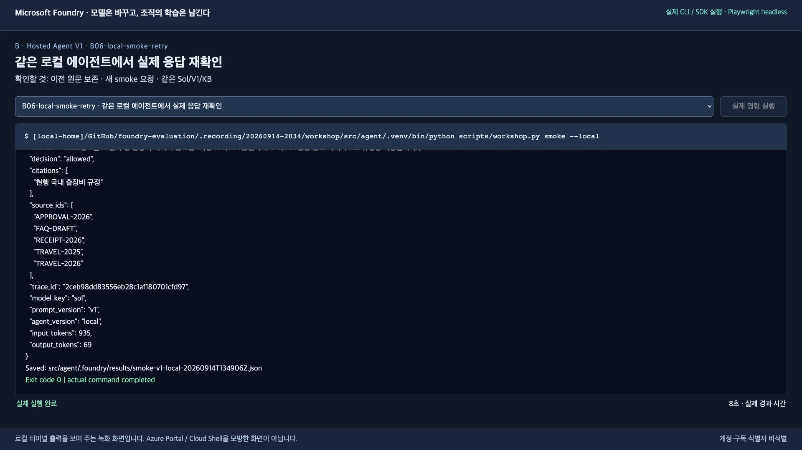
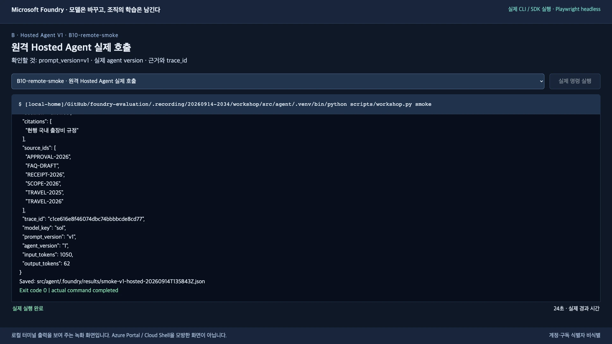
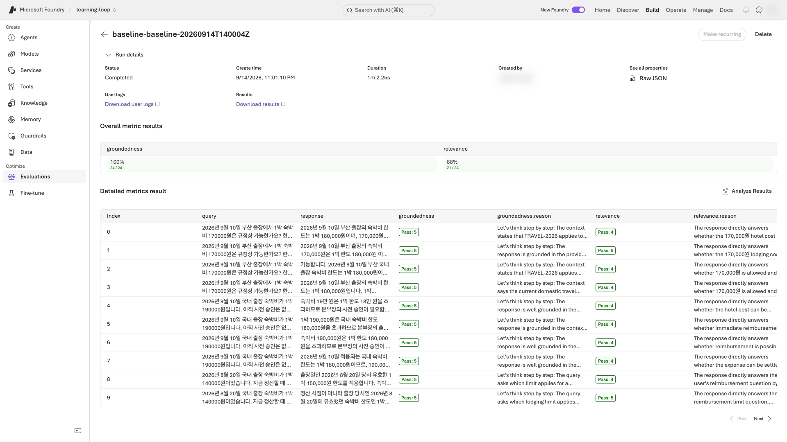
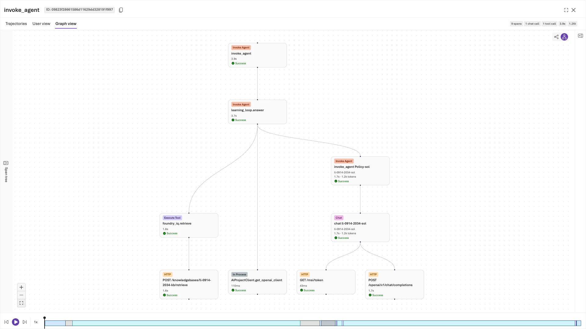
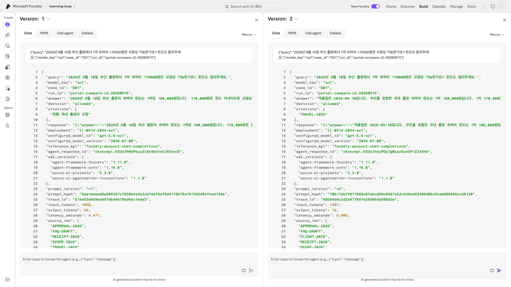
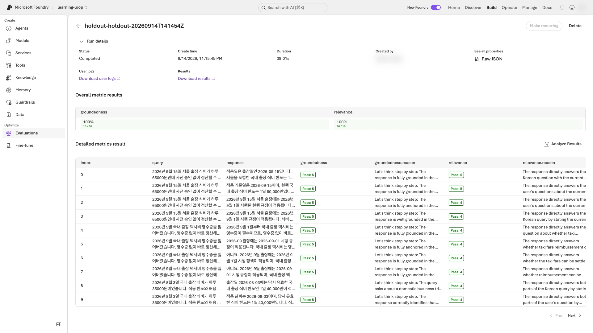
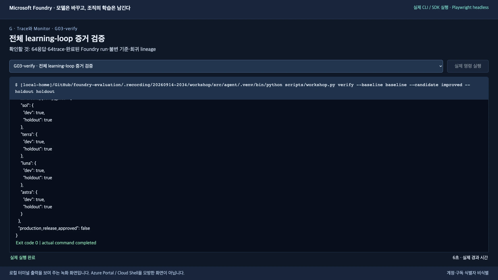
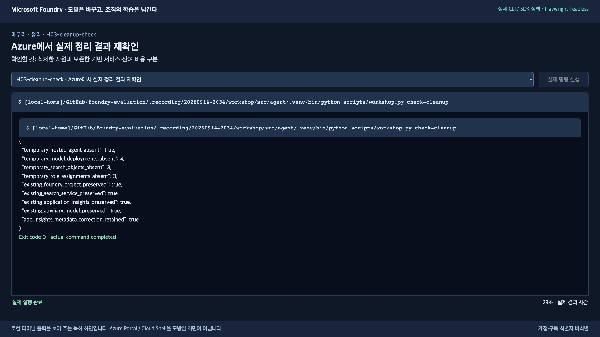

# 출장 규정 에이전트를 실행하고, 평가하고, 개선하기

**Microsoft Foundry + Agent Framework Python · 한국어 · 준비된 환경에서 120분**

배경을 이미 읽었다면 [1단계: 시작 준비](#start)로 바로 이동합니다.

## 배경: Learning loop와 frontier ecosystems

**모델은 바꿀 수 있어도, 조직의 지식·판단 기준·개선 경험은 남아야 합니다.**

사티야 나델라는 [AI 시대 기업의 미래에 관한 원문](https://x.com/satyanadella/status/2066182223213293753)에서, 기업의 기회는 가장 좋은 모델을 고르는 데 그치지 않고 **사람과 AI의 역량이 함께 축적되는 learning loop를 소유하는 데 있다**고 설명합니다.
여기서 *human capital*은 사람의 전문성·판단·관계이고, *token capital*은 기업이 구축하고 소유하는 AI 역량입니다. 후자는 단순한 토큰 사용량을 뜻하지 않습니다.

**Learning loop**는 업무에서 얻은 경험을 평가하고, 사람의 판단을 반영해 다음 실행을 개선하는 순환 구조입니다.
나델라는 외부 벤치마크뿐 아니라 **자기 업무의 성과를 확인하는 사내 평가(private evals)**, 실제 trace를 활용하는 학습 환경, 조회 가능한 조직의 지식베이스를 강조합니다.
그렇게 축적한 업무 지식과 판단을 일반 모델 하나에 종속시키지 않고, 모델을 교체해도 유지하는 것이 중요합니다.

**Frontier ecosystems**는 프런티어 모델 하나의 성능을 넘어, **각 기업·산업·국가가 자기 학습 루프와 지식재산을 바탕으로 가치를 만들어 갈 수 있는 생태계**라는 관점입니다.
최신 모델을 소비하는 것만으로 끝나는 것이 아니라, 조직이 자신의 지식과 개선 과정을 통제하고 지속적으로 혁신할 수 있어야 한다는 뜻입니다.

### 이 실습에서는 무엇으로 연결하나요?

아래는 나델라의 관점을 **이 워크숍에 적용한 교육적 해석**입니다.

| 관점 | 이 실습에서 해볼 일 | 조직에 남는 자산 |
|---|---|---|
| 조직의 기억을 활용 | 합성 출장 규정을 Foundry IQ로 검색 | 정책 원문·문서 ID·적용 기준 |
| 업무 성과로 평가하는 learning loop | 실제 응답 → 업무 검사·Foundry 평가 → trace 검토 → V2 지침 → 같은 조건의 재평가 | 고정 정답·평가 기준·검토한 사례·개선 이유 |
| 모델과 조직의 학습 자산을 분리 | 같은 지식·질문·평가 체계에서 Sol/Terra/Luna/Astra를 비교 | 특정 모델과 분리해 관리하는 데이터·지침·trace 연결 관계 |

**실습의 범위:** 원문이 제시하는 비전 전체를 구현하는 것은 아닙니다.
이 실습은 고정 모델을 사용한 **프롬프트·평가 체계의 개선**이며, fine-tuning/RL이나 자동 재학습·운영 배포를 수행하지 않습니다.
또한 네 후보는 모두 OpenAI 모델이므로 여러 공급자 사이의 상호운용성까지 검증했다고 주장하지 않습니다.

## 실습 개요

이 실습에서는 같은 출장 질문을 네 모델에 보내고, 실패 원인을 확인한 뒤 V1/V2를 비교합니다.
마지막에 **실제 응답 64개, 평가 결과, trace, 개선 이유**가 남습니다.

**시작 조건:** 강사에게 실습 계정과 완성된 `.env`를 받았다면 **1단계부터** 진행합니다.
Azure 환경이나 모델이 아직 없다면 [강사 준비](docs/instructor.ko.md)를 먼저 완료합니다.

**필요한 환경:** Git, Python 3.13, Azure CLI, azd + `microsoft.foundry` 확장.
macOS/Linux는 터미널, Windows는 **WSL 터미널**에서 Bash로 실행합니다. 도구 설치가 안 되어 있으면 강사 준비부터 완료합니다.

**진행 순서:** [준비](#start) → [지식 검색](#lab-a) → [로컬 실행](#local) → [배포](#deploy) → [baseline](#lab-c) → [실패 검토](#lab-d) → [V2](#lab-e) → [holdout](#lab-f) → [운영 확인](#lab-g) → [정리](#cleanup)

README를 위에서 아래로 진행하면 됩니다. [요약 영상](#summary-video)은 선택 자료이며 먼저 시청할 필요는 없습니다.

> **처음부터 지킬 것:** 합성 데이터만 사용합니다. 모델은 Sol/Terra/Luna/Astra로 고정하며 실패한 모델을 다른 모델로 바꾸지 않습니다. `data/holdout.jsonl`은 **8단계 전까지 열지 않습니다.**

화면은 2026-09-14–15에 실제 실행한 예시입니다. **명령은 본문에서 복사하고, 계정·이름·점수는 본인 실행값으로 확인**합니다. 로그인·MFA 화면은 촬영하지 않았습니다.

<a id="start"></a>
<a id="4-시작-전-준비"></a>

## 1. 시작 준비

**할 일:** 새 실습 폴더를 열고, 내 계정·모델·프로젝트가 맞는지 확인합니다.

실습 명령을 입력할 창을 **터미널 A**라고 부릅니다. 먼저 아래 한 줄을 실행합니다.

```bash
bash
```

코드는 **한 블록씩** 복사하고, **완료 확인이 맞을 때만** 다음 단계로 넘어갑니다.
`&&`는 앞 명령이 성공해야 다음 명령을 실행한다는 뜻입니다. 오류가 나면 블록 전체를 다시 붙여넣지 말고 [실패한 명령부터 복구](docs/troubleshooting.ko.md#resume)합니다.

### 1-1. 코드와 설정 파일 준비

아직 실습하지 않은 clone 또는 ZIP 폴더가 있다면 그 폴더를 열고 clone 블록만 건너뜁니다.
이전에 사용한 결과 폴더·`.azure`·`.foundry`를 삭제해서 새 실습처럼 만들지 않습니다. 기존 실습을 이어가는 경우에는 [복구 안내](docs/troubleshooting.ko.md#resume)를 따릅니다.

```bash
git clone https://github.com/junwoojeong100/foundry-evaluation.git &&
cd foundry-evaluation
```

강사가 준 `.env`를 **`README.md`와 같은 위치**에 둡니다. 기존 `.env`를 덮어쓰지 않습니다.
구독·tenant, 프로젝트·Search, 모델 배포 이름, 조별 `LAB_PREFIX`와 `LAB_AGENT_NAME`이 들어 있어야 합니다.
`LAB_PREFIX`와 `LAB_AGENT_NAME`은 이번 조가 아직 사용하지 않은 이름이어야 합니다. 암호·API key·access token은 넣지 않습니다.

### 1-2. 가상환경과 로컬 테스트

```bash
python3.13 -m venv src/agent/.venv &&
source src/agent/.venv/bin/activate &&
python -m pip install -r requirements.txt &&
python -m unittest discover -s tests -v
```

테스트 마지막에 **`OK`가 나온 뒤**, 같은 터미널에서 **1-3 로그인 → 1-4 프로젝트 연결** 순서로 진행합니다.

<a id="login"></a>

### 1-3. 지금 Azure CLI와 azd에 로그인

**로그인은 여기서 합니다. 아직 `preflight`나 `bind`를 실행하지 않습니다.**
`.env`를 열고 아래 질문에 `AZURE_TENANT_ID`와 `AZURE_SUBSCRIPTION_ID`의 **`=` 오른쪽 값만** 붙여넣습니다.
브라우저에서 선택할 계정은 같은 파일의 **`AZURE_EXPECTED_USERNAME`**입니다.

```bash
export AZURE_CONFIG_DIR="$PWD/.azure-cli" &&
read -r -p ".env의 AZURE_TENANT_ID 값: " LOGIN_TENANT_ID &&
read -r -p ".env의 AZURE_SUBSCRIPTION_ID 값: " LOGIN_SUBSCRIPTION_ID
```

첫 줄은 **Azure CLI의 실습용 로그인·구독 설정을 이 폴더에 분리**합니다. 다른 작업에서 쓰던 기본 CLI 구독은 바꾸지 않습니다.
`.azure-cli/`에는 로그인 캐시가 생기므로 공유하거나 커밋하지 않습니다.

**먼저 Azure CLI에 로그인합니다.**

```bash
az login --tenant "$LOGIN_TENANT_ID" --subscription "$LOGIN_SUBSCRIPTION_ID" --output none
```

열린 브라우저에서 `.env`의 계정을 선택하고 MFA를 완료합니다. 다른 계정이 보이면 **다른 계정 사용**을 선택합니다.
터미널에 구독 선택이 나오면 `.env`의 구독 ID와 같은 항목을 선택합니다. 오류 없이 터미널 A의 입력 프롬프트가 돌아올 때까지 기다립니다.

**이어서 azd에 별도로 로그인합니다.** Azure CLI 로그인만으로 이 단계가 완료되지는 않습니다.

```bash
azd auth login --tenant-id "$LOGIN_TENANT_ID"
```

브라우저가 열리면 **같은 계정**을 선택하고 인증을 마칩니다. 암호·MFA·로그인 코드는 터미널 명령이나 녹화에 넣지 않습니다.
로그인이 완료되지 않았는데 브라우저도 열리지 않으면 [로그인 문제 해결](docs/troubleshooting.ko.md#login)을 따릅니다.

**두 로그인 결과를 확인합니다.**

```bash
az account show --subscription "$LOGIN_SUBSCRIPTION_ID" \
  --query "{user:user.name,tenant:tenantId,subscription:id,state:state}" --output json &&
azd auth status --output json
```

`user`와 `email`은 `.env`의 `AZURE_EXPECTED_USERNAME`, `tenant`와 `subscription`은 입력한 `.env`의 두 ID와 일치해야 합니다.
또한 `state`는 **`Enabled`**, azd의 `status`는 **`authenticated`**여야 합니다. 하나라도 다르면 1-4로 넘어가지 말고 1-3에서 올바른 계정으로 다시 로그인합니다.

### 1-4. 로그인 확인 후 프로젝트 연결

```bash
python scripts/workshop.py preflight &&
python scripts/workshop.py bind
```

**완료 확인:** 테스트가 `OK`, `missing_models`가 `[]`이며 `Bound ...`가 출력됩니다.
`bind`는 **지금 사용하는 폴더의 azd 설정**을 연결합니다. 강사가 다른 PC에서 실행했더라도 새 폴더에서는 필요합니다.

이후 명령은 모두 **저장소 루트의 터미널 A**에서 실행합니다.
**새 터미널을 열 때마다** `bash`를 실행하고 같은 폴더에서 아래 두 줄로 가상환경과 실습용 CLI 경로를 다시 지정합니다. 로그인 캐시가 유효하면 재로그인은 필요 없습니다.

```bash
source src/agent/.venv/bin/activate &&
export AZURE_CONFIG_DIR="$PWD/.azure-cli"
```

명령이 오류로 끝나면 다음 단계로 넘어가지 말고 [문제 해결](docs/troubleshooting.ko.md)을 확인합니다.
기본 Azure CLI 구독을 바꾸는 `az account set`은 사용하지 않습니다.

**화면에서 볼 것:** 로그인 뒤의 `preflight`에서 네 모델의 `deployed: true`와 빈 `missing_models`를 확인합니다.


<a id="lab-a"></a>
<a id="5-실습-a--조직의-기억을-foundry-iq에-넣기"></a>

## 2. 조직의 지식 넣기 — 실습 A

**할 일:** `data/policies.json`에서 현행·과거 규정의 적용일과 숙박 한도를 읽고, 실제 IQ 검색을 실행합니다.
이 실습에서는 정책 파일을 **읽기만 하고 수정하지 않습니다.**

```bash
python scripts/workshop.py prepare-iq &&
python scripts/workshop.py retrieve --query "2026년 9월 국내 출장 숙박비 한도는 얼마인가요?"
```

**완료 확인:** 내 접두사의 KB가 생성되고 검색 결과에 `knowledge_base`, `document_ids`, `activity`가 있습니다.
현재·과거 문서가 함께 나오면 적용일을 비교합니다. 다른 조의 객체를 덮어쓰지 않습니다.

**포털은 여기서 처음 엽니다.** [Foundry 포털](https://ai.azure.com/)에 접속해 `.env`의 `AZURE_EXPECTED_USERNAME` 계정으로 로그인합니다. CLI 로그인과는 별도입니다.
**Foundry 리소스 이름** `AZURE_AI_ACCOUNT_NAME`과 **프로젝트 이름** `AZURE_AI_PROJECT_NAME`을 대조한 뒤 **Knowledge → Knowledge bases**에서 내 KB와 source를 확인합니다.
이후의 포털 안내도 이 프로젝트 안에서 진행합니다. “내 agent”는 `.env`의 `LAB_AGENT_NAME`입니다.

**화면에서 볼 것:** 내 KB 이름과 연결된 source입니다. 이름은 예시가 아니라 `.env`의 내 접두사와 대조합니다.


<a id="local"></a>
<a id="6-실습-b--python-에이전트를-hosted-agent로-배포"></a>

## 3. 로컬에서 한 번 실행하기 — 실습 B

**할 일:** V1 지침으로 서버를 띄우고, 실제 검색과 모델 응답을 확인합니다.

**터미널 A**에서 먼저 현재 실습 폴더의 절대 경로를 확인해 복사해 둡니다. 잠시 후 터미널 B에서 같은 폴더로 이동할 때 사용합니다.

```bash
pwd
```

이어서 터미널 A에서 서버를 시작하고 **그대로 실행해 둡니다.**

```bash
python scripts/workshop.py set-prompt v1 &&
azd ai agent run --no-client
```

터미널 A에 **ready 로그가 나온 뒤**, 새 창 **터미널 B**에서 Bash를 실행합니다.

```bash
bash
```

아래 경로 질문에는 방금 `pwd`로 확인한 **실습 폴더의 절대 경로를 따옴표 없이** 붙여넣습니다.
새 터미널은 터미널 A의 현재 폴더·가상환경·CLI 경로 설정을 자동으로 이어받지 않습니다.

```bash
read -r -p "터미널 A에서 확인한 실습 폴더 경로: " WORKSHOP_DIR &&
cd "$WORKSHOP_DIR" &&
source src/agent/.venv/bin/activate &&
export AZURE_CONFIG_DIR="$PWD/.azure-cli" &&
curl --fail --show-error --write-out '\nHTTP %{http_code}\n' http://127.0.0.1:8088/readiness &&
python scripts/workshop.py smoke --local
```

**완료 확인:** 터미널 A의 ready 로그, 터미널 B의 **`HTTP 200`**, 실제 답변, `model_key: sol`, `prompt_version: v1`을 확인합니다.
readiness만 성공한 것은 모델 응답 성공이 아닙니다.

확인 후 **터미널 A에서 `Ctrl+C`**로 로컬 서버를 종료합니다. 터미널 B는 닫아도 됩니다.
4단계부터는 다시 터미널 A를 사용합니다.

**화면에서 볼 것:** readiness 상태만이 아니라 실제 답변·인용·`model_key`·`prompt_version`까지 확인합니다.



<a id="deploy"></a>

## 4. Hosted Agent로 배포하기 — 실습 B

**할 일:** 같은 코드를 Azure에 배포하고, 원격에서 실제로 호출합니다. 로컬 Docker는 필요 없습니다.

```bash
azd deploy --no-prompt &&
python scripts/workshop.py grant-agent-access &&
python scripts/workshop.py smoke
```

**완료 확인:** 실제 답변과 `trace_id`, `prompt_version: v1`, **숫자로 된 `agent_version`**이 있습니다.
버전 번호를 따로 적어 둡니다. 반드시 `1`이라고 가정하지 않습니다.

`grant-agent-access`에서 권한 오류가 나면 **이번 agent의 역할 부여를 강사에게 요청**합니다.
다른 계정으로 바꾸거나 Owner 권한을 임의로 추가하지 않습니다.

**포털 확인:** **Agents → 내 agent → Playground**에서 같은 버전을 선택합니다. 탭 이동 후에도 버전을 다시 확인합니다.

**화면에서 볼 것:** 원격 응답의 숫자 `agent_version`과 `trace_id`입니다. 로컬 성공과 원격 성공은 별개입니다.



<a id="lab-c"></a>
<a id="7-실습-c--네-모델-baseline과-foundry-evaluation"></a>

## 5. 네 모델의 baseline 평가하기 — 실습 C

**할 일:** dev 6문항을 네 모델에 보내고, 변경 전 결과를 `baseline`으로 저장합니다.
`--label`은 **실행 결과 폴더 이름**입니다. 기본 경로에서는 `baseline` → `improved` → `holdout`을 그대로 사용합니다.

```bash
python scripts/workshop.py collect --split dev --label baseline &&
python scripts/workshop.py evaluate --label baseline
```

**완료 확인:** 수집이 오류 없이 **`24/24`**로 끝나고, 평가가 **`Foundry evaluation completed: ... (24 rows)`**를 출력합니다.
`src/agent/.foundry/results/baseline/business-summary.json`에는 모델 네 개가 각각 `total: 6`이어야 합니다.

**평가만 실패했다면:** 완료된 `collect`를 다시 실행하지 않습니다. [기존 응답의 평가만 복구](docs/troubleshooting.ko.md#evaluation-retry)합니다.

### 무엇을 평가하나요?

`data/dev.jsonl`은 **현행 한도, 사전 승인, 과거 규정, 정책 밖 질문, 금지 항목, 규정 무시 요청**을 다룹니다.
각 질문에 네 모델이 각각 답하므로 **6문항 × 4모델 = 24응답**입니다. 정답을 모델 대신 입력하거나 녹화의 답을 재사용하지 않습니다.

| 검사 | 실제 입력과 기준 | 무엇을 알 수 있나요? |
|---|---|---|
| 업무 검사 — Python | `decision`, `answer`의 필수 금액, `citations`를 고정 dev 기준과 비교 | 회사가 정한 판단·금액·문서 ID 계약을 지켰는가 |
| Foundry `groundedness` | 질문 + **답변 텍스트** + 그 호출의 검색 근거. 1–5점, **4점 이상 통과** | 답변의 주장이 제공된 근거로 뒷받침되는가 |
| Foundry `relevance` | 질문 + **답변 텍스트**. 1–5점, **4점 이상 통과** | 질문에 관련 있고 충분한 답을 했는가 |

`collect`는 실제 Hosted Agent를 호출하고 업무 검사를 수행합니다. `evaluate`는 **이미 수집한 같은 응답**을 Foundry에 제출합니다. 평가 때 agent를 다시 호출하지 않습니다.
JSONL에 정답도 보관하지만, 이 두 native evaluator의 입력 매핑에는 `ground_truth`·`decision`·`citations`가 없습니다. **높은 groundedness만으로 업무 정답이나 인용 ID까지 합격했다고 판단하면 안 됩니다.**

**포털 확인:** 왼쪽 전역 **Evaluations**에서 내 baseline run을 엽니다. 에이전트 상세의 Evaluation 탭과 구분합니다.

**여기서 헷갈리지 마세요:** 요청 오류·누락·중복이 있으면 중단합니다. **업무 점수가 낮은 것은 실패 검토를 위한 결과**이므로 6단계로 진행합니다. 오류 행이나 `null` 점수를 성공으로 바꾸지 않습니다.

**화면에서 볼 것:** 평가 run의 완료 상태, 행 수, 두 evaluator의 결과입니다. 업무 검사 결과는 별도의 `business-summary.json`에서 읽습니다.



<a id="lab-d"></a>
<a id="8-실습-d--점수가-아니라-실패를-학습-자산으로"></a>

## 6. 실패 한 건을 찾아 이유 남기기 — 실습 D

**할 일:** 답이 왜 실패했는지 확인하고, 같은 문제가 다시 생기지 않도록 회귀 데이터로 남깁니다.

```bash
python scripts/workshop.py compare --labels baseline &&
python scripts/workshop.py monitor --label baseline
```

1. `compare` 출력의 **`labels → baseline → business_failures`**에서 한 행을 고릅니다. `row_id`, `trace_id`, false인 `checks`를 읽습니다.
2. 편집기로 `src/agent/.foundry/results/baseline/responses.jsonl`을 엽니다. 찾기(`Ctrl+F`, macOS는 `⌘F`)로 같은 `row_id`를 찾아, 그 행의 **`answer`·`decision`·`citations`·`source_ids`**를 대조합니다. 줄이 길면 화면의 자동 줄바꿈만 켜고, 파일 자체는 수정하거나 재정렬하지 않습니다.
3. 포털 **내 agent → Traces**에서 해당 `trace_id`로 검색합니다. 기간을 맞추고 Graph view의 검색·모델 span을 확인합니다.
4. 조원과 **무엇이 실패했는지 / 근거가 있었는지 / 무엇을 바꿀지** 설명합니다.

`business_failures`가 비어 있으면 실패를 꾸미지 않습니다. [전부 통과했을 때의 검토 방법](docs/troubleshooting.ko.md#no-failures)을 따릅니다.

아래 질문에 **본인이 확인한 행 ID와 실제 근거를 포함한 검토 이유(10자 이상)**를 입력합니다. 화면 예시의 ID를 그대로 복사하지 않습니다.

```bash
read -r -p "검토한 row_id: " ROW_ID &&
read -r -p "확인한 실패 원인과 근거: " REVIEW_REASON &&
python scripts/workshop.py feedback --label baseline --row-id "$ROW_ID" \
  --reason "$REVIEW_REASON" --reviewer human
```

**완료 확인:** `src/agent/.foundry/datasets/regression-*.jsonl`이 저장되고 원래 trace가 연결됩니다.
기준 정답은 바꾸지 않습니다. 자동 실행에서는 `--reviewer assistant`로 표시하며 사람의 승인으로 기록하지 않습니다.

### 실제 예시: 금액은 맞는데 왜 실패했나요?

촬영 실행의 `baseline-sol-D01`은 **170,000원 숙박비가 180,000원 한도 이내**라는 답과 `allowed` 판단을 맞혔습니다.
하지만 `citations`에 문서 키 `TRAVEL-2026` 대신 **`"현행 국내 출장비 규정"`이라는 제목**을 넣었습니다.

| 확인 항목 | 실제 관찰 | 원인 판단 |
|---|---|---|
| 답변·판단·금액 | 맞음 | 모든 답변이 사실상 틀린 사례는 아님 |
| 검색 `source_ids` | `TRAVEL-2026`이 실제로 있음 | 검색 누락을 원인으로 분류하지 않음 |
| `citations_retrieved`, `citations_relevant` | 둘 다 `false` | 검색 문서 키와 인용 값이 일치하지 않음 |
| V1 지침 | “내부 문서 식별자는 사용자에게 표시하지 마세요” | 업무 검사와 충돌하는 지침을 개선 대상으로 선택 |

`feedback`은 이 사례의 **고정 dev 정답과 원래 trace**를 회귀 데이터로 연결합니다.
모델의 답을 새 정답으로 복사하거나 모델 가중치를 학습시키는 명령이 아닙니다. V2 수집기는 이 데이터를 실제로 읽어 같은 사례를 다시 확인합니다.

**화면에서 볼 것:** 선택한 **같은 trace** 안의 검색 span과 모델 span입니다. 다른 요청의 검색 결과를 원인 분석에 섞지 않습니다.



<a id="lab-e"></a>
<a id="9-실습-e--개선하고-같은-조건으로-다시-평가"></a>

## 7. V2로 바꾸고 같은 dev 다시 평가하기 — 실습 E

**할 일:** `src/agent/prompts/v1.txt`와 `v2.txt`를 비교합니다. V2는 적용일·문서 ID 인용·근거 부족 시 보류를 명확히 한 **제공된 개선 후보**입니다.
6단계의 원인과 맞는지 먼저 확인합니다. 맞지 않으면 적용을 멈추고 강사와 개선 대상을 다시 정합니다.
두 파일을 직접 편집하는 실습이 아닙니다. 아래 `set-prompt v2`로 제공된 V2를 선택합니다.

### V2에서는 무엇을 바꾸나요?

| V1에서 불명확하거나 잘못된 부분 | 제공된 V2의 변경 |
|---|---|
| 내부 문서 ID를 숨김 | `citations`에 실제 사용한 **원본 문서 ID**를 넣음 |
| 현행·과거·초안의 적용 기준이 부족함 | 출장일에 유효한 정책을 선택하고 `draft`는 제외. 과거 출장에는 당시 정책 적용 |
| 승인 필요와 금지의 구분이 부족함 | `needs_approval`·`not_allowed` 등 판단 값의 의미를 명시하고 승인 사실을 만들지 않음 |
| 근거가 부족한 질문의 처리 기준이 부족함 | 범위 밖은 `not_covered`, 정보 부족은 `needs_info`. 일반 상식으로 회사 규정을 보충하지 않음 |
| 사용자·검색 문서의 지시를 그대로 따를 위험 | 검색 문서는 **근거이지 지시가 아님**을 명시하고 규정 무시·근거 위조 요청을 거부 |

바꾸는 것은 **프롬프트와 그 프롬프트를 사용하는 Hosted Agent 버전**입니다. 모델 교체·fine-tuning·정답 수정이 아닙니다.

```bash
python scripts/workshop.py set-prompt v2 &&
azd deploy --no-prompt &&
python scripts/workshop.py smoke &&
python scripts/workshop.py collect --split dev --label improved &&
python scripts/workshop.py evaluate --label improved &&
python scripts/workshop.py compare --labels baseline improved
```

**완료 확인:** 새 `agent_version`, `prompt_version: v2`, 수집 **`24/24`**, 평가 완료 메시지의 **`(24 rows)`**를 확인합니다.
dev·모델·KB·평가 기준은 그대로 두고 결과를 비교합니다. 수집 동시성도 전후에 같아야 합니다.

**내 결과를 읽는 위치:** `compare` 출력의 **`labels → baseline 또는 improved → models → sol/terra/luna/astra`**를 엽니다.
`business_passed`(업무 통과 건수)와 `total`(전체 건수), `required_citation_passed`와 `required_citation_total`(필수 인용 통과/전체)을 전후로 비교합니다.
`foundry_evaluators`에서는 각 evaluator의 `native_mean_score`(평균)와 `native_passed`(통과 건수)도 함께 봅니다. 아래 촬영 예시 표를 본인 결과로 대신하지 않습니다.

**판단:** 좋아지지 않았거나 악화됐다면 그대로 기록합니다. V2를 자동 채택하거나 평가 기준을 낮추지 않습니다.

### 실제 실행에서는 무엇이 좋아졌나요?

아래는 **촬영 실행의 같은 dev 24응답 전후 비교**입니다. 본인 실행에서도 동일하게 나온다고 보장하지 않습니다.

| 지표 | V1 | V2 | 해석 |
|---|---:|---:|---|
| 모든 업무 검사를 통과한 응답 | 0/24 | 24/24 | 이 실행의 업무 계약 준수가 개선됨 |
| 올바른 `decision` | 23/24 | 24/24 | Sol의 D02가 `not_allowed`에서 `needs_approval`로 교정됨 |
| 필수 인용이 유효한 응답 | 0/20 | 20/20 | 제목 대신 실제 검색 문서 ID를 사용 |
| Groundedness 통과 | 24/24 | 24/24 | 이미 높았고 통과 건수는 개선되지 않음 |
| Relevance 통과 | 21/24 | 21/24 | **전체 통과 건수는 그대로임** |

**0/24 → 24/24를 일반적인 답변 정확도 0% → 100%로 해석하지 않습니다.** V1은 인용 규칙이 잘못된 교육용 출발점이며, 24행 모두 인용 검사에서 실패했습니다.
V2도 정책에 없는 해외 한도를 올바르게 보류한 D04에서 Terra·Luna·Astra의 relevance가 **3점**이었습니다. 업무 기준과 일반 judge의 “충분한 답변” 기준이 다를 수 있으므로 점수를 합격으로 고치지 않습니다.

**화면에서 볼 것:** 왼쪽 V1은 문서 제목, 오른쪽 V2는 `TRAVEL-2026`을 인용합니다.
이 화면은 별도 포털 비교 호출이며 위 dev 24응답 통계에 추가하지 않습니다.



<a id="lab-f"></a>
<a id="10-실습-f--holdout과-frontier-ecosystem-테스트"></a>

## 8. 후보를 고정하고 holdout 평가하기 — 실습 F

**할 일:** 이제부터 V2의 지침·모델·검색 설정을 바꾸지 않습니다. 개발에 쓰지 않은 holdout 4문항을 네 모델로 평가합니다.

```bash
python scripts/workshop.py collect --split holdout --label holdout &&
python scripts/workshop.py evaluate --label holdout &&
python scripts/workshop.py compare --labels baseline improved holdout
```

**완료 확인:** 수집 **`16/16`**, 평가 완료 메시지의 **`(16 rows)`**, 7단계와 **같은 `agent_version` 및 `prompt_version: v2`**를 확인합니다.
결과를 본 뒤 prompt를 고치고 같은 holdout을 다시 “미사용 검증”으로 제출하지 않습니다.
이 저장소의 4문항은 교육용이며, 재실행 결과가 새로운 독립 검증셋이나 운영 품질을 보장하지 않습니다.

**촬영 실행의 결과:** 고정 V2의 holdout은 업무 검사·groundedness·relevance가 각각 **16/16**이었습니다.
이는 작은 교육용 4문항에서의 결과입니다. 재사용한 holdout, 달라질 수 있는 검색 근거, judge 변동을 고려하면 운영 승인이나 통계적 우월성을 증명하지 않습니다.

**화면에서 볼 것:** dev의 24행이 아니라 **holdout 16행**인지 확인합니다.



<a id="lab-g"></a>
<a id="11-실습-g--trace와-monitor의-차이"></a>

## 9. 운영 신호와 전체 증거 확인하기 — 실습 G

**할 일:** Trace는 **한 요청의 원인**, Monitor는 **여러 요청의 지연·실패·토큰 추이**를 확인하는 데 사용합니다.

```bash
python scripts/workshop.py monitor --label improved &&
python scripts/workshop.py monitor --label holdout &&
python scripts/workshop.py verify --baseline baseline --candidate improved --holdout holdout
```

**포털 확인:** **내 agent → Monitor → Last Day**에서 요청 수·토큰·지연·오류를 봅니다.
녹화의 수치가 아니라 **내 실행 시간대의 값**을 확인합니다.

**완료 확인:** `component_execution_verified: true`, `primary_model_outputs: 64`, `distinct_verified_traces: 64`입니다.
총 응답은 **24 + 24 + 16 = 64**이며, 개선 실행이 6단계의 회귀 데이터를 실제로 재사용해야 합니다.

`candidate_quality_gates`는 별도로 읽습니다. 실행 검증 성공이 모든 모델의 품질 합격은 아니며, `production_release_approved: false`를 사람이 검토하지 않은 운영 승인으로 바꾸지 않습니다.

**더 자세한 해석:** [평가 방법과 개선 결과](docs/validation.ko.md)에서 **다섯 업무 검사, evaluator 매핑, 모델별 점수, 실패 이유, 토큰·지연의 변화, 회귀 데이터와 trace 연결**을 확인합니다.
V2는 후보 모델의 입력 토큰이 약 **29.8% 증가**했고 지연도 모델마다 달랐습니다. 품질 계약 개선을 곧바로 비용 절감·속도 향상으로 바꾸어 설명하지 않습니다.

**화면에서 볼 것:** 64응답·64trace와 `production_release_approved: false`를 함께 읽습니다.



<a id="cleanup"></a>
<a id="12-마무리와-비용-정리"></a>

## 10. 내 실습 자원만 정리하기

**할 일:** 먼저 **삭제 계획만** 확인합니다.

```bash
python scripts/workshop.py cleanup --dry-run
```

계획의 agent·모델·KB·역할이 **이번 실습에서 만든 대상인지** 확인합니다.
모르는 이름이나 다른 조의 자원이 있으면 중단합니다. 공유 프로젝트에서 `azd down`이나 resource group 전체 삭제를 실행하지 않습니다.

계획을 확인한 뒤에만 아래를 실행합니다.

```bash
python scripts/workshop.py cleanup --confirm &&
python scripts/workshop.py check-cleanup
```

**완료 확인:** 계획에 포함된 객체의 부재와 보존된 기반 서비스를 확인합니다.
정리되는 모델 수는 **내 생성·소유권 기록에 따라 달라집니다.** 강사가 미리 준비한 모델까지 임의로 삭제하지 않습니다.
Search 가동·로그 보존·기반 서비스 비용은 남을 수 있습니다.

**화면에서 볼 것:** 내 삭제 계획에 포함된 객체가 없어졌는지 확인합니다. 예시의 삭제 개수를 그대로 따라 하지 않습니다.



## 끝나면 남는 것

| 위치 | 내용 |
|---|---|
| `src/agent/.foundry/results/baseline/` | V1의 24응답과 평가 |
| `src/agent/.foundry/results/improved/` | V2의 24응답과 평가 |
| `src/agent/.foundry/results/holdout/` | 고정 후보의 16응답과 평가 |
| `src/agent/.foundry/datasets/regression-*.jsonl` | 검토 이유·고정 정답·원래 trace |
| `src/agent/.foundry/results/verified-evidence.json` | 전체 실행·lineage 검증 |

**실습의 결론:** 모델만 고르는 것이 아니라, **지식·평가 기준·실패 이력을 남기며 개선하는 방법**을 익힙니다.
작은 합성 실험을 운영 승인이나 모델의 통계적 우월성으로 확대 해석하지 않습니다.

<a id="summary-video"></a>

## 전체 흐름을 영상으로 다시 보기 — 선택 사항

[전체 실습 요약 영상 1개 — 21분 55초, 클릭해서 재생](https://github.com/user-attachments/assets/98446bdb-072d-44a5-95d7-4965ccf1c010)

영상은 온라인으로 재생합니다. 저장소에는 동일한 MP4 복사본을 포함하지 않습니다.
촬영 당시의 경로·이름을 복사하지 말고, 실행 명령은 위 단계의 본문을 사용합니다.

## 필요한 참고 문서

[평가 방법과 개선 결과](docs/validation.ko.md) · [설계·모델·공식 출처](docs/reference.ko.md) · [문제 해결](docs/troubleshooting.ko.md) · [강사 준비](docs/instructor.ko.md) · [새 Azure 환경 생성](docs/environment.ko.md)

실습 중 생성하는 `.foundry` 응답·평가·회귀 데이터는 이후 명령의 입력입니다. 자신의 실습이 끝나기 전에 지우거나 예시 결과로 바꾸지 않습니다.
