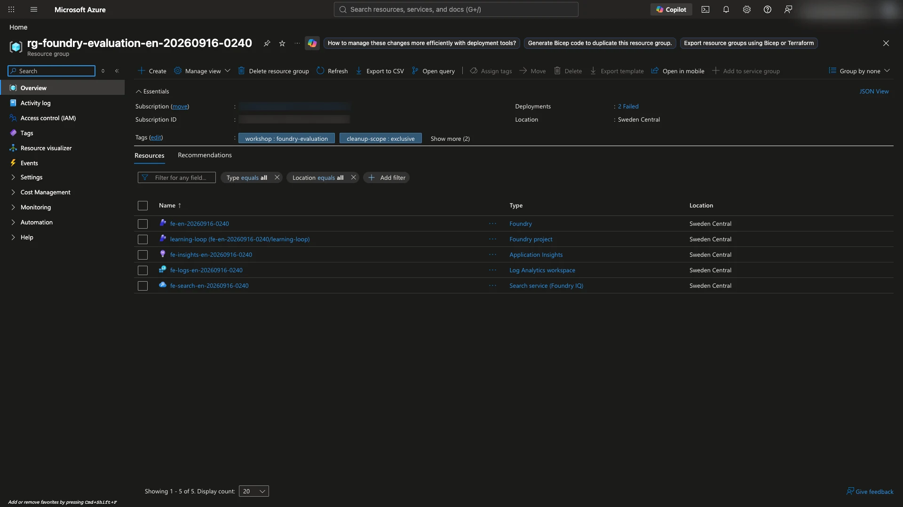

# Create a new English Azure environment — instructor or self-study

[English workshop](../README.md) · [한국어](environment.ko.md)

**Outcome:** an English-only workshop group in **Sweden Central**, with Foundry, Search, telemetry, four candidate models, and a fixed auxiliary planner/judge.

Participants with a prepared `.env` should skip this document and start at [README step 1](../README.md#start).

For self-study, you are the environment owner. Complete the [basic tool checks](instructor.en.md#tools) and [access prerequisites](instructor.en.md#access) first. Run one block at a time in the same Bash/WSL terminal; keep it open so its paths and login profile remain available.

**To delegate environment creation to GHCP:** start with the [separate installation and startup guide](copilot.en.md). Do not jump to execution prompts before installation and sign-in. Review the account, subscription, and billable scope; installing tools does not grant Azure permissions.

<a id="setup-route"></a>

**Route:** [1. Workspace](#setup-workspace) → [2. Identity/capacity](#setup-identity) → [3. Services](#setup-foundation) → [4. Access/connections](#setup-access) → [5. Auxiliary model](#setup-auxiliary) → [6. Candidates](#setup-candidates) → [handoff](#handoff).

Step 2 uses only the README's **sign-in section**, then returns here. If the foundation already exists, use [existing-foundation preparation](instructor.en.md#existing-foundation) instead.

> New services incur costs. Use synthetic data, preserve shared/Korean resources, and never change the default Azure CLI subscription used by other work. Sweden Central resource placement does not mean GlobalStandard model inference is confined to that region.

<a id="setup-workspace"></a>

## 1. Create an isolated English source workspace

Use a **Git clone**, not an extracted ZIP: the preparation tool records the actual source commit and file hashes. Work in the same Bash terminal and stop on an error.

If you are not already at the root of an **unused Git clone**, start here:

```bash
git clone https://github.com/junwoojeong100/foundry-evaluation.git foundry-evaluation-setup-en &&
cd foundry-evaluation-setup-en
```

<a id="initial-settings"></a>

In your editor, copy `.env.example` to a new **`.env` in this folder**, not `.env.txt`. Do not overwrite an existing configuration. For the initial IDs, sign in to [Azure Portal](https://portal.azure.com/) with the approved account: **Subscriptions → your subscription → Overview** provides the subscription ID; **Microsoft Entra ID → Overview** provides its directory's tenant ID. Portal sign-in does not sign in either CLI.

| Initial field | Value |
|---|---|
| `AZURE_SUBSCRIPTION_ID` | Authorized workshop subscription |
| `AZURE_TENANT_ID` | Its tenant |
| `AZURE_EXPECTED_USERNAME` | Account that will sign in |
| `AZURE_RESOURCE_GROUP` | Previous group to inspect; if none, keep the key as **`AZURE_RESOURCE_GROUP=`**, not the template placeholder |
| `LAB_LANGUAGE` | `en` |

Keep the other template settings. New service names, endpoints, and deployment names will be generated in the isolated folder. Do not put credentials in `.env`.

**If the GHCP page sent you here only for initial settings, stop here and return to [plan review](copilot.en.md#plan-review).** Let GHCP run `init` / `prepare` after approval; do not run the same setup in both places. If preparing the environment manually, continue below.

```bash
python3.13 -m venv src/agent/.venv &&
source src/agent/.venv/bin/activate &&
python -m pip install -r requirements.lock.txt
```

Choose a fresh run ID once and keep `RUN_DIR` throughout:

```bash
REPO_ROOT="$(pwd)" &&
RUN_ID="en-$(date -u +%Y%m%d-%H%M%S)" &&
RUN_DIR="$REPO_ROOT/.workshop/$RUN_ID" &&
printf 'RUN_DIR=%s\n' "$RUN_DIR" &&
python scripts/prepare_environment.py init --run-dir "$RUN_DIR" --language en
```

Save the printed absolute `RUN_DIR` path now. **Checkpoint:** `init` finishes and creates **`$RUN_DIR/config.json`**. It records the chosen names; it has not copied the source or created Azure resources.

<a id="setup-snapshot"></a>

Next, create the runnable source snapshot:

```bash
python scripts/prepare_environment.py prepare --run-dir "$RUN_DIR"
```

**Checkpoint:** **`$RUN_DIR/source-manifest.json`** and **`$RUN_DIR/workshop/.env`** exist. If either command failed, preserve this path and use [setup recovery](troubleshooting.en.md#setup-resume), not a new `RUN_ID`.

| Folder | Purpose | When used |
|---|---|---|
| `REPO_ROOT` | Original clone with the guide and preparation tools | Initial setup, then provisioning in steps 2–5 |
| `RUN_DIR` | This setup's `config.json`, source manifest, and infrastructure records | Provisioning scripts read it through `--run-dir`; it is **not** the runnable source root |
| `RUN_DIR/workshop` | Isolated runnable source, generated `.env`, Python environment, and CLI profile | Sign-in, step 6, and the participant exercise |

**The runnable configuration is now `RUN_DIR/workshop/.env`.** Editing the original clone's `.env` does not update this generated copy. Keep the saved configuration and ownership records intact when resuming.

<a id="setup-python"></a>

Install and test the isolated source:

```bash
cd "$RUN_DIR/workshop" &&
python3.13 -m venv src/agent/.venv &&
source src/agent/.venv/bin/activate &&
python -m pip install -r requirements.lock.txt &&
python -m unittest discover -s tests -v
```

**Checkpoint:** tests end with `OK`; **`$RUN_DIR/source-manifest.json`** records the source commit and hashes. **`$RUN_DIR/workshop/.env`** has `LAB_LANGUAGE=en`, new owned names, and no reused `.azure`, `.foundry`, or virtual environment.

Stay in **`$RUN_DIR/workshop`** for sign-in so the later English agent uses the same isolated CLI profile. This snapshot contains runnable source, not another copy of the guide; keep this guide open in your browser/editor.

<a id="setup-identity"></a>

## 2. Verify identity, preservation, and capacity

Complete only [README step 1-3](../README.md#login): CLI profile, tenant/subscription inputs, Azure CLI sign-in, azd sign-in, and both account checks. Return here afterward. Do **not** run README preflight/bind yet; the foundation is not ready.

Then return to the **original clone** for provisioning. Keep `AZURE_CONFIG_DIR` unchanged: its absolute path still points to the new workspace's login profile.

```bash
cd "$REPO_ROOT" &&
python scripts/provision_environment.py identity --run-dir "$RUN_DIR" &&
python scripts/provision_environment.py ownership --run-dir "$RUN_DIR" --preserve-existing &&
python scripts/provision_environment.py model-capacity --run-dir "$RUN_DIR"
```

**Checkpoint:** all identity matches are true, the subscription is Enabled, existing groups are explicitly preserved, and capacity is verified for the exact model versions.

`--preserve-existing` means **keep all existing groups**, including the Korean workshop. This command does not delete groups. Without that flag, finding previous candidates stops the command for a manual ownership review.

Each Azure CLI operation passes the configured subscription explicitly. Capacity availability and subscription quota are separate checks; model preparation validates quota again.

<a id="setup-foundation"></a>

## 3. Create the new group and foundation services

Review the generated names in **`$RUN_DIR/config.json`**, then run:

```bash
python scripts/provision_environment.py group --run-dir "$RUN_DIR" &&
python scripts/provision_environment.py foundry --run-dir "$RUN_DIR" &&
python scripts/provision_environment.py project --run-dir "$RUN_DIR" &&
python scripts/provision_environment.py logs --run-dir "$RUN_DIR" &&
python scripts/provision_environment.py insights --run-dir "$RUN_DIR" &&
python scripts/provision_environment.py search --run-dir "$RUN_DIR"
```

**Checkpoint:** the new group contains the Foundry account/project, Search, Application Insights, and Log Analytics in Sweden Central. Azure Portal **Resources** and **Tags** should match this run's names and `workshop`, `cleanup-scope`, and `run` tags.



The example's **2 Failed** deployment-history entries are separate automatic alert/governance failures, not failed creation of these five resources. Their [actual causes are documented](validation.en.md#8-read-operational-and-setup-errors-honestly); do not change shared subscription settings just to remove the indicator.

The provisioner requires both ownership tags and this run's creation record. A tag alone is not authorization to modify another resource.

Search uses Basic with one replica/partition. Its `semanticSearch` and `knowledgeRetrieval` free settings do **not** make Search uptime or model calls free.

If only the local Search wait expires, preserve that attempt and continue waiting for the **same resource**:

```bash
python scripts/provision_environment.py search-status --run-dir "$RUN_DIR" &&
python scripts/provision_environment.py wait-search --run-dir "$RUN_DIR" &&
python scripts/provision_environment.py search-status --run-dir "$RUN_DIR"
```

Require `provisioning_state: Succeeded` and `status: running`; do not recreate the service or change region just to obtain a green screen.

<a id="setup-access"></a>

## 4. Grant scoped access and create connections

The `user-*` operations target **the user verified in step 2**, not every future participant. Prepare other users according to the [instructor access checklist](instructor.en.md#access-boundaries).

```bash
python scripts/provision_environment.py user-foundry --run-dir "$RUN_DIR" &&
python scripts/provision_environment.py user-model --run-dir "$RUN_DIR" &&
python scripts/provision_environment.py user-search-service --run-dir "$RUN_DIR" &&
python scripts/provision_environment.py user-search-data --run-dir "$RUN_DIR" &&
python scripts/provision_environment.py project-monitor --run-dir "$RUN_DIR" &&
python scripts/provision_environment.py insights-connection --run-dir "$RUN_DIR" &&
python scripts/provision_environment.py search-connection --run-dir "$RUN_DIR"
```

**Checkpoint:** user roles are scoped to the new project/account/Search; the project identity can read the new telemetry. Search uses an Entra connection, and the App Insights connection has its actual `ResourceId` metadata.

The agent's instance identity is created later. Grant its Search/model access in [README step 4](../README.md#deploy), not by assigning broad Owner permissions to it.

<a id="setup-auxiliary"></a>

## 5. Deploy the fixed auxiliary model and verify endpoints

```bash
python scripts/provision_environment.py auxiliary --run-dir "$RUN_DIR" &&
python scripts/provision_environment.py ready --run-dir "$RUN_DIR"
```

**Checkpoint:** the actual returned project and model endpoints match the new environment. They are different endpoints with different purposes.

The auxiliary deployment is `gpt-5.4-mini` / `2026-03-17`. It is the planner/judge, not a replacement for one of the four candidates.

<a id="setup-candidates"></a>

## 6. Prepare candidates and hand over the English configuration

```bash
cd "$RUN_DIR/workshop" &&
source src/agent/.venv/bin/activate &&
python scripts/workshop.py preflight --allow-missing-models &&
python scripts/workshop.py prepare-models &&
python scripts/workshop.py preflight &&
python scripts/workshop.py calibrate
```

**Checkpoint:** `language: en`, the four exact candidate identities/versions, `deployed: true`, `missing_models: []`, and a successful judge calibration. The two calibration examples are not part of the 64 candidate outputs.

<a id="handoff"></a>

**Choose one handoff:**

| Who continues | Folder and next action |
|---|---|
| You, for one-off self-study | Stay in **`$RUN_DIR/workshop`** and continue at [README step 1-4](../README.md#project-binding). Read the preflight checkpoint, then bind. Do not repeat cloning, installation, or sign-in. |
| Instructor rehearsing for a class | Keep this folder for model ownership. Use a [separate rehearsal clone](instructor.en.md#rehearsal-workspace) with new runtime names so rehearsal cleanup cannot delete the shared models. |
| A new participant | Give them a complete English `.env` with **unused** team names and the **actual prepared model deployment names**. They start at [README step 1](../README.md#start) in their own folder. |

Do not copy ownership, authentication, or result files to a participant's folder. Do not switch the Korean workspace's language or overwrite its knowledge objects. Use the [team handoff checklist](instructor.en.md#handoff).

## Costs and boundaries

Participant cleanup removes only that folder's owned runtime objects. It does not remove every instructor-prepared model or foundation service. The instructor manages remaining Search, logging, auxiliary-model, and foundation costs.

The actual English results and scope are explained in [English evaluation results](validation.en.md). Resource pictures and scores from another language/run are not substitutes for this execution.

<a id="final-cleanup"></a>

## Final cleanup of a personal foundation — a separate choice

**Only the environment owner proceeds, after completing `cleanup` and `check-cleanup` in README step 10.** Deleting the foundation is a separate decision; participant cleanup or a GHCP execution request does not approve deleting an entire group.

| Environment | Choose this path |
|---|---|
| Existing/shared environment, or a group needed by later participants/classes | **Preserve the foundation and auxiliary deployment.** The owner manages remaining costs, retention, and the final shutdown date. Do not delete the group below. |
| An **exclusively owned group newly created by this guide's tools**, with no other users or future exercises | After verifying ownership below, you may delete **only that group**. |
| Missing creation records or uncertain ownership/users | Stop and consult the owner. A name or tag alone does not authorize deletion. |

### 1. Preserve evidence and verify the deletion scope

Keep the required local responses, evaluations, regression records, `verified-evidence.json`, and `cleanup-check.json`. Do not assume Foundry report URLs or Azure traces will remain accessible after deletion. Do not share or commit authentication caches, passwords, or tokens.

Open `config.json` and `infrastructure-state.json` from the **same recorded `RUN_DIR`** in your editor. Do not create a new run.

| Check | Values that must match |
|---|---|
| Run | `config.json → run_id` and `infrastructure-state.json → run` |
| Group to delete | `config.json → resource_group`. **Preserve `old_resource_group`.** |
| Subscription / Resource ID | `config.json → subscription` and the subscription/group in `infrastructure-state.json → group_id` |
| Created services | Resource IDs recorded under `infrastructure-state.json → resources` |

In [Azure Portal](https://portal.azure.com/), verify the configured account, tenant, and subscription, then open **Resource groups → that group**. Its **Overview / Properties** Resource ID must match the recorded `group_id`, and its location must be **Sweden Central (`swedencentral`)**. Check **Tags**: `workshop=foundry-evaluation`, `cleanup-scope=exclusive`, `purpose=synthetic-data-only`, and `run=your run_id`.

**Also inspect Resources and current usage.** The remaining Foundry account/project, Search, App Insights, Log Analytics, and auxiliary deployment must belong to this run's creation records and have no other users. Stop if there is an unrecorded resource, an unclear cross-group dependency, or a future class using this group. Do not edit tags or ownership files to make the checks pass.

### 2. Delete only the reviewed group

**This removes the entire group and its remaining services; the group itself cannot be recovered.** Proceed only after the owner reviews the exact scope and impact and decides to delete it. If GHCP performs the action, **approve this specific subscription, group, and deletion impact separately**.

On that group's page, select **Delete resource group**, enter the **reviewed group name** in the confirmation field, and confirm deletion. Do not expand the scope to another group or shared environment. Follow the [official resource-group deletion procedure](https://learn.microsoft.com/azure/azure-resource-manager/management/delete-resource-group#delete-resource-group).

<a id="final-cleanup-check"></a>

### 3. Confirm deletion and review remaining charges

Wait for the portal's **deletion-completed notification**, then refresh Resource groups in the same subscription and confirm that the exact group name is absent. Submitting the request is not completion. If locks, permissions, or dependencies prevent deletion, preserve the error and consult the owner; do not remove protections as a workaround.

**Do not rerun `check-cleanup` afterward.** It checks README step 10, where the foundation remains; use the portal outcome above to verify full-group deletion. Previously incurred usage and delayed charges may still appear. Review the subscription's **Cost Management → Cost analysis**; successful deletion does not mean a zero bill.

Sources: [Foundry basic infrastructure example](https://github.com/Azure-Samples/azd-ai-starter-basic/tree/main/infra) and [Search knowledge-retrieval billing settings](https://learn.microsoft.com/azure/search/agentic-retrieval-how-to-enable-disable).
