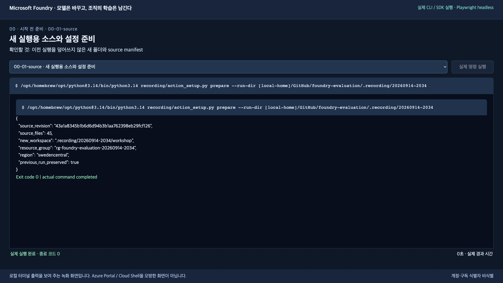
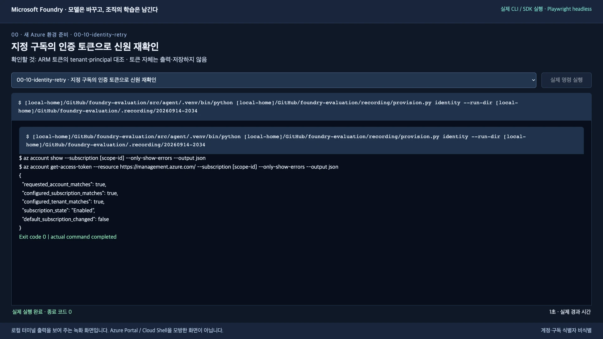
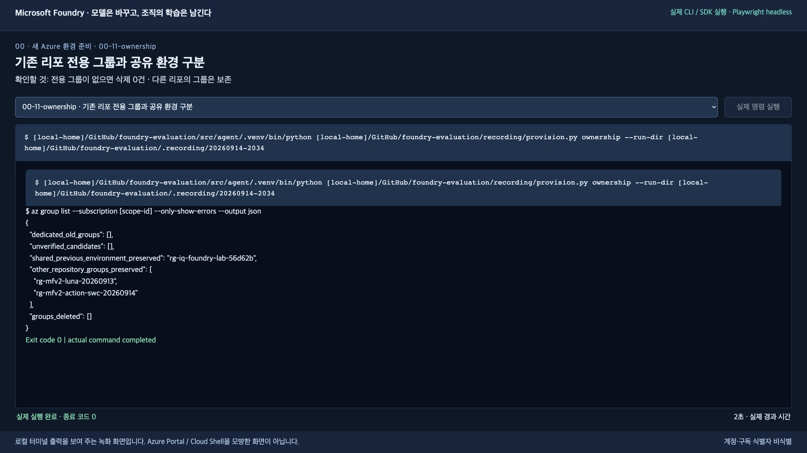
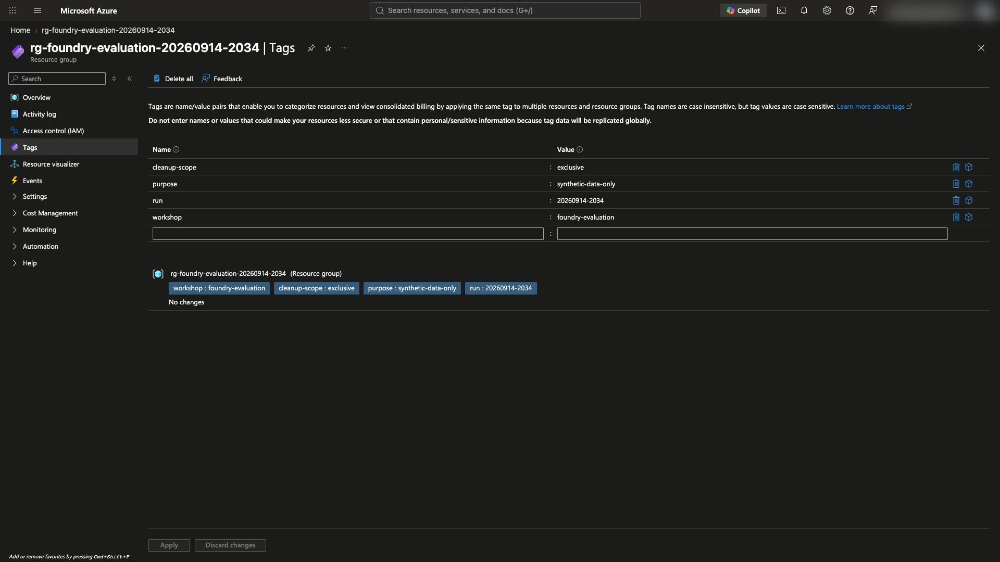
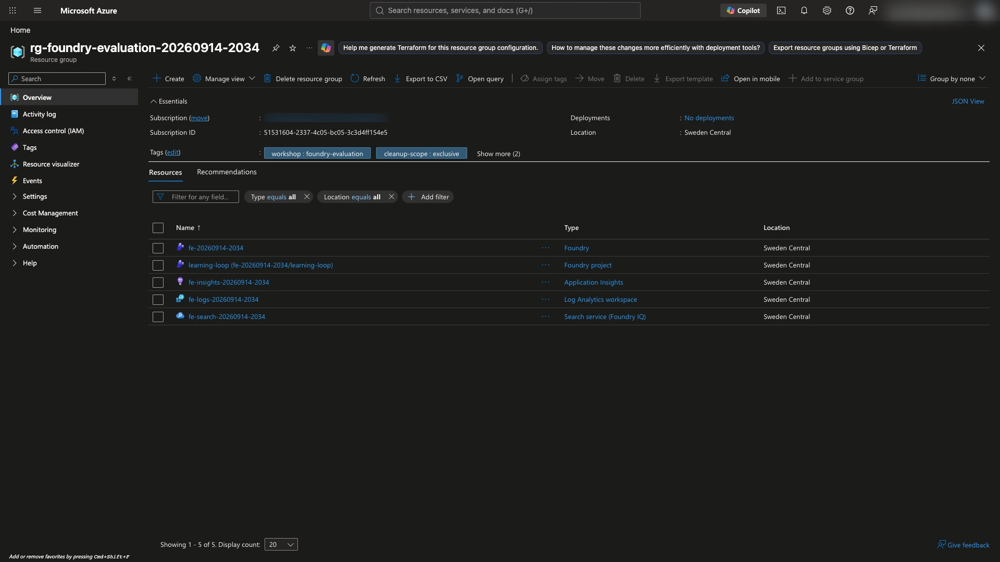
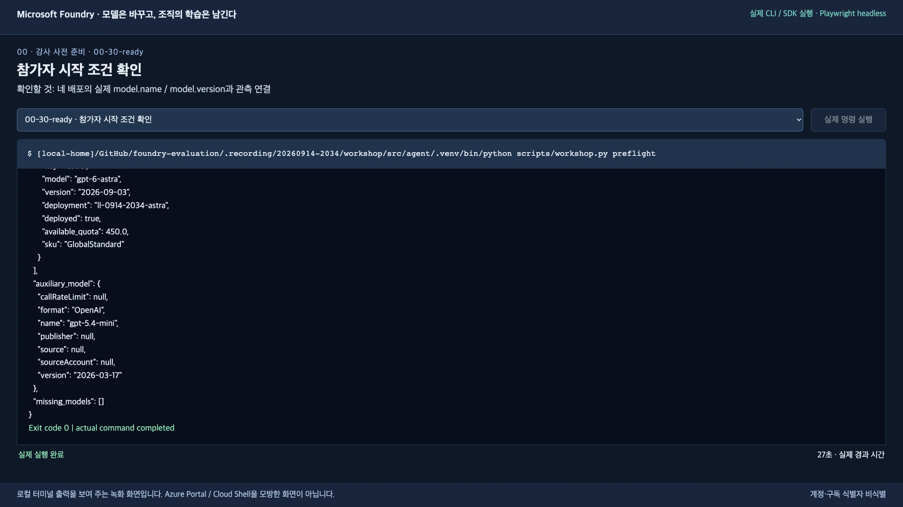
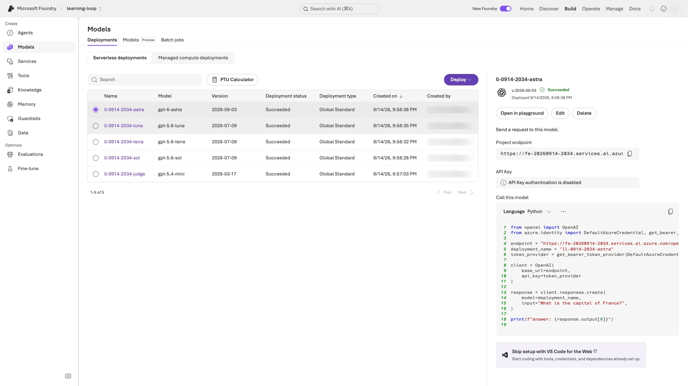

# 새 Azure 환경 준비하기 — 강사 또는 개인 실습

**목표:** Sweden Central에 실습 전용 그룹·Foundry·Search·관측·모델을 준비하고, 참가자에게 조별 `.env`를 전달합니다.
이미 준비된 환경을 받았다면 이 문서를 건너뛰고 [참가자 1단계](../README.ko.md#start)로 이동하세요.

Git, Python 3.13, Azure CLI, azd + `microsoft.foundry` 확장, Bash가 필요합니다. 도구 설치와 권한은 [강사 준비](instructor.ko.md)를 먼저 확인합니다.
아래는 **같은 Bash 터미널에서 한 블록씩** 실행합니다. 오류가 나면 다음 블록으로 넘어가지 않습니다.
혼자 실습한다면 본인이 환경 소유자를 맡습니다. [도구·권한 준비](instructor.ko.md#tools)를 먼저 마치고, 경로 변수와 로그인 프로필을 유지하도록 준비가 끝날 때까지 이 터미널을 열어 둡니다.

> 새 서비스에는 비용이 발생합니다. 합성 데이터만 사용하고, 공유 자원과 기본 Azure CLI 구독은 변경하지 않습니다.
> 서비스 위치가 Sweden Central이어도 **GlobalStandard 모델의 추론이 그 리전 안에만 머문다는 뜻은 아닙니다.**

## 1. 새 실행 폴더 준비

**할 일:** 이 도구는 Git commit으로 소스 버전을 확인하므로 ZIP이 아니라 **아직 실습하지 않은 Git clone**에서 실행합니다. 그런 폴더의 루트에 있지 않다면 먼저 아래를 실행합니다.

```bash
git clone https://github.com/junwoojeong100/foundry-evaluation.git foundry-evaluation-setup-ko &&
cd foundry-evaluation-setup-ko
```

편집기에서 `.env.example`을 복사해 **지금 폴더의 새 `.env`**로 저장합니다. `.env.txt`가 되거나 기존 설정을 덮어쓰지 않도록 합니다.
초기 ID는 승인된 계정으로 [Azure Portal](https://portal.azure.com/)에 로그인한 뒤 **Subscriptions → 해당 구독 → Overview**에서 구독 ID, **Microsoft Entra ID → Overview**에서 그 구독 디렉터리의 tenant ID를 확인합니다. 포털 로그인은 두 CLI 로그인과 별개입니다.

| 먼저 채울 값 | 내용 |
|---|---|
| `AZURE_SUBSCRIPTION_ID` | 강사가 승인한 실습 구독 |
| `AZURE_TENANT_ID` | 그 구독의 tenant |
| `AZURE_EXPECTED_USERNAME` | 직접 로그인할 계정 |
| `AZURE_RESOURCE_GROUP` | 조사할 이전 그룹 이름. 없으면 템플릿 표시 대신 **`AZURE_RESOURCE_GROUP=`**로 키를 남기고 값만 비움 |
| `LAB_LANGUAGE` | `ko` |

새 서비스 이름·endpoint·조별 기본 이름은 아래 도구가 **별도 폴더의 `.env`에 생성**합니다.
나머지는 `.env.example`의 설정을 유지합니다. 암호·API key·토큰은 넣지 않습니다.

```bash
python3.13 -m venv src/agent/.venv &&
source src/agent/.venv/bin/activate &&
python -m pip install -r requirements.lock.txt
```

**실행 ID는 여기서 한 번만 정합니다.** 아래에서 만든 `RUN_DIR`를 끝까지 사용합니다.
녹화에 나온 `20260914-2034`를 복사하거나 기존 실행 폴더를 재사용하지 않습니다.

```bash
REPO_ROOT="$(pwd)"
RUN_ID="$(date -u +%Y%m%d-%H%M%S)"
RUN_DIR="$REPO_ROOT/.workshop/$RUN_ID"
python scripts/prepare_environment.py init --run-dir "$RUN_DIR" --language ko &&
python scripts/prepare_environment.py prepare --run-dir "$RUN_DIR"
```

새 소스 폴더에 독립 가상환경을 만들고, Azure를 호출하기 전에 테스트합니다.

```bash
cd "$RUN_DIR/workshop" &&
python3.13 -m venv src/agent/.venv &&
source src/agent/.venv/bin/activate &&
python -m pip install -r requirements.lock.txt &&
python -m unittest discover -s tests -v
```

**완료 확인:** 테스트가 `OK`입니다. **`$RUN_DIR/source-manifest.json`**에 소스 revision·SHA-256이 있고 **`$RUN_DIR/workshop/.env`**에 `LAB_LANGUAGE=ko`와 새 이름이 있습니다. 이전 `.azure`·`.foundry`·결과·가상환경을 재사용하지 않았습니다.
**지금의 `$RUN_DIR/workshop` 폴더를 유지합니다.** 다음 로그인도 이 폴더에서 실행해야 이후 로컬 실습과 같은 CLI 캐시를 사용합니다.
이 스냅샷은 실행할 소스이며 가이드 복사본은 포함하지 않습니다. 가이드는 브라우저나 편집기에 계속 열어 둡니다.

<details>
<summary>녹화 예시 — 새 소스 폴더 확인</summary>



</details>

## 2. 로그인·소유권·용량 확인

**할 일:** 지금 폴더에서 [README 1-3의 로그인 절차](../README.ko.md#login)를 실행합니다.
실습용 CLI 경로 지정 → tenant·구독 입력 → `az login` → `azd auth login` → 두 계정 확인까지 마친 뒤 **이 문서로 돌아옵니다.**
기반 서비스가 아직 없으므로 README 1-4의 `preflight`·`bind`는 실행하지 않습니다. 로그인·암호·토큰은 녹화하지 않습니다.

이제 **원래 저장소 루트**로 돌아와 소유권과 용량을 확인합니다. 절대 경로로 지정한 `AZURE_CONFIG_DIR`는 그대로 유지되며, 3–5단계도 원래 루트에서 실행합니다.
`identity`는 설정한 구독·tenant·사용자를 ARM 토큰의 실제 principal과 대조하며 토큰을 저장하지 않습니다.

```bash
cd "$REPO_ROOT" &&
python scripts/provision_environment.py identity --run-dir "$RUN_DIR" &&
python scripts/provision_environment.py ownership --run-dir "$RUN_DIR" --preserve-existing &&
python scripts/provision_environment.py model-capacity --run-dir "$RUN_DIR"
```

**완료 확인:** 세 `matches` 값이 `true`, 구독은 `Enabled`이며 지정한 네 모델과 보조 모델의 용량 레코드가 있습니다.
각 Azure CLI 요청에는 설정한 구독이 명시됩니다. 실제 구독 할당량은 6단계의 `preflight`와 모델 준비에서 다시 확인합니다.

위 경로는 **`--preserve-existing`으로 기존 그룹을 모두 보존**하며 삭제하지 않습니다. 옵션 없이 실행하면 이전 후보를 발견했을 때 소유권 확인을 위해 중단할 수 있습니다. 어느 경로든 태그·이름만으로 다른 자원을 삭제하거나 오류를 무시하지 않습니다.

<details>
<summary>녹화 예시 — 계정 대조와 기존 그룹 보존</summary>




</details>

## 3. 새 전용 그룹과 서비스 생성

**할 일:** **`$RUN_DIR/config.json`**에 생성된 새 이름을 확인한 뒤 실행합니다. 같은 자원을 수동 `az ... create`로 한 번 더 만들지 않습니다.

```bash
python scripts/provision_environment.py group --run-dir "$RUN_DIR" &&
python scripts/provision_environment.py foundry --run-dir "$RUN_DIR" &&
python scripts/provision_environment.py project --run-dir "$RUN_DIR" &&
python scripts/provision_environment.py logs --run-dir "$RUN_DIR" &&
python scripts/provision_environment.py insights --run-dir "$RUN_DIR" &&
python scripts/provision_environment.py search --run-dir "$RUN_DIR"
```

**완료 확인:** Azure Portal의 **새 리소스 그룹 → Resources**에 Foundry 계정·프로젝트·Search·Application Insights·Log Analytics가 있습니다.
모두 새 그룹과 Sweden Central에 있어야 합니다. **Tags**에서 `workshop`, `cleanup-scope`, `run`을 대조합니다.
도구는 태그뿐 아니라 이번 실행의 실제 생성 기록도 요구합니다.

Search는 Basic 1 replica / 1 partition입니다. `semanticSearch`와 `knowledgeRetrieval`의 `free` 설정이 **Search 가동·모델 호출까지 무료라는 뜻은 아닙니다.**
Portal의 ARM **Deployments** 목록은 Foundry 모델 배포 목록과 다릅니다.

<details>
<summary>Search 대기 시간만 초과했다면 — 같은 자원 확인</summary>

실패한 대기 기록을 보존하고, 자원을 재생성하거나 리전을 바꾸지 않습니다.

```bash
python scripts/provision_environment.py search-status --run-dir "$RUN_DIR" &&
python scripts/provision_environment.py wait-search --run-dir "$RUN_DIR" &&
python scripts/provision_environment.py search-status --run-dir "$RUN_DIR"
```

같은 자원의 `provisioning_state: Succeeded`, `status: running`을 확인한 뒤 4단계로 진행합니다.

</details>

<details>
<summary>녹화 예시 — 전용 태그와 다섯 구성 자원</summary>




</details>

## 4. 필요한 권한과 연결 준비

**할 일:** 새 자원 범위에만 역할과 연결을 만듭니다. `user-*` 명령은 **2단계에서 검증한 사용자 한 명**에게 적용됩니다.
다른 참가자는 [강사의 권한 체크리스트](instructor.ko.md#권한)에 따라 별도로 준비합니다.

```bash
python scripts/provision_environment.py user-foundry --run-dir "$RUN_DIR" &&
python scripts/provision_environment.py user-model --run-dir "$RUN_DIR" &&
python scripts/provision_environment.py user-search-service --run-dir "$RUN_DIR" &&
python scripts/provision_environment.py user-search-data --run-dir "$RUN_DIR" &&
python scripts/provision_environment.py project-monitor --run-dir "$RUN_DIR" &&
python scripts/provision_environment.py insights-connection --run-dir "$RUN_DIR" &&
python scripts/provision_environment.py search-connection --run-dir "$RUN_DIR"
```

**완료 확인:** 사용자에게 새 프로젝트의 Foundry User, 새 계정의 OpenAI User, 새 Search의 작성·적재 역할이 있습니다.
프로젝트 identity에는 새 관측 자원의 Logs 읽기 권한이 있고, Search는 `AAD`, App Insights는 실제 `ResourceId` metadata를 가진 연결입니다.

**사용자·프로젝트 identity·agent instance identity는 다릅니다.**
배포 후 agent의 Search 읽기·모델 추론 역할은 [참가자 4단계](../README.ko.md#deploy)의 `grant-agent-access`에서 부여합니다. Owner를 일괄 추가하지 않습니다.

## 5. 보조 모델과 실제 endpoint 확인

**할 일:** 고정 planner/judge를 배포하고 Azure가 반환한 실제 endpoint를 새 실행 폴더에 반영합니다.

```bash
python scripts/provision_environment.py auxiliary --run-dir "$RUN_DIR" &&
python scripts/provision_environment.py ready --run-dir "$RUN_DIR"
```

**완료 확인:** 새 그룹·프로젝트·Search와 두 endpoint를 확인합니다. Project endpoint와 Azure OpenAI endpoint는 용도가 다릅니다.
보조 모델은 `gpt-5.4-mini` / `2026-03-17`이며 네 후보 모델 중 하나를 대신하지 않습니다.

## 6. 네 후보 준비 후 참가자에게 전달

**할 일:** 새 소스 폴더로 이동해 모델을 준비하고 judge를 점검합니다.

```bash
cd "$RUN_DIR/workshop" &&
source src/agent/.venv/bin/activate &&
python scripts/workshop.py preflight --allow-missing-models &&
python scripts/workshop.py prepare-models &&
python scripts/workshop.py preflight &&
python scripts/workshop.py calibrate
```

**완료 확인:** Sol/Terra/Luna/Astra의 고정 모델 ID·버전, `deployed: true`, `missing_models: []`, calibration 통과를 확인합니다.
Calibration 예제 2개는 본평가 64응답이 아닙니다. 모델 접근·할당량이 부족하면 다른 모델로 대체하지 않고 준비를 중단합니다.

**개인 실습·리허설은 `$RUN_DIR/workshop`에서 [README 1-4 프로젝트 연결](../README.ko.md#project-binding)로 이어갑니다.** 소스·완성된 `.env`·가상환경·CLI 로그인이 이미 있으므로 다시 clone하거나 1-1부터 반복하지 않습니다. Preflight 완료 기준을 확인한 뒤 bind합니다.
새 참가자 폴더에는 완성된 `.env`를 주되, **미사용 `LAB_PREFIX` / `LAB_AGENT_NAME`**을 조별로 지정합니다.
실제 모델 배포 이름은 유지하고 `.azure`·`.foundry` 소유권 파일·결과는 전달하지 않습니다.
자세한 전달 항목과 리허설 분리는 [강사 체크리스트](instructor.ko.md#참가자에게-전달할-것)를 따릅니다.

<details>
<summary>녹화 예시 — 후보 네 개와 별도 보조 배포</summary>




</details>

## 종료와 비용 관리

화면은 과거 `rg-foundry-evaluation-20260914-2034` 실행입니다. **내 run ID·이름·결과는 다릅니다.**

참가자의 `cleanup`은 그 폴더에서 소유한 agent·세션·모델·KB 객체·역할만 정리합니다.
**강사가 준비한 기반 서비스와 모델까지 모두 삭제하지 않습니다.** 남은 Search·로그 보존·보조 모델의 비용과 최종 정리는 강사가 별도로 관리합니다.

이후 실행은 [README](../README.ko.md), 점수와 개선의 해석은 [평가 방법과 개선 결과](validation.ko.md)를 따릅니다.

구성 근거: [공식 Foundry 기본 인프라 예제](https://github.com/Azure-Samples/azd-ai-starter-basic/tree/main/infra) · [Search knowledge retrieval 과금 설정](https://learn.microsoft.com/azure/search/agentic-retrieval-how-to-enable-disable).
