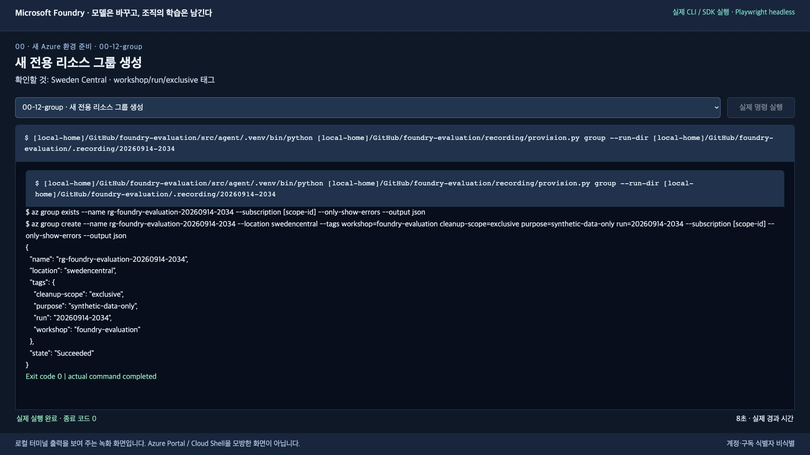
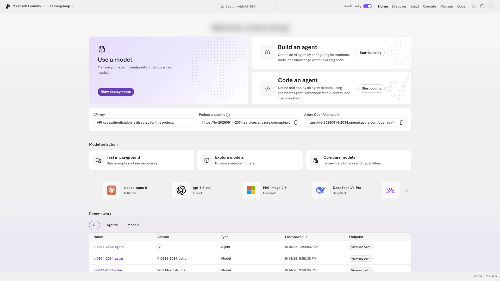
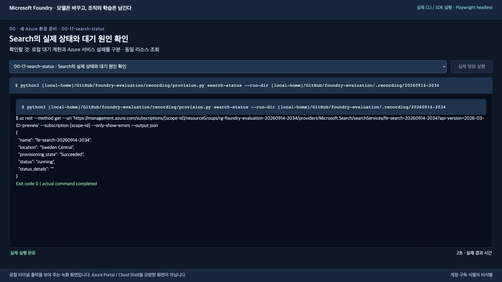

# 새 Azure 환경부터 시작하기

**참가자 120분에 앞서 강사가 준비하는 과정**입니다. 이미 준비된 조별 환경을 받았다면 [참가자 가이드](../README.md)의 시작 전 준비로 이동하세요.

이번 재실행은 `swedencentral`에 **새 전용 그룹과 새 서비스**를 만들었습니다. 기존 IQ 실습 환경과 다른 리포의 그룹은 재사용하거나 삭제하지 않았습니다.

| 구분 | 이번 실행 |
|---|---|
| 리소스 그룹 | `rg-foundry-evaluation-20260914-2034` |
| Foundry 계정 / 프로젝트 | `fe-20260914-2034` / `learning-loop` |
| Search | `fe-search-20260914-2034`, Basic, replica 1 / partition 1 |
| 관측 | 새 Log Analytics와 Application Insights |
| 후보 모델 | Sol / Terra / Luna / Astra, 기존 가이드의 모델·버전 유지 |
| 보조 모델 | `gpt-5.4-mini` / `2026-03-17`, 별도 planner/judge |
| 실행 분리 | `.recording/20260914-2034/workshop/`에 소스·설정·결과 분리 |

서비스 위치는 Sweden Central입니다. **GlobalStandard 모델의 추론까지 해당 리전 안에서만 처리된다는 뜻은 아닙니다.** 합성 데이터만 사용하며, 실제 운영에서는 데이터 처리 지역·비용·권한을 별도로 검토합니다.

## 1. 새 실행 폴더와 Python 환경

촬영 도구는 기존 소스를 새 폴더에 복사하고 파일별 SHA-256을 기록합니다. 이전 `.azure`, `.foundry`, `.venv`, 결과 파일을 새 실험에 섞지 않습니다.

아래 도구는 Python·Azure CLI·azd와 이 리포의 Python 의존성이 설치된 강사 환경에서 사용합니다. 입력은 이 리포의 `.env`에 설정한 계정·구독·tenant입니다. **다른 환경에서 재실행할 때는 새 run ID를 사용**하고, 이후 예제의 `20260914-2034`도 그 ID로 바꿉니다. 기존 실행 폴더는 덮어쓰지 않습니다.

```bash
python recording/action_setup.py init --run-dir .recording/<new-run-id>
python recording/action_setup.py prepare --run-dir .recording/<new-run-id>
```

새 소스 폴더에서 가상환경을 만들고 저장소의 고정 의존성을 설치합니다. 아래는 이번 실행 폴더의 예입니다.

```bash
cd .recording/20260914-2034/workshop
python3.13 -m venv src/agent/.venv
source src/agent/.venv/bin/activate
python -m pip install -r requirements.lock.txt
python -m unittest discover -s tests -v
cd ../../..
```


**화면 확인:** 새 실행 폴더, source revision, 파일 수를 확인합니다. 설치 전 가상환경의 패키지 확인에서 발생한 `ModuleNotFoundError`도 기록에 남겼으며, 고정 의존성 설치 후 검사를 통과했습니다. 이것을 Azure 서비스 실패로 집계하지 않습니다.

## 2. 계정 확인과 이전 자원의 소유권 조사

Azure CLI와 azd 로그인은 본인이 직접 완료합니다. 암호·토큰을 `.env`, 채팅, 녹화에 넣지 않습니다. `.env`의 구독·tenant·예상 사용자와 실제 인증 주체를 대조하고, **기본 Azure CLI 구독은 변경하지 않습니다.**

`recording/provision.py`는 모든 Azure CLI 요청에 설정된 구독을 명시합니다. `identity`는 해당 구독으로 발급받은 ARM 토큰의 tenant와 principal도 대조하며, 토큰 자체를 출력하거나 저장하지 않습니다.

```bash
python recording/provision.py identity --run-dir .recording/20260914-2034
python recording/provision.py ownership --run-dir .recording/20260914-2034
```


**화면 확인:** 세 `matches` 값과 구독의 `Enabled` 상태를 읽습니다. 이름이 비슷한 계정을 선택한 것만으로 통과하지 않습니다.


**화면 확인:** 이번에는 `dedicated_old_groups`가 비어 있어 **기존 그룹 삭제는 0건**입니다. 이전 `rg-iq-foundry-lab-56d62b`는 공유 환경이며, `microsoft-foundry-v2-labs`의 두 그룹도 다른 리포의 자원이므로 보존했습니다. `.env`에 적혀 있다는 이유만으로 그룹 전체를 삭제하지 않습니다.

## 3. 새 리소스 그룹 생성

이하 환경 준비 명령은 원래 저장소 루트에서 실행합니다. 촬영용 `config.json`에 기록한 새 이름만 사용하며, 생성 기록과 소유권 태그가 없는 그룹은 수정하지 않습니다.

```bash
python recording/provision.py group --run-dir .recording/20260914-2034
```

실제로 실행되는 Azure CLI의 핵심 형태는 다음과 같습니다. `<...>`는 강사가 확인한 값으로 바꿉니다.

```bash
az group create \
  --subscription "<configured-subscription>" \
  --name "<new-dedicated-group>" \
  --location swedencentral \
  --tags workshop=foundry-evaluation cleanup-scope=exclusive \
    purpose=synthetic-data-only run="<new-run-id>"
```




**화면 확인:** `workshop`, `cleanup-scope`, `run`을 함께 봅니다. 태그만 붙이면 공유 자원을 삭제할 권한이 생기는 것은 아닙니다. 이 도구는 **이번 실행의 생성 기록도 함께 요구**합니다.

## 4. Foundry·Search·관측 서비스 생성

```bash
python recording/provision.py foundry --run-dir .recording/20260914-2034
python recording/provision.py project --run-dir .recording/20260914-2034
python recording/provision.py logs --run-dir .recording/20260914-2034
python recording/provision.py insights --run-dir .recording/20260914-2034
python recording/provision.py search --run-dir .recording/20260914-2034
```


**화면 확인:** 계정, 프로젝트, Search, Application Insights, Log Analytics가 **모두 새 그룹과 Sweden Central에 있는지** 확인합니다. 여기의 `Deployments / No deployments`는 ARM 템플릿 배포 이력이며, Foundry의 모델 배포 개수를 뜻하지 않습니다.



**화면 확인:** Project endpoint와 Azure OpenAI endpoint는 다릅니다. API key 인증이 비활성화된 상태를 확인했고, 이 가이드는 Entra 인증을 사용했습니다. 화면의 카탈로그 추천 모델을 이번 네 후보의 대체물로 선택하지 않습니다.

Search의 `semanticSearch`와 `knowledgeRetrieval`은 서로 다른 설정입니다. 이번 작은 합성 실습에서는 둘 다 `free`로 명시했습니다. **Search Basic 서비스의 가동 비용이나 planner/judge 모델 호출까지 무료라는 뜻은 아닙니다.**

### Search가 오래 준비 중이면

이번에는 최초 대기 명령의 15분 제한에 도달한 뒤에도 Azure가 `Provisioning`을 반환했습니다. 실패한 대기 시도를 보존하고, 자원을 재생성하거나 다른 리전으로 바꾸지 않았습니다.

```bash
python recording/provision.py search-status --run-dir .recording/20260914-2034
python recording/provision.py wait-search --run-dir .recording/20260914-2034
```



**화면 확인:** `provisioning_state: Succeeded`, `status: running`을 구분해 읽습니다. 로컬 대기 시간 초과는 서비스의 최종 실패 판정이 아닙니다. 이후 명령으로 **같은 리소스 ID의 상태를 다시 확인**해야 합니다.

## 5. 필요한 권한과 연결만 준비

```bash
python recording/provision.py user-foundry --run-dir .recording/20260914-2034
python recording/provision.py user-model --run-dir .recording/20260914-2034
python recording/provision.py user-search-service --run-dir .recording/20260914-2034
python recording/provision.py user-search-data --run-dir .recording/20260914-2034
python recording/provision.py project-monitor --run-dir .recording/20260914-2034
python recording/provision.py insights-connection --run-dir .recording/20260914-2034
python recording/provision.py search-connection --run-dir .recording/20260914-2034
```

| 주체 | 권한 / 연결 | 범위 |
|---|---|---|
| 참가자 | Foundry User | 새 프로젝트 |
| 참가자 | Cognitive Services OpenAI User | 새 Foundry 계정 |
| 지식 적재 담당자 | Search Service Contributor + Search Index Data Contributor | 새 Search |
| 프로젝트 identity | Log Analytics Reader | 새 App Insights / Logs |
| Foundry → Search | `AAD` 연결 | 새 Search |
| Foundry → App Insights | 연결 문자열과 실제 `ResourceId` metadata | 새 App Insights |

**사용자, 프로젝트 identity, 배포 후 생기는 agent instance identity는 다릅니다.** 마지막 주체의 Search 읽기·모델 추론 권한은 [실습 B](../README.md#6-실습-b--python-에이전트를-hosted-agent로-배포)의 `grant-agent-access`에서 따로 부여합니다.

## 6. 모델을 확인하고 준비

```bash
python recording/provision.py model-capacity --run-dir .recording/20260914-2034
python recording/provision.py auxiliary --run-dir .recording/20260914-2034
python recording/provision.py ready --run-dir .recording/20260914-2034
```

새 소스 폴더로 이동한 뒤 네 후보를 준비합니다.

```bash
cd .recording/20260914-2034/workshop
source src/agent/.venv/bin/activate
python scripts/workshop.py preflight --allow-missing-models
python scripts/workshop.py prepare-models
python scripts/workshop.py bind
python scripts/workshop.py preflight
python scripts/workshop.py calibrate
```


**화면 확인:** 네 후보의 실제 모델 ID·버전, `deployed: true`, 빈 `missing_models`를 확인합니다. 별도 보조 모델을 후보 중 하나의 대체물로 사용하지 않습니다. Calibration의 고정 예제 2개도 본평가 64응답과 구분합니다.

이후 [참가자 가이드의 실습 A](../README.md#5-실습-a--조직의-기억을-foundry-iq에-넣기)로 진행합니다.

## 근거와 비용 경계

구성은 [공식 Foundry 기본 인프라 예제](https://github.com/Azure-Samples/azd-ai-starter-basic/tree/main/infra)와 [Search의 knowledge retrieval 과금 설정](https://learn.microsoft.com/azure/search/agentic-retrieval-how-to-enable-disable)을 참고했습니다. 서비스와 SDK/API의 GA·Preview 상태를 같은 것으로 표현하지 않습니다.

실습 마지막의 `cleanup`은 이 실행에서 추적한 agent·세션·네 후보 배포·KB 객체와 역할을 정리합니다. **기반 서비스까지 모두 없어진다는 뜻은 아닙니다.** 남은 새 Search, 관측 보존, Foundry 및 보조 모델의 상태와 실제 실행 한계는 [검증 보고서](validation.ko.md)에서 따로 확인합니다.

이번 구독에서는 자동 경보/거버넌스 관련 ARM 이력에 `MissingSubscriptionRegistration`과 `ResourceNotFound`도 남았습니다. 실제 실행·평가·정리와 별도로 기록했으며 공유 구독 설정을 임의로 수정하지 않았습니다. 따라서 새 환경의 모든 운영 거버넌스까지 준비됐다는 주장으로 해석하지 않습니다.
