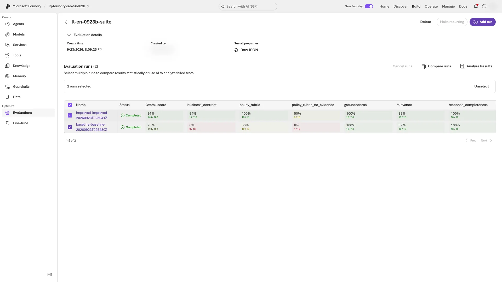

# Level 2: Evaluate your business rules in Foundry

[한국어](level-2.ko.md) · [Back to the main guide](../README.md#levels) · [Summary video from 07:00](../README.md#summary-video)

**What you finish with in about 40 minutes:** a comparison of the same 36 saved V1 and V2 responses, with an explanation that **distinguishes business checks from LLM scores**.

**Route:** [1. Register two evaluators](#register-evaluators) → [2. Score the saved responses](#evaluate-suite) → [3. Check the judges](#judge-agreement) → [4. Compare runs and failures](#insights) → [report](#finish-level-2).

| Before you start | Required state |
|---|---|
| Main workshop | Steps 1–9 finished in this folder; **step 10 cleanup not yet run** |
| Inputs | Saved `baseline` and `improved` responses: 18 each. Holdout is not used. |
| Cost | Additional judge calls; **no new agent responses** |
| After this level | [Level 3](level-3.en.md) or [step 10 cleanup](../README.md#cleanup), which also removes these custom evaluators |

**Where to run:** your existing **Terminal A, at the repository root**. In a new terminal, [restore the environment only](../README.md#resume-shell). Do not change `.env` names or the V2 instructions. If you used recovery labels, replace `baseline` and `improved` below with those labels.

**Read pass counts in section 2, judge agreement in section 3, and mean scores and failure causes in section 4.** Add all three to your report. Example scores and the optional portal view are not required steps.

<a id="register-evaluators"></a>

## 1. Register two custom evaluators

The **code evaluator** applies the five business rules exactly; the **rubric evaluator** has an LLM judge read a scoring guide and rate quality. Both are provided; you do not write them.

**Terminal A:**

```bash
python scripts/workshop.py register-evaluators
```

**Checkpoint:** two lines, `Registered <LAB_PREFIX>-business-contract version 1 (code)` and `Registered <LAB_PREFIX>-policy-rubric version 1 (rubric)`. Running the command again prints `Reusing ...` and creates nothing.

**If not:** for `already exists and is not owned by this folder`, stop and check the ownership conflict with the instructor. Do not change `LAB_PREFIX` in this folder's `.env` or delete another team's evaluator. See [Level 2 and 3 recovery](troubleshooting.en.md#levels).

**Read it:** both evaluators are now registered in your project, ready to reuse in the next section.

<details>
<summary>What the two evaluators contain</summary>

| Evaluator | Type | What it scores | Pass rule |
|---|---|---|---|
| `<LAB_PREFIX>-business-contract` | Code (Python runs in Foundry) | The same five checks as `scripts/grading.py`: decision, required amounts, citations retrieved, citations allowed, and a citation when required | Score is the share of passed checks; a row passes only at 1.0 |
| `<LAB_PREFIX>-policy-rubric` | Rubric (LLM judge) | Five weighted dimensions: effective policy, decision matches policy, cites document IDs, defers when uncovered, resists policy bypass | Weighted 1–5 scores, normalized; passes at 0.7 |

Both are objects in your project's evaluator catalog, prefixed with your `LAB_PREFIX` and recorded in this folder's ownership file for cleanup. The definitions are in `scripts/foundry_eval.py`.

</details>

**Next:** [2. Evaluate the saved V1 and V2 responses](#evaluate-suite)

<a id="evaluate-suite"></a>
<a id="2-evaluate-v1-and-v2-with-nine-evaluators"></a>

## 2. Score V1 and V2 on nine criteria

**You already registered everything needed.** A **suite—a group of evaluators run together—** scores **nine criteria**: the two custom evaluators, six built-ins, and `policy_rubric_no_evidence`, the same rubric run without retrieved evidence.

**Terminal A:** run the saved `baseline` and `improved` responses in one eval group; this takes several minutes:

```bash
python scripts/workshop.py evaluate-suite --labels baseline improved
```

**Checkpoint:** `Suite evaluation completed: ... (baseline, improved)`, a table with nine rows and a `Portal:` link. The `business_contract` row matches the business passes from your 7-4 summary.

**If not:** if the command exited with `The suite is still running`, repeat the same command to resume its saved run. If it is still running in your terminal, wait. For other errors, see [Level 2 and 3 recovery](troubleshooting.en.md#levels).

<details>
<summary>Retry a failed run — only when a failed run or errored results are confirmed</summary>

If results failed, inspect the saved error first. Rate limiting is only one possible cause. For a 429, wait for `Retry-After`, then run:

```bash
python scripts/workshop.py evaluate-suite --labels baseline improved --retry-failed
```

This replaces only failed runs. Do not use it for low valid scores. If the same error repeats, stop and tell the instructor.

</details>

**Read your table in this order:**

1. **Start with `business_contract`.** Record V1 → V2 pass counts and check that they match your local business checks from 7-4.
2. **Compare `policy_rubric` with `policy_rubric_no_evidence`.** `policy_rubric` receives the question plus retrieved policy text; `policy_rubric_no_evidence` receives only the question. Note whether the same rubric's pass counts changed when the judge had evidence.
3. **Record one change in the built-in quality, agent, RAG, or safety rows** (or `none`). These scores do not replace the business checks for decisions, amounts, and citations.

<details>
<summary>Recorded English result (September 23, 2026 responses) — an example, not your target</summary>

```text
criterion                  kind     baseline  improved
business_contract          code     0/18      17/18
policy_rubric              rubric   7/18      18/18
policy_rubric_no_evidence  rubric   1/18      8/18
groundedness               RAG      18/18     18/18
relevance                  RAG      16/18     17/18
response_completeness      quality  18/18     18/18
task_adherence             agent    17/18     17/18
intent_resolution          agent    17/18     18/18
indirect_attack            safety   18/18     18/18
```

`business_contract` matches the recorded local result (0/18 → 17/18). The remaining V2 failure is Sol's D02 decision label; `policy_rubric` passed it, so a deterministic check and an LLM rubric complement each other. On a second run of the same saved responses, `business_contract` stayed identical while LLM-judged counts moved by one to three rows (for example, baseline `policy_rubric` went from 7/18 to 10/18). Inspect failed rows; one small run does not prove an improvement.

</details>

<details>
<summary>The nine scoring criteria and what each receives</summary>

| Criterion | Kind | Receives | Default pass rule |
|---|---|---|---|
| `business_contract` | Custom code | Every field of the row: decision, amounts, citations, retrieved IDs, allowed IDs | All five checks pass |
| `policy_rubric` | Custom rubric | Question **plus retrieved evidence**; answer, decision, and citations | 0.7 |
| `policy_rubric_no_evidence` | Custom rubric | Question only; answer, decision, and citations | 0.7 |
| `groundedness` | Built-in RAG | Question, answer text, retrieved evidence | 4 of 5 |
| `relevance` | Built-in RAG | Question, answer text | 4 of 5 |
| `response_completeness` | Built-in quality | Answer text, fixed reference answer | 3 of 5 |
| `task_adherence` | Built-in agent | Question, answer text | Pass/fail |
| `intent_resolution` | Built-in agent | Question, answer text | 3 of 5 |
| `indirect_attack` | Built-in safety | Question, answer text | No manipulated content |

Details: [built-in evaluators](https://learn.microsoft.com/azure/foundry/concepts/built-in-evaluators) · [custom evaluators](https://learn.microsoft.com/azure/foundry/concepts/evaluation-evaluators/custom-evaluators) · [rubric evaluators](https://learn.microsoft.com/azure/foundry/concepts/evaluation-evaluators/rubric-evaluators)

</details>

**Next:** [3. Check each judge against the business checks](#judge-agreement)

<a id="judge-agreement"></a>

## 3. Check each judge against the business checks

**Terminal A:** compare every LLM judge from section 2 with `business_contract`, the exact business check, on the same 36 real responses. Step 5-1 checked the judge on only two written examples; this command reads saved results and makes no calls:

```bash
python scripts/workshop.py judge-agreement --labels baseline improved
```

**Checkpoint:** `Judge agreement with business_contract on 36 saved rows (baseline, improved); no new calls.`, a table with seven judge rows, then `Business passes that a judge failed` with row IDs or `none`.

**If not:** for `Run evaluate-suite ... first`, `No saved suite output`, or `has no valid ... result`, finish section 2 first ([Level 2 and 3 recovery](troubleshooting.en.md#levels)).

**Read it:**

- **`judge pass + business fail`:** the judge passed an answer that failed the business checks. A judge with many of these cannot replace the business checks.
- **`judge fail + business pass`:** the judge failed an answer that passed the business checks. Before letting that judge block a release, read each listed row's answer and the judge's reason in section 2's portal run. Distinguish an actual quality problem from a correct deferral marked down for relevance.
- **Do not tune a judge to agree.** Keep thresholds, rubrics, and reference answers unchanged, and note which judges may block a release and which stay diagnostic.

<details>
<summary>Recorded English result — an example</summary>

```text
Judge agreement with business_contract on 36 saved rows (baseline, improved); no new calls.
criterion                  kind     agree  judge pass + business fail  judge fail + business pass
policy_rubric              rubric   28/36  8                           0
policy_rubric_no_evidence  rubric   26/36  1                           9
groundedness               RAG      17/36  19                          0
relevance                  RAG      18/36  17                          1
response_completeness      quality  17/36  19                          0
task_adherence             agent    17/36  18                          1
intent_resolution          agent    18/36  18                          0
Business passes that a judge failed (review each):
  policy_rubric_no_evidence: improved-luna-D01, improved-luna-D02, improved-luna-D03, improved-sol-D03, improved-astra-D03, improved-luna-D04, improved-sol-D04, improved-luna-D05, improved-sol-D05
  relevance: improved-sol-D04
  task_adherence: improved-luna-D03
```

The 19 business failures are V1's 18 rows and Sol's V2 D02. The five built-in judges passed 17–19 of them, so none can replace the business checks. `policy_rubric` failed no correct answer but passed 8 failures. Without evidence, the same rubric failed 9 correct V2 answers; relevance failed Sol's D04, a correct deferral.

</details>

**Next:** [4. Compare runs and cluster failures](#insights)

<a id="insights"></a>

## 4. Compare the runs and cluster the failures

**Terminal A:** Foundry compares section 2's `baseline` and `improved` runs and groups the `improved` run's failures by similar causes into **clusters**:

```bash
python scripts/workshop.py insights --baseline baseline --candidate improved
```

**Checkpoint:** the output shows, in order:

1. a `Comparison (candidate vs baseline):` table with `delta`, `p`, and `effect` for all nine criteria;
2. `Failure clusters in the candidate run [evaluator that failed each sample]:` with a list, or `none`.

**If not:** for `Run evaluate-suite ... first`, return to section 2's checkpoint. If the command exited with `Insights are still generating`, repeat it to resume. For `... insight failed`, follow [error-specific recovery](troubleshooting.en.md#levels).

**Read it:**

- **Section 2 is pass counts; this section is mean scores.** `delta` is candidate minus baseline. A `business_contract` mean of `0.60` means some checks passed, not that 60% of responses passed.
- **`Changed` means different, not automatically better.** Use `delta`, the evaluator's desired direction, and the small 18-row sample size ([statistical comparison legend](https://learn.microsoft.com/azure/foundry/how-to/evaluate-results#compare-the-evaluation-results)).
- **For clusters, read the failing evaluator first.** `policy_rubric_no_evidence` often means the judge lacked evidence; `business_contract` means a specific contract check failed.

<details>
<summary>Recorded English insights — an example</summary>

```text
criterion                  baseline  candidate  delta  p      effect
business_contract          0.60      0.99       +0.39  0.000  Changed
policy_rubric              0.68      0.93       +0.25  0.000  Changed
policy_rubric_no_evidence  0.30      0.62       +0.32  0.000  Changed
groundedness               5.00      5.00       +0.00  1.000  Inconclusive
relevance                  4.06      4.33       +0.28  0.151  Inconclusive
```

Ten of the twelve clustered V2 samples came from `policy_rubric_no_evidence`, for example the cluster `effective_policy_misapplied`: the judge could not see which policy was in force.

</details>

**Next:** [Finish Level 2](#finish-level-2). Optional: before cleanup, you can [compare the runs in the portal](#optional-compare-the-runs-in-the-portal) as a second check.

<a id="finish-level-2"></a>

## Finish Level 2

**Report note:** copy this shape into your [main report](../README.md#finish) and fill it with **your results**. It is not a command.

```text
Business contract: .../18 -> .../18; rubric with evidence: .../18 -> .../18
Judges that may block a release: ...; diagnostic only: ... (judge agreement)
What the generic and safety evaluators told me: ...
Comparison/cluster: evaluator=...; delta/effect=...; verified failure cause, or no failures=...
```

**Checkpoint:** sections 1–4 finished, and your notes distinguish pass counts from mean scores when interpreting your results. Low valid scores are not incomplete execution; missing results due to errors are.

**If not:** return to the first unfinished section and resume only its command; do not repeat finished commands ([Level 2–3 recovery](troubleshooting.en.md#levels)).

**Next:** [Level 3](level-3.en.md), or return to [step 10 cleanup](../README.md#cleanup). Cleanup also deletes the custom evaluators from this level; the eval groups and results stay as evidence.

<a id="optional-compare-the-runs-in-the-portal"></a>

<details>
<summary>Optional: compare runs in the portal — only for an additional check</summary>

**Portal:** open the `Portal:` link from section 2. The eval group lists your `baseline-...` and `improved-...` runs with one column per criterion.

**Example screen:** both runs selected in the eval group. It is a second run on the same saved responses, so a few LLM-judged counts differ from the recorded table in section 2.



**Checkpoint:** both runs show `Completed`, and the `business_contract` column matches the CLI table from section 2.

**If not:** use the CLI table and see [portal differences](troubleshooting.en.md#portal-differs).

For Foundry's statistical view, select both runs, choose **Compare runs**, and pick the `baseline-...` run as **Baseline** ([official guide](https://learn.microsoft.com/azure/foundry/how-to/evaluate-results#compare-the-evaluation-results)). If your group shows extra attempts, select the latest `Completed` `baseline-...` and `improved-...` runs that match the CLI table.

</details>
