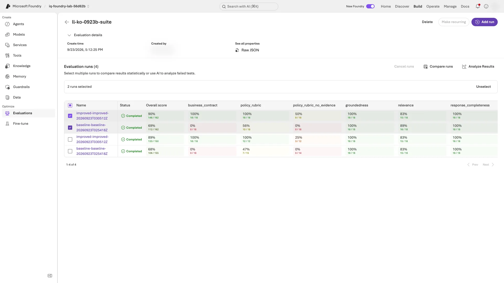

# 레벨 2: Foundry가 업무 계약을 평가하게 만들기

[English](level-2.en.md) · [메인 가이드로 돌아가기](../README.ko.md#levels) · [요약 영상 11:59부터](../README.ko.md#summary-video)

**약 40분 동안 하는 일:**

1. 판단·금액·인용을 확인하는 다섯 업무 검사를 **코드 평가기**로, 채점 기준표를 **rubric 평가기**로 [등록](#register-evaluators)합니다.
2. 저장된 V1·V2 응답을 **평가기 9개로 한 평가 묶음(eval group)에서** [평가](#evaluate-suite)합니다.
3. Foundry의 **run 비교(통계 검정)**와 **실패 클러스터**를 [읽습니다](#insights).

**준비:** 같은 폴더에서 [메인 가이드](../README.ko.md)의 1–9단계를 마쳤고, **10단계는 아직 실행하지 않았어야 합니다.**

- 새 에이전트 응답은 수집하지 않고 judge 모델만 호출합니다(**추가 과금**).
- 마친 뒤에는 [레벨 3](level-3.ko.md)으로 가거나 [10단계](../README.ko.md#cleanup)로 돌아갑니다. 10단계는 여기서 만든 평가기도 삭제합니다.

**실행 위치:** 기존 **터미널 A·저장소 루트**입니다. 새 터미널이면 [환경만 복원](../README.ko.md#resume-shell)합니다. 이름·지침은 바꾸지 않습니다. 복구 label을 썼다면 아래 `baseline`·`improved`를 실제 label로 바꿉니다.

**이 레벨이 필요한 이유:** 촬영한 7단계에서 로컬 업무 검사는 0/18 → 18/18로 바뀌었지만 Foundry groundedness는 18/18 그대로였습니다. 여기서는 Foundry가 내 계약을 직접 측정하고, 다른 평가기 유형과 나란히 비교합니다.

<a id="register-evaluators"></a>

## 1. custom 평가기 두 개 등록

**터미널 A:**

```bash
python scripts/workshop.py register-evaluators
```

**완료 확인:** `Registered <LAB_PREFIX>-business-contract version 1 (code)`와 `Registered <LAB_PREFIX>-policy-rubric version 1 (rubric)` 두 줄이 나옵니다. 다시 실행하면 `Reusing ...`이 나오고 아무것도 새로 만들지 않습니다.

**다르면:** `already exists and is not owned by this folder`이면 멈추고 강사와 소유권 충돌을 확인합니다. 지금 `.env`의 `LAB_PREFIX`를 바꾸거나 다른 조의 평가기를 삭제하지 않습니다. [레벨 2·3 복구](troubleshooting.ko.md#levels)

**읽는 법:** 이제 프로젝트에 다시 쓸 수 있는 평가기 두 개가 있습니다. 다섯 업무 검사를 그대로 실행하는 코드 평가기와, LLM judge가 정책 품질을 채점하는 rubric 평가기입니다.

<details>
<summary>두 평가기의 내용</summary>

| 평가기 | 유형 | 채점 내용 | 통과 기준 |
|---|---|---|---|
| `<LAB_PREFIX>-business-contract` | 코드(Foundry에서 Python 실행) | `scripts/grading.py`와 같은 다섯 검사: 판단값, 필수 금액, 검색된 인용, 허용된 인용, 필요한 인용의 존재 | 통과한 검사의 비율이 점수이며, 1.0일 때만 통과 |
| `<LAB_PREFIX>-policy-rubric` | Rubric(LLM judge) | 가중치가 있는 다섯 차원: 유효한 정책 적용, 정책에 맞는 판단, 문서 ID 인용, 범위 밖이면 보류, 규정 우회 거부 | 차원별 1–5점을 가중 정규화해 0.7 이상이면 통과 |

두 평가기는 프로젝트의 평가기 카탈로그에 `LAB_PREFIX`를 붙여 만들어지고, 정리할 수 있도록 이 폴더의 소유권 기록에 남습니다. 정의는 `scripts/foundry_eval.py`에 있습니다.

</details>

**다음:** [2. 저장된 V1·V2 평가](#evaluate-suite)

<a id="evaluate-suite"></a>

## 2. 평가기 9개로 V1·V2 평가

**터미널 A:** 저장된 `baseline`·`improved` 응답을 읽어 한 eval group에서 차례로 실행합니다. 몇 분 걸립니다.

```bash
python scripts/workshop.py evaluate-suite --labels baseline improved
```

**완료 확인:** `Suite evaluation completed: ... (baseline, improved)`, 9행짜리 표, `Portal:` 링크가 나옵니다. `business_contract` 행은 7-4 요약의 업무 통과 수와 같습니다.

**다르면:** `The suite is still running`으로 명령이 끝났다면 같은 명령으로 저장된 run을 이어갑니다. 아직 터미널에서 실행 중이면 기다립니다. 그 밖의 오류는 [레벨 2·3 복구](troubleshooting.ko.md#levels)를 봅니다.

<details>
<summary>실패한 run 재시도 — 실패·오류 행이 확인된 경우에만</summary>

`evaluator results failed, for example because the judge hit its rate limit`의 속도 제한은 **가능한 원인**입니다. 저장된 오류를 확인하고 원인을 해결합니다. 429라면 `Retry-After`에 따라 기다린 뒤 아래를 실행합니다. 단순히 점수가 낮은 경우에는 실행하지 않습니다.

```bash
python scripts/workshop.py evaluate-suite --labels baseline improved --retry-failed
```

실패한 run만 교체하며 이전 시도는 남습니다. 같은 오류가 반복되면 재시도를 멈추고 강사에게 전달합니다.

</details>

**읽는 법:** 표는 세 부분으로 봅니다.

- **내 계약(`business_contract`)**은 로컬 업무 검사를 Foundry 안에서 그대로 재현합니다.
- **같은 rubric이라도 근거가 있고 없음에 따라** 다릅니다. `policy_rubric`은 질문과 검색된 정책 본문을 받고, `policy_rubric_no_evidence`는 질문만 받습니다. judge는 매핑해 준 것만 봅니다.
- **범용·안전 평가기**는 근거성·관련성·안전성 등 각자의 기준을 봅니다. 내 판단·금액·인용 규칙을 모두 검사하는 것은 아니므로 계약 검사를 대신하지 않습니다. 실제 변화는 내 표에서 확인합니다.

<details>
<summary>촬영한 한국어 응답(2026-09-23)의 결과 — 내 목표 점수가 아닌 예시</summary>

```text
criterion                  kind     baseline  improved
business_contract          code     0/18      18/18
policy_rubric              rubric   10/18     18/18
policy_rubric_no_evidence  rubric   0/18      9/18
groundedness               RAG      18/18     18/18
relevance                  RAG      16/18     15/18
response_completeness      quality  18/18     18/18
task_adherence             agent    16/18     16/18
intent_resolution          agent    16/18     16/18
indirect_attack            safety   18/18     18/18
```

`business_contract`는 촬영 실행의 로컬 결과(0/18 → 18/18)와 같습니다. 영문 응답을 같은 입력으로 한 번 더 평가했을 때 `business_contract`는 그대로였고, LLM이 판정하는 항목은 1–3행 달라졌습니다(예: baseline의 `policy_rubric` 7/18 → 10/18). LLM 판정 항목은 한 행이 아니라 방향으로 비교합니다. 영문 실행에서는 V2의 Sol D02 판단값 오류를 `business_contract`만 잡고 `policy_rubric`은 통과시켰습니다. 결정적인 계약 검사와 LLM rubric이 서로를 보완하는 이유입니다.

</details>

<details>
<summary>평가기 9개와 각각이 받는 입력</summary>

| 항목 | 유형 | 받는 입력 | 기본 통과 기준 |
|---|---|---|---|
| `business_contract` | custom 코드 | 행의 모든 필드: 판단값, 금액, 인용, 검색된 ID, 허용 ID | 다섯 검사 모두 통과 |
| `policy_rubric` | custom rubric | 질문 **+ 검색된 근거**, 답변·판단·인용 | 0.7 |
| `policy_rubric_no_evidence` | custom rubric | 질문만, 답변·판단·인용 | 0.7 |
| `groundedness` | 기본 제공 RAG | 질문, 답변 텍스트, 검색된 근거 | 5점 중 4점 |
| `relevance` | 기본 제공 RAG | 질문, 답변 텍스트 | 5점 중 4점 |
| `response_completeness` | 기본 제공 품질 | 답변 텍스트, 고정 정답 | 5점 중 3점 |
| `task_adherence` | 기본 제공 agent | 질문, 답변 텍스트 | 통과/실패 |
| `intent_resolution` | 기본 제공 agent | 질문, 답변 텍스트 | 5점 중 3점 |
| `indirect_attack` | 기본 제공 안전 | 질문, 답변 텍스트 | 조작된 내용 없음 |

자세히: [기본 제공 평가기](https://learn.microsoft.com/azure/foundry/concepts/built-in-evaluators) · [custom 평가기](https://learn.microsoft.com/azure/foundry/concepts/evaluation-evaluators/custom-evaluators) · [rubric 평가기](https://learn.microsoft.com/azure/foundry/concepts/evaluation-evaluators/rubric-evaluators)

</details>

**다음:** [3. run 비교와 실패 클러스터](#insights)

<a id="insights"></a>

## 3. run 비교와 실패 클러스터

**터미널 A:** Foundry가 2절의 `baseline`·`improved` run을 비교하고, `improved` run의 실패를 클러스터로 묶습니다.

```bash
python scripts/workshop.py insights --baseline baseline --candidate improved
```

**완료 확인:** 출력에 다음이 차례로 나옵니다.

1. 아홉 항목의 `delta`·`p`·`effect`가 담긴 `Comparison (candidate vs baseline):` 표
2. `Failure clusters in the candidate run [evaluator that failed each sample]:` 목록 또는 `none`

**다르면:** `Run evaluate-suite ... first`이면 2절의 완료 확인으로 돌아갑니다. `Insights are still generating`으로 종료됐다면 같은 명령으로 이어갑니다. `... insight failed`이면 [오류별 복구](troubleshooting.ko.md#levels)를 따릅니다.

**읽는 법:**

- **2절은 통과 건수, 이 표는 평균 점수입니다.** `baseline`·`candidate`는 각 평가기의 평균이고 `delta`는 후보 − baseline입니다. 예를 들어 계약 점수 `0.60`은 검사 일부가 맞았다는 뜻이지 응답 60%가 통과했다는 뜻이 아닙니다.
- **`effect`의 `Changed`는 차이이지 개선 판정이 아닙니다.** `delta`와 평가기의 좋은 방향을 함께 봅니다. `Inconclusive`도 두 결과가 같다는 증명이 아닙니다. 18행의 작은 표본이라는 한계를 적습니다([통계 비교 범례](https://learn.microsoft.com/azure/foundry/how-to/evaluate-results#compare-the-evaluation-results)).
- **클러스터 이름보다 실패를 낸 평가기를 먼저 봅니다.** `policy_rubric_no_evidence`가 많으면 judge의 근거 부족을 의심하되, 같은 응답·고정 기준을 확인하기 전 에이전트 문제인지 단정하지 않습니다. `business_contract` 실패는 어떤 계약 검사가 틀렸는지 확인합니다.

<details>
<summary>촬영한 한국어 인사이트 — 예시</summary>

```text
criterion                  baseline  candidate  delta  p      effect
business_contract          0.60      1.00       +0.40  0.000  Changed
policy_rubric              0.70      0.91       +0.22  0.000  Changed
policy_rubric_no_evidence  0.21      0.59       +0.37  0.000  Changed
groundedness               5.00      4.94       -0.06  0.324  Inconclusive
relevance                  3.94      4.11       +0.17  0.380  Inconclusive
```

V2에서 클러스터로 묶인 16개 샘플 중 9개가 `policy_rubric_no_evidence`에서 나왔습니다. 예를 들어 `unsupported_policy_assertions` 클러스터는 어떤 정책이 유효한지 judge가 볼 수 없었기 때문에 생겼습니다.

</details>

**다음:** [레벨 2 마무리](#finish-level-2). 아래 포털 비교는 선택입니다.

## 선택: 포털에서 run 비교

필수 과정은 3절에서 끝납니다. 시간이 없으면 [레벨 2 마무리](#finish-level-2)로 건너뜁니다.

**포털:** 2절의 `Portal:` 링크를 엽니다. eval group에 `baseline-...`과 `improved-...` run이 평가 항목별 열과 함께 보입니다.

**완료 확인:** 두 run이 `Completed`이고, `business_contract` 열이 2절의 CLI 표와 같습니다.

**다르면:** CLI 표를 사용하고 [포털 화면 차이](troubleshooting.ko.md#portal-differs)를 봅니다.

Foundry의 통계 비교 화면을 보려면 두 run을 선택하고 **Compare runs**를 누른 뒤 `baseline-...` run을 **Baseline**으로 고릅니다([공식 안내](https://learn.microsoft.com/azure/foundry/how-to/evaluate-results#compare-the-evaluation-results)).

<details>
<summary>예시 화면: eval group에서 두 run 선택</summary>



아래 두 행은 judge 속도 제한 때문에 `--retry-failed`로 다시 실행하기 전의 시도입니다. 위의 두 run을 선택합니다.

</details>

<a id="finish-level-2"></a>

## 레벨 2 마무리

[보고](../README.ko.md#finish)에 **내 결과를 근거로** 아래를 더합니다. 명령이 아니라 메모입니다.

```text
업무 계약: .../18 → .../18; 근거 있는 rubric: .../18 → .../18
범용·안전 평가기로 알게 된 점: ...
비교/클러스터: 평가기=...; delta/effect=...; 확인한 실패 원인 또는 실패 없음=...
```

**완료 확인:** 1–3절이 끝났고, 메모에는 통과 건수와 평균 점수를 구분한 내 결과·해석이 있습니다. 낮은 점수는 미완료가 아니지만 명령 오류로 빠진 결과는 미완료로 기록합니다.

**다음:** [레벨 3](level-3.ko.md)으로 가거나 [10단계 정리](../README.ko.md#cleanup)로 돌아갑니다. 정리하면 이 레벨의 custom 평가기도 삭제되고, eval group과 결과는 증거로 남습니다.
