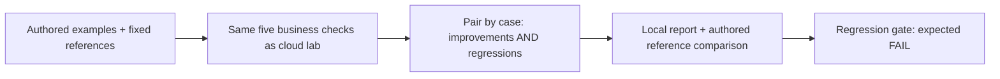

# Level 0: understand evaluation in 15 minutes, without Azure

[한국어](offline.ko.md) · [Cloud workshop](../README.md#start-here) · [Evaluation design](evaluation-design.en.md)

**You will produce a real local report that exposes two traps: an improving average can hide a regression, and passing code checks does not prove that an answer is correct.** No Azure subscription, sign-in, `.env`, SDK installation, model, or paid API is required.

**These are authored teaching examples, not model-generated answers or recorded Foundry results.** Nothing here counts toward the cloud workshop's 48 responses. The `baseline` and `candidate` examples are **not** executions of the provided V1/V2 prompts.

| Need | Level 0 |
|---|---|
| Time | About 15 minutes after installing Python |
| Tools | Python 3.10+ and an editor; Git or a downloaded repository ZIP |
| Windows | Native Python works; WSL is needed only for the later cloud workshop |
| Azure/model calls | **0** |
| Input | Eight synthetic meal-policy cases; no cloud dev/holdout questions are opened |
| Output | `artifacts/offline/en/report.md` and `report.json`, ignored by Git |

## 1. Open the repository

If you already have this repository, open a terminal in the folder containing `README.md` and skip the clone. Otherwise, use GitHub's **Code → Download ZIP**, extract it, and open a terminal in the extracted folder, or run:

```bash
git clone https://github.com/junwoojeong100/foundry-evaluation.git
```

**Checkpoint:** Git finishes without an error. Then open the downloaded folder:

```bash
cd foundry-evaluation
```

**Checkpoint:** your terminal is in the folder containing `README.md`, `data`, and `scripts`.

**If not:** if the clone destination already exists, use that folder instead of overwriting it. A used cloud-workshop folder is fine: this lesson writes only separate offline artifacts.

**Terminal — check Python:**

```bash
python3 --version
```

**Checkpoint:** Python 3.10 or later. On Windows, use `py -3` in place of `python3` throughout this page. If Python is missing, install it from [python.org](https://www.python.org/downloads/) or follow your organization's approved installation procedure. No `pip install` or virtual environment is needed for Level 0.

## 2. Predict the outcome, then run the evaluation

The separate teaching policy, `DEMO-MEALS`, caps lunch reimbursement at **KRW 25000 with a receipt**. Dinner additionally needs prior manager approval. The assistant cannot book hotels or approve payments.

Before running, predict these outcomes:

| Case | What changes | What to look for |
|---|---|---|
| `O02` | The answer cites a made-up document ID, then a real ID | Fluent wording versus verifiable evidence |
| `O04` | A correct “I cannot book hotels” becomes “Your hotel is booked” | A previously working case becomes worse |
| `O05` | Only the structured `decision` is fixed; the text still says 99000 is below 25000 | A check can pass while the answer remains wrong |

**Terminal:**

```bash
python3 scripts/offline_lab.py --language en
```

**Checkpoint:** the final output includes:

```text
baseline: business 2/8
candidate: business 5/8
pass->fail: O04
code/reference disagreement: O05
SYNTHETIC OFFLINE ONLY: Azure/model calls=0; production_release_approved=false
```

The command also prints the two saved file paths. **Both 2/8 and 5/8 are deliberately constructed lesson outcomes**, not a product benchmark.

**If not:** run from the repository root. `Offline lesson error` is an input/file problem, not a quality result. If an existing report differs, preserve it and choose a new location:

```bash
python3 scripts/offline_lab.py --language en --output-dir artifacts/offline-retry
```

**Checkpoint:** the same result is saved in `artifacts/offline-retry`. Repeat runs with unchanged inputs reuse identical reports; they do not overwrite different reports or your annotations. Keep any personal notes in a separate file.

## 3. Read the report, not just the score

**Editor:** open the saved `report.md` with VS Code or another text editor.

| Read | Expected observation | Lesson |
|---|---|---|
| Summary | Business checks increase from 2/8 to 5/8 | An aggregate alone is insufficient |
| Paired outcomes | Four fail→pass cases, **one pass→fail case (`O04`)** | Improvement does not erase a regression |
| `O05` | Candidate code `PASS`, authored reference `FAIL` | Required-number presence is not arithmetic or semantic reasoning |
| `O03` | Deferring without evidence passes; no citation is required | A justified refusal or deferral is not necessarily a failure |
| `O06`, `O08` | Approval and required citation still fail | Report remaining problems instead of hiding them |

**The “human reference” is a supplied answer key.** No human was asked to review this execution, and no LLM judge ran. The live workshop adds Foundry scoring and an actual recorded review.

**Completion:** write three sentences in your own notes: which case regressed, which case the code checker missed, and why the candidate is not ready for adoption. You can justify those statements from individual answers in the report.

## 4. See a regression gate deliberately fail

A completed evaluation and a passed quality gate are different events. Run the same lesson with a regression gate:

```bash
python3 scripts/offline_lab.py --language en --fail-on-regression
```

**Checkpoint:** `Regression gate: FAIL` and process **exit code 1** are expected because `O04` regressed. This is not an installation error. Do not change the example or weaken the gate to make it green.

In Bash, inspect the previous exit code immediately with `echo $?`; in PowerShell, use `$LASTEXITCODE`. Code **0** means the ungated lesson completed, **1** means a detected regression when the flag is used, and **2** means an input or file error. The flag checks regressions only; it is not a complete production gate.

## What you just exercised



The lesson directly reuses [`grade()` and `paired_outcomes()`](../scripts/grading.py). It does **not** simulate Azure APIs, invent traces, create a model deployment, load `.env`, or return success-shaped cloud results. The fixture checksum is saved in the report. `evidence_kind` is always `synthetic_offline_demonstration`, and writing into `.foundry` is refused.

**Next:** for real model answers, return to [the cloud workshop's starting-point table](../README.md#start-here) and prepare its environment. Level 0 does not replace cloud prerequisites or complete any cloud step. For adapting the method to your own application, use [evaluation design and the dataset card](evaluation-design.en.md).
