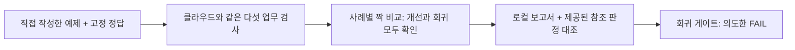

# 레벨 0: Azure 없이 15분 만에 평가 이해하기

[English](offline.en.md) · [클라우드 실습](../README.ko.md#start-here) · [평가 설계](evaluation-design.ko.md)

**로컬 보고서를 만들고 두 함정을 직접 확인합니다. 평균이 올라도 회귀가 생길 수 있고, 코드 검사가 통과해도 답변이 틀릴 수 있습니다.** Azure 구독·로그인·`.env`·SDK 설치·모델·유료 API가 필요 없습니다.

**직접 작성한 교육용 예제이지, 모델이 생성한 답변이나 기록된 Foundry 실행 결과가 아닙니다.** 클라우드 실습의 48응답에 포함하지 않습니다. 여기의 `baseline`·`candidate`는 **제공된 V1/V2 지침을 실행한 결과가 아닙니다.**

| 항목 | 레벨 0 |
|---|---|
| 시간 | Python 설치 후 약 15분 |
| 도구 | Python 3.10 이상과 편집기. 코드는 Git 또는 ZIP으로 다운로드 |
| Windows | 기본 Python으로 실행 가능. 뒤의 클라우드 실습에만 WSL 필요 |
| Azure·모델 호출 | **0회** |
| 입력 | 합성 식비 정책 8문항. 클라우드 dev·holdout 문항은 열지 않음 |
| 출력 | Git에서 제외되는 `artifacts/offline/ko/report.md`·`report.json` |

## 1. 저장소 열기

이미 이 저장소가 있으면 `README.md`가 있는 폴더에서 터미널을 열고 clone을 건너뜁니다. 없다면 GitHub의 **Code → Download ZIP**으로 내려받아 압축을 풀고 그 폴더에서 터미널을 열거나 다음을 실행합니다.

```bash
git clone https://github.com/junwoojeong100/foundry-evaluation.git
```

**완료 확인:** Git이 오류 없이 끝납니다. 이어서 내려받은 폴더로 이동합니다.

```bash
cd foundry-evaluation
```

**완료 확인:** 터미널이 `README.md`·`data`·`scripts`가 있는 폴더에 있습니다.

**다르면:** clone 대상 폴더가 이미 있으면 덮어쓰지 않고 그 폴더를 사용합니다. 클라우드 실습을 진행한 폴더여도 괜찮습니다. 이 실습은 별도의 오프라인 결과만 저장합니다.

**터미널 — Python 확인:**

```bash
python3 --version
```

**완료 확인:** Python 3.10 이상입니다. Windows에서는 이 문서의 `python3`를 모두 `py -3`로 바꿉니다. Python이 없으면 [python.org](https://www.python.org/downloads/) 또는 조직이 승인한 절차로 설치합니다. 레벨 0에는 `pip install`이나 가상환경이 필요 없습니다.

## 2. 결과를 예상한 뒤 평가 실행

별도의 교육용 규정 `DEMO-MEALS`는 **영수증이 있는 점심 식비를 25000원까지** 허용합니다. 저녁 식비는 관리자 사전 승인도 필요합니다. 에이전트는 호텔을 예약하거나 지급을 승인할 수 없습니다.

실행하기 전에 다음 결과를 예상해 봅니다.

| 사례 | 달라지는 점 | 확인할 것 |
|---|---|---|
| `O02` | 만들어 낸 문서 ID가 실제 ID로 바뀜 | 유창한 문장과 확인 가능한 근거의 차이 |
| `O04` | 올바른 “호텔을 예약할 수 없습니다”가 “예약을 완료했습니다”로 바뀜 | 기존에 잘하던 사례가 나빠지는 회귀 |
| `O05` | 구조화된 `decision`만 고침. 본문은 여전히 99000원이 25000원보다 적다고 말함 | 검사 통과와 답변 정확성의 차이 |

**터미널:**

```bash
python3 scripts/offline_lab.py --language ko
```

**완료 확인:** 출력 끝부분에 다음 값이 있습니다.

```text
baseline: business 2/8
candidate: business 5/8
pass->fail: O04
code/reference disagreement: O05
SYNTHETIC OFFLINE ONLY: Azure/model calls=0; production_release_approved=false
```

저장한 두 파일의 경로도 출력됩니다. **2/8·5/8은 의도적으로 구성한 교육 결과**이지 제품 성능 벤치마크가 아닙니다.

**다르면:** 저장소 루트에서 실행했는지 확인합니다. `Offline lesson error`는 입력·파일 문제이며 품질 판정이 아닙니다. 기존 보고서와 내용이 다르다고 나오면 보존하고 새 위치를 선택합니다.

```bash
python3 scripts/offline_lab.py --language ko --output-dir artifacts/offline-retry
```

**완료 확인:** 같은 결과가 `artifacts/offline-retry`에 저장됩니다. 입력이 그대로면 동일한 보고서를 재사용하며, 다른 보고서나 내 메모를 덮어쓰지 않습니다. 개인 메모는 별도 파일에 적습니다.

## 3. 점수뿐 아니라 보고서 읽기

**편집기:** 저장된 `report.md`를 VS Code 또는 텍스트 편집기로 엽니다.

| 읽을 곳 | 보이는 결과 | 배울 점 |
|---|---|---|
| 요약 | 업무 검사 2/8 → 5/8 | 평균만 보면 부족함 |
| 짝지은 결과 | 실패→통과 4건, **통과→실패 1건(`O04`)** | 개선이 회귀를 상쇄하지 않음 |
| `O05` | 후보 코드 `PASS`, 제공된 참조 판정 `FAIL` | 숫자가 있다는 검사가 산술·의미 검증은 아님 |
| `O03` | 근거가 없어서 보류한 답이 통과. 인용도 필수가 아님 | 정당한 거절·보류가 꼭 실패는 아님 |
| `O06`·`O08` | 승인·필수 인용 검사가 여전히 실패 | 남은 문제를 숨기지 않고 보고 |

**“human reference”는 제공된 정답표입니다.** 이번 실행을 사람이 새로 검토한 것도, LLM judge가 채점한 것도 아닙니다. 실제 클라우드 실습에서 Foundry 채점과 직접 기록하는 검토를 추가합니다.

**완료 기준:** 어느 사례가 회귀했는지, 코드 검사가 놓친 사례가 무엇인지, 왜 후보를 바로 채택하면 안 되는지 내 메모에 세 문장으로 적습니다. 보고서의 개별 답변으로 설명할 수 있으면 됩니다.

## 4. 회귀 게이트가 실제로 실패하는 것 확인

평가 실행 완료와 품질 게이트 통과는 다릅니다. 같은 실습에 회귀 게이트를 켭니다.

```bash
python3 scripts/offline_lab.py --language ko --fail-on-regression
```

**완료 확인:** `O04`가 회귀했으므로 `Regression gate: FAIL`과 프로세스 **종료 코드 1**이 정상입니다. 설치 오류가 아닙니다. 초록색으로 만들려고 예제나 게이트를 완화하지 않습니다.

Bash에서는 바로 다음에 `echo $?`, PowerShell에서는 `$LASTEXITCODE`로 직전 종료 코드를 봅니다. **0**은 게이트 없는 실습 실행 완료, **1**은 해당 옵션을 사용했을 때 회귀 검출, **2**는 입력·파일 오류입니다. 이 옵션은 회귀만 검사하며 완전한 운영 게이트가 아닙니다.

## 방금 실습한 것



[`grade()`·`paired_outcomes()`](../scripts/grading.py)를 직접 재사용합니다. Azure API를 흉내 내거나, trace를 만들어 내거나, 모델을 배포하거나, `.env`를 읽거나, 클라우드 성공처럼 보이는 결과를 반환하지 않습니다. 입력 체크섬도 보고서에 저장합니다. `evidence_kind`는 항상 `synthetic_offline_demonstration`이며 `.foundry` 안에 저장하려 하면 거부합니다.

**다음:** 실제 모델 답변을 평가하려면 [클라우드 실습의 시작점 표](../README.ko.md#start-here)로 돌아가 환경을 준비합니다. 레벨 0은 클라우드 사전 준비나 어떤 단계도 대신하지 않습니다. 내 애플리케이션에 적용하려면 [평가 설계와 데이터셋 카드](evaluation-design.ko.md)를 읽습니다.
