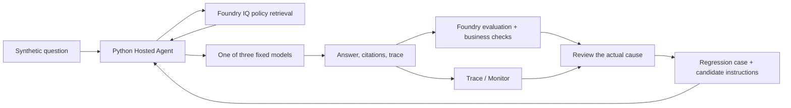

# Architecture, model contracts, and evaluation concepts

[English workshop](../README.md) · [한국어](reference.ko.md)

Follow [the English README](../README.md) for the execution path. Use this page only to look up a term, label, model or deployment name, endpoint, evidence field, or evaluation boundary; do not restart here.

| I need to check | Go to | Return to |
|---|---|---|
| Term or result label | [terms](#terms), [decision labels](#decision-values) | [Start](../README.md#start) or [step 6 review](../README.md#lab-d) |
| Model or deployment name | [model/deployment names](#model-names) | [step 5](../README.md#lab-c) or [step 8](../README.md#lab-f) |
| Evidence field | [retrieval evidence](#retrieval-evidence) | [step 6 review](../README.md#lab-d) |
| Evaluation gate | [evaluation scope](#evaluation-scope) | [step 8 holdout](../README.md#lab-f) |
| Trace or Monitor | [Trace and Monitor](#trace-monitor) | [step 9 evidence](../README.md#lab-g) |
| Background assumption | [scenario](#scenario), [optional background](#background) | [Start](../README.md#start) |
| Runtime or language boundary | [execution path](#execution-path), [endpoints](#endpoints), [language isolation](#language) | [Start](../README.md#start) |
| Preparation or recovery | [instructor](instructor.en.md), [troubleshooting](troubleshooting.en.md) | [Start](../README.md#start) |

<a id="terms"></a>

## Terms used in the workshop

**Short answer:** these names keep the tool, deployed agent, model, data, and result labels separate.

**Tools and runtime**

| Term | Meaning here |
|---|---|
| Copilot CLI | Development tool that can help run commands. |
| Workshop agent | Deployed Python app that answers policy questions in Azure. |
| Agent instance | Per-request Python Agent Framework object that calls Sol, Luna, or Astra; the models do not vote. |
| Foundry | Azure services and portal used by the workshop. |
| Agent Framework | Python agent library. |
| Knowledge base / KB | Searchable policy evidence. |
| Hosted Agent | Python code running in managed Azure. |

**Models and labels**

| Term | Meaning here |
|---|---|
| Model | Fixed deployment of `gpt-6-sol`, `gpt-6-luna`, or `gpt-6-astra`. |
| V1 / V2 | Supplied instruction versions. |
| `agent_version` | Numeric hosted-agent version from each deployment. |
| `baseline` / `improved` | Result labels before and after selecting V2. |
| dev | Six frozen questions for review and improvement. |
| holdout | Four separate questions after freezing the candidate. |

**Evaluation**

| Term | Meaning here |
|---|---|
| Judge | Separate model that scores answer text. |
| calibration | Two examples that check supported versus unsupported claims. |
| Native evaluation | Foundry scores answer text. |
| Business checks | Python checks decision, amount, and citation contract; native scores do not replace them. |
| rubric | Response scoring criteria. |
| Quality gate | Model-level workshop threshold, not production approval. |

**Evidence and files**

| Term | Meaning here |
|---|---|
| trace | Connected retrieval, model, and response spans for one request. |
| Regression case | Reviewed case with fixed reference and original trace. |
| lineage | Relationship among language, model, prompt, data, version, and result. |
| `case_id` / `row_id` | `case_id` identifies a question; `row_id` identifies one response by label, model, and question. Match V1/V2 with **`case_id` + `model_key`**. |
| JSON / JSONL | JSON is one structured document; JSONL stores one JSON object per line. Find responses by `row_id`, not line number. |

↩ [Start](../README.md#start).

<a id="decision-values"></a>

## Read the answer and decision separately

**Short answer:** `answer` is the explanation; `decision` is the label the Python check compares with `expected_decision`.

| `decision` | Meaning here | Do not confuse it with |
|---|---|---|
| `allowed` | Permitted under the applicable policy and stated conditions | An actual approval, booking, or payment |
| `needs_approval` | Prior approval is required | An absolute prohibition or proof that approval was granted |
| `not_allowed` | The policy prohibits it | Merely waiting for the required approval |
| `needs_info` | Information needed to decide is missing from the request | A topic outside the supplied policies |
| `not_covered` | The supplied policies do not cover the topic | A policy prohibition |

A useful explanation can still carry the wrong label. For a mismatch, compare the explanation, label, and fixed reference separately. Preserve `expected_decision`; do not rewrite the rubric to agree with the response.

↩ [step 5 baseline](../README.md#lab-c) or [step 6 review](../README.md#lab-d).

<a id="scenario"></a>

## Scenario and retained assets

**Short answer:** Hanbit Technology is fictional; KRW amounts, policy dates, document status, and cited evidence are the assets that remain after the workshop.

The fictional Hanbit Technology assistant explains South Korea domestic travel policy. Currency stays **Korean won (KRW)** in English; translation does not change limits or rules.

Policies include current rules, archived rules, and an unapproved draft. Correct behavior depends on **travel date and document status**, not only on whether a retrieved sentence mentions an amount.

The agent gives guidance only; it does not book, approve, pay, or grant exceptions. Policies, references, and calibration examples are synthetic training materials, not approved company policy.

The loop improves instructions and validation; traces do not train model weights. [Level 3](level-3.en.md#continuous-eval) evaluates traces on a schedule, but fine-tuning, RL, automatic retraining, and automatic production promotion remain outside scope.

↩ [Start](../README.md#start).

<a id="model-names"></a>

## Fixed model identities

**Short answer:** use model keys in requests, model IDs/versions for the verified model identity, and Azure deployment names from the prepared environment.

| Name | Where to read it | Where used |
|---|---|---|
| Model key | `sol`, `luna`, or `astra` | Agent request `model_key` and result grouping |
| Model ID and version | Table below | The fixed model identity checked by `preflight` |
| Azure deployment names | Instructor-provided `.env` or Foundry **Build → Models** | `.env` values: `MODEL_SOL_DEPLOYMENT`, `MODEL_LUNA_DEPLOYMENT`, `MODEL_ASTRA_DEPLOYMENT`, and auxiliary `LAB_AUX_DEPLOYMENT`; they need not equal model keys or IDs |

Changing `LAB_PREFIX` for a new team does not rename shared model deployments.

| Key | Model ID | Version |
|---|---|---|
| `sol` | `gpt-6-sol` | `2026-09-22` |
| `luna` | `gpt-6-luna` | `2026-09-22` |
| `astra` | `gpt-6-astra` | `2026-09-03` |

`preflight` checks the actual deployment, model/version, regional catalog, and quota. A catalog entry does not guarantee availability in another subscription. If a required model is unavailable, stop rather than substitute another one.

- The three candidates answer independently with the same dev/holdout, KB, instructions, and evaluation criteria; they are not a multi-agent voting council.
- A separate fixed `gpt-5.4-mini` deployment serves retrieval planning and evaluation judging; it does not replace a candidate model.
- All three candidates are OpenAI models, so this is not a cross-provider interoperability benchmark.

↩ [step 5 baseline](../README.md#lab-c) or [step 8 holdout](../README.md#lab-f).

<a id="execution-path"></a>

## Why this execution path

**Short answer:** the workshop uses direct Python source deployment, strict JSON requests, isolated per-question state, and the same Foundry account's Azure OpenAI Chat Completions endpoint.

- **Direct code deployment:** `azure.yaml` describes Python 3.13 source deployment. No local Docker/ACR build is required.
- **Workshop invocations:** each request carries explicit `model_key`, `case_id`, and `run_id` values. Model routing is allowlisted.
- **Level 3 target evaluation:** Foundry posts `{"type": "input_text", "text": ...}`; the agent extracts invocation JSON from that text, or sends plain text to Sol with `case_id` `external` ([Level 3, section 4](level-3.en.md#evaluate-agent)).
- **Independent request state:** a hosted session reuses compute, while a new Agent instance is created for each question/model request.
- **Strict JSON contract:** the model returns JSON text, which Pydantic validates. The application does not repair invalid output and label it a success.

The selected inference path is the **same Foundry account's Azure OpenAI v1 Chat Completions endpoint**. The code uses the supported `AIProjectClient.get_openai_client()` endpoint/credential override with `OpenAIChatCompletionClient`. It is not a fallback to another model or the public OpenAI service.

Application-side JSON validation differs from service-enforced Structured Outputs. Both languages keep the existing model compatibility path.

↩ [step 3 local run](../README.md#local).

<a id="endpoints"></a>

## Endpoints and token scopes

**Short answer:** project management, model inference, and IQ retrieval use different endpoints and Entra token scopes.

| Purpose | Setting | Entra token scope |
|---|---|---|
| Agent management / Foundry evaluation | `FOUNDRY_PROJECT_ENDPOINT` | `https://ai.azure.com/.default` |
| Candidate-model inference | `AZURE_OPENAI_ENDPOINT` | `https://cognitiveservices.azure.com/.default` |
| IQ retrieval | `AZURE_SEARCH_ENDPOINT` | `https://search.azure.com/.default` |

A GA hosting service does not make every SDK or API used with it GA.

↩ [step 1 setup](../README.md#lab-a).

<a id="language"></a>

## Language isolation

**Short answer:** language changes create separate data, prompt, response, evaluation, telemetry, and lineage records; do not mix them.

`LAB_LANGUAGE=ko` is the default; `LAB_LANGUAGE=en` selects English policies, questions, prompts, model request labels, calibration examples, and hosted response metadata.

Use separate folders and prefixes. Korean data remains at `data/` and Korean prompts keep their current location; English data is at `data/en/` and English prompts are under `src/agent/prompts/en/`.

Ownership state, responses, evaluations, telemetry summaries, and regression provenance identify the language; records without a language field are **Korean**. Translations preserve policy IDs, dates, amounts, decision labels, and citation rules, but text changes create new dataset, prompt, and context hashes. Do not mix language cohorts or present translated Korean results as English execution.

↩ [Start](../README.md#start).

<a id="retrieval-evidence"></a>

## Reading retrieval evidence

**Short answer:** read `docKey` or `sourceData.id` for the policy document, and read `context_hash` before attributing answer differences to a model.

`references[].id` is a reference number inside a retrieval result, not necessarily the policy document key. Use `docKey` or `sourceData.id`; if neither field is present, treat the citation as unresolved evidence and return to [step 6 review](../README.md#lab-d).

The `retrieve` output prints the resolved `document_ids`, the planning `activity`, and the `saved` path; the full `references` stay in that saved JSON.

The same corpus can produce different contexts on different calls. If `context_hash` differs, do not attribute every answer difference solely to the candidate model.

**Retrieval-miss guard:** `retrievalInstructions` tell the KB to search relevant policies even when a request asks it to ignore rules or assume approval.

- If the planner does not search, the agent retries the same question **once** and records `retrieval_attempts` in the response and trace.
- If both attempts skip search, the answer continues without evidence and the trace shows that failure. [Why this was added](validation.en.md#retrieval-miss)

<details>
<summary>Why this is real Foundry IQ retrieval</summary>

This creates actual Search knowledge sources and knowledge bases and calls `/knowledgebases/{name}/retrieve`; it does not rename a normal `search()` response to “Foundry IQ.” Small synthetic documents use semantic retrieval. No separate embedding deployment or MCP tool is required.

The Foundry Indexes list, a knowledge source's advanced settings, and the actual Azure Search index are different surfaces.

</details>

↩ [step 6 review](../README.md#lab-d).

<a id="evaluation-scope"></a>

## Evaluation and adoption criteria

**Short answer:** Level 1 checks all 48 saved responses and traces and fixed evaluators. Read the six business-gate results (dev and holdout for each model) separately from native scores. **A `false` gate does not prevent workshop completion**; report that result. This is not production approval.

**The criteria below describe the main 10-step workshop (Level 1).** [Level 2](level-2.en.md) and [Level 3](level-3.en.md) use other inputs and thresholds, so do not combine their scores with the primary 48 responses.

| Layer | What it checks | What it does not establish |
|---|---|---|
| Native groundedness | Whether answer claims are supported by the retrieved context | Every business decision, current-policy choice, or citation ID |
| Native relevance | Whether the answer addresses the question | Complete business correctness or the quality of every justified refusal |
| Deterministic business checks | Decision, required amounts, and allowed retrieved citations | Full semantic correctness of all answer text |
| Human review | Applicability, exceptions, cause, and the proposed improvement | Statistical evidence of production quality from a tiny sample |

Level 1's native path is a **JSONL dataset evaluation of captured agent answers**. It calls a judge but does not invoke the agent again. The native `response` field is the answer text; business checks separately inspect the structured decision and citation array.

During an experiment:

| Check | Required value | If different |
|---|---|---|
| Response matrix | 18 baseline dev rows, 18 improved dev rows, 12 holdout rows; no errors, duplicates, or missing rows | [Recover only the failed stage](troubleshooting.en.md#resume) |
| Fixed inputs | Same dev data, corpus, concurrency, judge, and evaluator definitions | Do not compare with baseline |
| Business gates | Every model's dev and holdout `business_gate` is true: ≥80% business passes and all required citations valid; dev is at least 5/6, holdout is 4/4 | Do not adopt |
| Native scoring | Native 1–5 scale and pass threshold 4; no null/error replacement | Keep as failed/missing evidence |
| Holdout use | Candidate frozen before holdout; holdout answers not used for improvement | Treat as a new experiment |
| Result reading | Native scores, business results, latency, token counts, and human review read separately | Do not collapse into one score |

`candidate_quality_gates` and the Level 3 release gate check workshop evidence only; `production_release_approved` remains false.

Method, measurements, and interpretation are in [the English evaluation explanation](validation.en.md). A business gate is not production authorization.

↩ [step 5 baseline](../README.md#lab-c) or [step 8 holdout](../README.md#lab-f).

<a id="trace-monitor"></a>

## Trace and Monitor

**Short answer:** trace checks prove each primary response has a successful unsampled trace; portal dashboards are broader operational aggregates.

`queries/monitor.kql` selects this agent's requests and connects dependencies through `operation_Id`. It avoids counting both framework and custom spans as duplicate model calls.

**Terminal — repository root:** this is the baseline example. During recovery, use the actual label named in the guide.

```bash
python scripts/workshop.py monitor --label baseline
```

**Checkpoint:** the JSON output shows `expected_trace_count`, matching `observed_trace_count`, and `complete: true` for the selected agent/run.

**If not:** check ingestion delay and query windows with [trace recovery](troubleshooting.en.md#telemetry). Do not repeat collection/evaluation.

`monitor` looks back two hours by default. `--hours` extends both the KQL filters and the API time window of the same trace-coverage query; the agent/run filter and exact trace-coverage checks stay unchanged. It is not the portal date selector or `azd ai agent monitor` log streaming.

The workshop agent uses `microsoft.fixed_percentage` with `1.0` for complete trace coverage. It does not change a shared Application Insights sampling policy.

- Portal dashboards may include smoke or additional UI invocations beyond the 48 primary responses.
- A displayed estimated cost of `$0` is not a complete Azure bill.
- An empty Tools chart does not prove that code-level IQ spans were absent.

Production requires separate sampling, privacy, retention, alerting, cost, and authorization policies.

↩ [step 9 evidence](../README.md#lab-g).

<a id="background"></a>
<a id="background-learning-loops-and-frontier-ecosystems"></a>

<details>
<summary>Optional background and source links</summary>

### Background: learning loops and frontier ecosystems — optional

**Short answer:** organizations should keep their knowledge, judgment, and improvement history even when they change models.



In [his original discussion of the future of the firm](https://x.com/satyanadella/status/2066182223213293753), Satya Nadella argues that the opportunity goes beyond choosing the best model. Organizations need to own a learning loop in which human expertise and their own AI capabilities reinforce each other. *Human capital* is people's expertise, judgment, and relationships; *token capital* means AI capability that a firm builds and owns, not simply the number of tokens it consumes.

A **learning loop** connects real work, business-specific evaluation, human judgment, and subsequent improvements. Queryable institutional knowledge, private evaluations, and traces help an organization retain what it learns.

**Frontier ecosystems** extend this idea beyond a single frontier model: organizations, industries, and countries should be able to develop their own expertise and create value, rather than depend entirely on one model's capabilities.

This workshop is a small educational interpretation of that perspective:

| Idea | What you will do | What remains reusable |
|---|---|---|
| Institutional memory | Retrieve synthetic travel policies with Foundry IQ | Policy documents, IDs, and applicability rules |
| Business-specific learning loop | Generate real answers, evaluate them, review a trace, and compare V1/V2 | Reference answers, evaluation criteria, reviewed cases, and improvement reasons |
| Separate models from organizational assets | Compare three fixed models with the same policy corpus and questions | Data, instructions, and trace lineage managed independently of a model choice |

This is **prompt and evaluation-system improvement**, not fine-tuning, reinforcement learning, or automatic production deployment. All three candidates are OpenAI models; the workshop does not claim cross-provider interoperability.

↩ [Start](../README.md#start).

### Official sources

| Source | Used for |
|---|---|
| [Nadella's learning-loop and frontier-ecosystem discussion](https://x.com/satyanadella/status/2066182223213293753) | Background perspective; the workshop is an educational interpretation |
| [Model catalog](https://ai.azure.com/explore/models) · [Azure-sold models](https://learn.microsoft.com/azure/ai-foundry/foundry-models/concepts/models-sold-directly-by-azure) · [Endpoints and deployment names](https://learn.microsoft.com/azure/foundry/foundry-models/concepts/endpoints) | Model IDs, regions, deployment types, and names used for inference |
| [Foundry hosting](https://learn.microsoft.com/agent-framework/hosting/foundry-hosted-agent?pivots=programming-language-python) | Python Hosted Agents |
| [OpenAI adapter](https://learn.microsoft.com/agent-framework/integrations/by-component/model-providers/openai) · [AIProjectClient](https://learn.microsoft.com/python/api/azure-ai-projects/azure.ai.projects.aiprojectclient) | Authenticated Chat Completions client integration |
| [Agent Server Core](https://learn.microsoft.com/python/api/overview/azure/ai-agentserver-core-readme?view=azure-python) · [Invocations](https://learn.microsoft.com/python/api/overview/azure/ai-agentserver-invocations-readme?view=azure-python) | Readiness, request context, telemetry, and JSON input/output |
| [Hosted sessions](https://learn.microsoft.com/azure/foundry/agents/how-to/manage-hosted-sessions?pivots=python) | Version-pinned sessions and batch requests |
| [Structured Outputs](https://learn.microsoft.com/agent-framework/agents/structured-outputs?pivots=programming-language-python) | Service-enforced schemas versus application validation |
| [Foundry IQ quickstart](https://learn.microsoft.com/azure/foundry/agents/quickstarts/quickstart-foundry-iq-hosted-agent) · [Retrieval pipeline](https://learn.microsoft.com/azure/search/agentic-retrieval-how-to-create-pipeline) · [Retrieve API](https://learn.microsoft.com/azure/search/agentic-retrieval-how-to-retrieve) | Knowledge objects, real retrieval, references, and activity |
| [Dataset evaluation](https://learn.microsoft.com/azure/foundry/observability/how-to/cloud-evaluation-datasets) · [Hosted evaluation](https://learn.microsoft.com/azure/foundry/observability/quickstarts/quickstart-evaluate-hosted-agent) | Evaluation modes, judging, and input mappings |
| [Tracing](https://learn.microsoft.com/azure/foundry/observability/how-to/trace-agent-setup) · [Monitoring](https://learn.microsoft.com/azure/foundry/observability/how-to/how-to-monitor-agents-dashboard) | Individual requests and operational aggregates |
| [Sampling configuration](https://learn.microsoft.com/azure/azure-monitor/app/opentelemetry-configuration#enable-sampling) | Trace completeness and its production tradeoffs |
| [Official Python Hosted Agent sample](https://github.com/microsoft-foundry/foundry-samples/tree/main/samples/python/hosted-agents/agent-framework) | azd direct-code deployment and protocol manifest |

</details>
