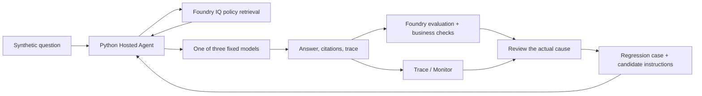

# Architecture, model contracts, and evaluation concepts

[English workshop](../README.md) · [한국어](reference.ko.md)

Follow [the English README](../README.md) for the execution path. This document explains the implementation choices and their boundaries.

## Terms used in the workshop

| Term | Meaning here |
|---|---|
| Copilot CLI / workshop agent | Copilot CLI is the development tool that helps run commands; the workshop agent is the Python application deployed to Azure to answer policy questions |
| Agent / model | One Python agent calls one of Sol, Luna, or Astra (`gpt-6-sol`, `gpt-6-luna`, `gpt-6-astra`) for each request; the models do not vote |
| Foundry / Agent Framework | Foundry provides Azure services and the portal; Agent Framework is the library used by the Python agent |
| Knowledge base / KB | Searchable organizational policy evidence |
| Hosted Agent | Python code executed in a managed Azure environment |
| V1 / V2 / `agent_version` | Two supplied instruction versions; each deployment also has a numeric hosted agent version |
| Baseline / `improved` | The result labels before and after selecting V2 |
| Dev | Six frozen questions available for review and improvement |
| Holdout | Four separate questions used after freezing the candidate |
| Judge / calibration | A separate model scores answer text; two supplied examples check that it distinguishes supported and unsupported claims |
| Native evaluation / business checks | Foundry scores answer text; Python checks the fixed decision, amount, and citation contract. Neither result replaces the other. |
| Rubric / quality gate | The rubric defines how to judge a response; the gate decides whether a model's aggregate results meet the workshop threshold, not whether to release it. |
| Trace | The connected retrieval, model, and response spans for one request |
| Regression case | A reviewed case with a fixed reference and original trace |
| Lineage | The relationship among language, model, prompt, data, version, and result |
| `case_id` / `row_id` | `case_id` identifies a fixed question; `row_id` identifies one response by label, model, and question. Match a case across V1/V2 with **`case_id` + `model_key`**. |
| JSON / JSONL | JSON is a structured document; JSONL stores one JSON object per line. Find a response by `row_id`, not its line number. |

## Read the answer and decision separately

**`answer` is the explanation; `decision` is the label the Python check compares with `expected_decision`.** A useful explanation can still carry the wrong label. These are the five labels used by the fixed reference and supplied V2:

| `decision` | Meaning here | Do not confuse it with |
|---|---|---|
| `allowed` | Permitted under the applicable policy and stated conditions | An actual approval, booking, or payment |
| `needs_approval` | Prior approval is required | An absolute prohibition or proof that approval was granted |
| `not_allowed` | The policy prohibits it | Merely waiting for the required approval |
| `needs_info` | Information needed to decide is missing from the request | A topic outside the supplied policies |
| `not_covered` | The supplied policies do not cover the topic | A policy prohibition |

For a mismatch, compare the explanation, label, and fixed reference separately. Preserve `expected_decision`; do not rewrite the rubric to agree with the response.

## Scenario and retained assets

The fictional Hanbit Technology assistant explains domestic business-travel policy for South Korea. Currency remains **Korean won (KRW)** in the English edition; translating the language does not change the monetary limits or business rules.

Policies include current and archived rules and an unapproved draft. Correct behavior depends on **the travel date and document status**, not merely on whether a retrieved sentence mentions an amount.

The agent gives guidance only. It does not book travel, approve an expense, issue a payment, or grant an exception. Policies, references, and calibration examples are synthetic AI-assisted training materials, not approved company policy.

The loop improves instructions and the validation system. Recording a trace does not train model weights. Fine-tuning, RL, continuous evaluation, automatic retraining, and automatic production promotion are outside this exercise.

## Fixed model identities

**Use the right name for the right field.**

| Name | Example or source | Where used |
|---|---|---|
| Model key | `sol` | Agent request `model_key` and result grouping |
| Model ID and version | `gpt-6-sol` / `2026-09-22` | The fixed model identity checked by `preflight` |
| Azure deployment name | The actual prepared name from the instructor or Foundry **Build → Models** | `.env`'s `MODEL_SOL_DEPLOYMENT`; it need not equal the model key or ID |

Apply the same distinction to Luna, Astra, and the auxiliary deployment. Changing `LAB_PREFIX` for a new team does not rename shared model deployments.

| Key | Model ID | Version |
|---|---|---|
| `sol` | `gpt-6-sol` | `2026-09-22` |
| `luna` | `gpt-6-luna` | `2026-09-22` |
| `astra` | `gpt-6-astra` | `2026-09-03` |

`preflight` checks the actual deployment, model/version, regional catalog, and quota. A catalog entry does not guarantee availability in another subscription. If a required model is unavailable, stop rather than substitute another one.

The three candidates answer independently. They are not a multi-agent voting council. A separate fixed `gpt-5.4-mini` deployment serves retrieval planning and evaluation judging.

All three candidates are OpenAI models. This is not a cross-provider interoperability benchmark.

## Why this execution path

- **Direct code deployment:** `azure.yaml` describes Python 3.13 source deployment. No local Docker/ACR build is required.
- **Invocations protocol:** each request carries explicit `model_key`, `case_id`, and `run_id` values. Model routing is allowlisted.
- **Independent request state:** a hosted session reuses compute, while a new Agent instance is created for each question/model request.
- **Strict JSON contract:** the model returns JSON text, which Pydantic validates. The application does not repair invalid output and label it a success.

The selected inference path is the **same Foundry account's Azure OpenAI v1 Chat Completions endpoint**. The code uses the supported `AIProjectClient.get_openai_client()` endpoint/credential override with `OpenAIChatCompletionClient`. It is not a fallback to another model or the public OpenAI service.

Application-side JSON validation is different from a model service enforcing Structured Outputs. The existing model compatibility path is retained for both languages.

| Purpose | Setting | Entra token scope |
|---|---|---|
| Agent management / Foundry evaluation | `FOUNDRY_PROJECT_ENDPOINT` | `https://ai.azure.com/.default` |
| Candidate-model inference | `AZURE_OPENAI_ENDPOINT` | `https://cognitiveservices.azure.com/.default` |
| IQ retrieval | `AZURE_SEARCH_ENDPOINT` | `https://search.azure.com/.default` |

Do not conflate a generally available hosting service with the GA/preview status of every SDK or API used with it.

## Language isolation

`LAB_LANGUAGE=ko` is the backward-compatible default. `LAB_LANGUAGE=en` selects English policies, questions, prompt text, model request labels, calibration examples, and hosted response metadata.

Korean data remains at `data/`; English data is at `data/en/`. Korean prompts keep their existing location and effective hashes; English prompts are under `src/agent/prompts/en/`.

Use separate working folders and resource prefixes. The ownership state, collected responses, evaluations, telemetry summaries, and regression provenance identify the language. Legacy records without a language field are treated as **Korean**, not silently relabeled as English.

Translations preserve policy IDs, dates, amounts, decision labels, and citation rules. Text changes create new dataset/prompt/context hashes. Do not combine language cohorts or present translated Korean results as actual English execution.

## Reading retrieval evidence

This implementation creates actual Search knowledge sources and knowledge bases and calls `/knowledgebases/{name}/retrieve`. It does not rename a normal `search()` response to “Foundry IQ.”

Small synthetic text documents use semantic retrieval. A separate embedding deployment or MCP tool is not required for this path.

`references[].id` is a reference number inside a retrieval result, not necessarily the policy document key. Use `docKey` or `sourceData.id`. The CLI prints resolved `document_ids` and actual planning activity.

The same corpus can produce different contexts on different calls. If `context_hash` differs, do not attribute every answer difference solely to the candidate model.

**Retrieval-miss guard:** the knowledge base has retrieval instructions (`retrievalInstructions`) to search the relevant policies even when a request asks to ignore the rules or to state that approval is complete. If the planner still runs no search, the agent retries the same question **once** and records the count as `retrieval_attempts` in the response and trace. If neither attempt searches, the answer proceeds without evidence; the failure is not hidden. [Why this was added](validation.en.md#retrieval-miss)

The Foundry Indexes list, a knowledge source's advanced settings, and the actual Azure Search index are different surfaces.

## Evaluation and adoption criteria

| Layer | What it checks | What it does not establish |
|---|---|---|
| Native groundedness | Whether answer claims are supported by the retrieved context | Every business decision, current-policy choice, or citation ID |
| Native relevance | Whether the answer addresses the question | Complete business correctness or the quality of every justified refusal |
| Deterministic business checks | Decision, required amounts, and allowed retrieved citations | Full semantic correctness of all answer text |
| Human review | Applicability, exceptions, cause, and the proposed improvement | Statistical evidence of production quality from a tiny sample |

The native path is a **JSONL dataset evaluation of actual captured agent answers**. It is not an agent-target evaluation that invokes the agent again. The native `response` field is the answer text; the business checks separately inspect the structured decision and citation array.

During an experiment:

- Require the complete three-model response matrix with no execution errors or duplicate/missing rows.
- Keep the dev data, corpus, concurrency, judge, and evaluator definitions fixed.
- Require a model's business pass rate to be at least 80%, with all required citations valid.
- Keep the native 1–5 scale and pass threshold of 4. Do not replace nulls/errors with grades.
- Freeze the candidate before holdout and do not use holdout answers to improve it.
- Read native scores, business results, latency, token counts, and human review separately.

The full English method, actual measurements, and interpretation belong in [the English evaluation explanation](validation.en.md). A business gate is not production authorization.

## Trace and Monitor

`queries/monitor.kql` selects this agent's requests and connects dependencies through `operation_Id`. It avoids counting both framework and custom spans as duplicate model calls.

`python scripts/workshop.py monitor --label baseline` defaults to a two-hour lookback. `--hours 24` extends both the KQL filters and the API time window for a paused run; the agent/run filter and exact trace-coverage checks remain unchanged. This is different from the portal's date selector or `azd ai agent monitor` log streaming.

The workshop agent uses `microsoft.fixed_percentage` with `1.0` for complete trace coverage. It does not change a shared Application Insights sampling policy.

Portal dashboards may include smoke or additional UI invocations beyond the 48 primary responses. A displayed estimated cost of `$0` is not a complete Azure bill. An empty Tools chart does not prove that code-level IQ spans were absent.

Production requires separately designed sampling, privacy, retention, alerting, cost, and authorization policies.

## Background: learning loops and frontier ecosystems — optional

**You should be able to change the model without losing your organization's knowledge, judgment, and improvement history.**

In [his original discussion of the future of the firm](https://x.com/satyanadella/status/2066182223213293753), Satya Nadella argues that the opportunity goes beyond choosing the best model. Organizations need to own a learning loop in which human expertise and their own AI capabilities reinforce each other. *Human capital* is people's expertise, judgment, and relationships; *token capital* means AI capability that a firm builds and owns, not simply the number of tokens it consumes.

A **learning loop** connects real work, business-specific evaluation, human judgment, and subsequent improvements. Queryable institutional knowledge, private evaluations, and traces help an organization retain what it learns.

**Frontier ecosystems** extend this idea beyond a single frontier model: organizations, industries, and countries should be able to develop their own expertise and create value, rather than depend entirely on one model's capabilities.

This workshop is a small educational interpretation of that perspective:

| Idea | What you will do | What remains reusable |
|---|---|---|
| Institutional memory | Retrieve synthetic travel policies with Foundry IQ | Policy documents, IDs, and applicability rules |
| Business-specific learning loop | Generate real answers, evaluate them, review a trace, and compare V1/V2 | Reference answers, evaluation criteria, reviewed cases, and improvement reasons |
| Separate models from organizational assets | Compare three fixed models with the same policy corpus and questions | Data, instructions, and trace lineage managed independently of a model choice |

This is **prompt and evaluation-system improvement**, not fine-tuning, reinforcement learning, or automatic production deployment. All three candidates are OpenAI models; the workshop does not claim to validate interoperability across model providers.

[Continue with workshop step 1](../README.md#start).

## Official sources

| Source | Used for |
|---|---|
| [Nadella's learning-loop and frontier-ecosystem discussion](https://x.com/satyanadella/status/2066182223213293753) | Background perspective; the workshop is an educational interpretation |
| [Model catalog](https://ai.azure.com/explore/models) · [Azure-sold models](https://learn.microsoft.com/azure/ai-foundry/foundry-models/concepts/models-sold-directly-by-azure) · [Endpoints and deployment names](https://learn.microsoft.com/azure/foundry/foundry-models/concepts/endpoints) | Model IDs, regions, deployment types, and names used for inference |
| [Foundry hosting](https://learn.microsoft.com/agent-framework/hosting/foundry-hosted-agent?pivots=programming-language-python) | Python Hosted Agents |
| [OpenAI adapter](https://learn.microsoft.com/agent-framework/integrations/by-component/model-providers/openai) · [AIProjectClient](https://learn.microsoft.com/python/api/azure-ai-projects/azure.ai.projects.aiprojectclient) | Authenticated Chat Completions client integration |
| [Agent Server Core](https://learn.microsoft.com/python/api/overview/azure/ai-agentserver-core-readme?view=azure-python) · [Invocations](https://learn.microsoft.com/python/api/overview/azure/ai-agentserver-invocations-readme?view=azure-python) | Readiness, request context, telemetry, and JSON input/output |
| [Hosted sessions](https://learn.microsoft.com/azure/foundry/agents/how-to/manage-hosted-sessions?pivots=python) | Version-pinned sessions and batch requests |
| [Structured Outputs](https://learn.microsoft.com/agent-framework/agents/structured-outputs?pivots=programming-language-python) | Service-enforced schemas versus application validation |
| [Foundry IQ quickstart](https://learn.microsoft.com/azure/foundry/agents/quickstarts/quickstart-foundry-iq-hosted-agent) · [Retrieval pipeline](https://learn.microsoft.com/azure/search/agentic-retrieval-how-to-create-pipeline) · [Retrieve API](https://learn.microsoft.com/azure/search/agentic-retrieval-how-to-retrieve) | Knowledge objects, real retrieval, references, and activity |
| [Dataset evaluation](https://learn.microsoft.com/azure/foundry/observability/how-to/cloud-evaluation-datasets) · [Hosted evaluation](https://learn.microsoft.com/azure/foundry/observability/quickstarts/quickstart-evaluate-hosted-agent) | Evaluation modes, judging, and input mappings |
| [Tracing](https://learn.microsoft.com/azure/foundry/observability/how-to/trace-agent-setup) · [Monitoring](https://learn.microsoft.com/azure/foundry/observability/how-to/how-to-monitor-agents-dashboard) | Individual requests and operational aggregates |
| [Sampling configuration](https://learn.microsoft.com/azure/azure-monitor/app/opentelemetry-configuration#enable-sampling) | Trace completeness and its production tradeoffs |
