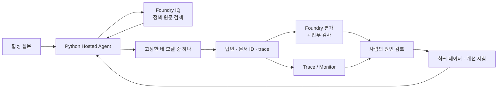

# 설계·모델·평가 기준

[한국어 실습](../README.ko.md) · [English](reference.en.md)

**실습 중에는 [참가자 가이드](../README.ko.md)만 순서대로 진행해도 됩니다.** 이 문서는 왜 그렇게 구현했는지 궁금할 때 읽는 참고 자료입니다.

## 먼저 알아둘 용어

| 용어 | 이 실습에서의 뜻 |
|---|---|
| Copilot CLI / 실습 agent | Copilot CLI는 명령 실행을 돕는 개발 도구. 실습 agent는 Azure에 배포해 출장 규정에 답하게 하는 Python 앱 |
| Agent / 모델 | Python agent 하나가 요청마다 Sol·Terra·Luna·Astra 중 하나를 호출하며, 모델끼리 투표하지 않음 |
| Foundry / Agent Framework | Foundry는 Azure 서비스와 포털, Agent Framework는 Python agent가 사용하는 라이브러리 |
| KB / knowledge base | 회사 문서를 검색하는 지식 계층 |
| Hosted Agent | Python 코드를 Azure의 관리형 환경에서 실행하는 에이전트 |
| V1 / V2 / `agent_version` | 제공된 지침 두 버전. 배포할 때마다 별도의 숫자 agent 버전도 생성됨 |
| baseline / `improved` | V2를 선택하기 전 / 후의 결과 label |
| dev | 실패를 보고 개선하는 데 쓰는 질문 6개 |
| holdout | 후보를 고정한 뒤 확인하는 질문 4개 |
| Judge / calibration | 답변 텍스트에 점수를 매기는 별도 모델 / 근거 있는 답과 없는 답을 구분하는지 예제 2개로 점검 |
| Native 평가 / 업무 검사 | Foundry의 답변 텍스트 채점 / Python의 고정 판단·금액·인용 계약 검사. 한쪽 결과가 다른 쪽을 대신하지 않음 |
| Rubric / 품질 gate | Rubric은 응답의 채점 기준. Gate는 모델별 집계 결과가 실습 기준을 넘었는지 판단하며, 운영 승인과는 다름 |
| trace | 한 요청의 검색·모델 호출·응답을 연결한 실행 기록 |
| regression / 회귀 데이터 | 검토한 사례와 정답·원래 trace를 남겨 다음 버전에서 다시 확인하는 자료 |
| lineage | 모델·지침·데이터·버전·실행 결과가 어디에서 왔는지 연결한 이력 |
| `case_id` / `row_id` | `case_id`는 고정 질문 ID, `row_id`는 label·모델·질문을 조합한 응답 ID. V1/V2의 같은 사례는 **`case_id` + `model_key`**로 찾음 |
| JSON / JSONL | JSON은 구조화된 문서, JSONL은 한 줄에 JSON 객체 하나를 저장한 형식. 응답은 줄 번호가 아니라 `row_id`로 찾음 |

## 시나리오와 남는 자산

가상의 **한빛기술 출장 규정 상담 에이전트**가 현행·과거 규정, 사전 승인, 영수증, 근거 없는 해외 출장 질문을 처리합니다.
현재·과거 정책뿐 아니라 미승인 초안도 있으므로 **적용일과 문서 상태**를 읽어야 합니다.
에이전트는 안내만 하며 실제 예약·출장 승인·지급은 하지 않습니다.

정책·기준 정답·calibration은 AI 보조로 작성한 합성 초안입니다. 실제 회사의 승인된 규정이 아니므로 운영에 사용하려면 업무 전문가의 검토가 먼저 필요합니다.

모델을 교체해도 KB, 고정 정답, 평가 기준, 지침, 검토한 실패 사례는 조직의 자산으로 남습니다.

이 과정은 **지침과 검증 체계의 개선**입니다. 로그를 켠다고 모델 가중치가 학습되지 않으며 fine-tuning/RL·자동 재학습·자동 운영 배포를 수행하지 않습니다.

## 고정한 모델과 보조 모델

**입력하는 위치에 맞는 이름을 사용합니다.**

| 이름 | 예시 또는 확인할 곳 | 사용하는 위치 |
|---|---|---|
| 모델 키 | `sol` | Agent 요청의 `model_key`, 결과 집계 |
| 모델 ID와 버전 | `gpt-5.6-sol` / `2026-07-09` | `preflight`가 대조하는 고정 모델 |
| Azure 배포 이름 | 강사가 전달했거나 Foundry **Build → Models**에서 확인한 실제 배포 이름 | `.env`의 `MODEL_SOL_DEPLOYMENT`. 모델 키·ID와 같을 필요 없음 |

Terra·Luna·Astra와 보조 배포도 같은 방식으로 구분합니다. 새 조의 `LAB_PREFIX`를 바꾸어도 공유 모델의 배포 이름은 바뀌지 않습니다.

| 키 | 실제 모델 ID | 버전 |
|---|---|---|
| `sol` | `gpt-5.6-sol` | `2026-07-09` |
| `terra` | `gpt-5.6-terra` | `2026-07-09` |
| `luna` | `gpt-5.6-luna` | `2026-07-09` |
| `astra` | `gpt-6-astra` | `2026-09-03` |

`preflight`가 각 실제 배포의 모델·버전과 지역별 지원·할당량을 확인합니다. 다른 구독에서도 접근·배포가 보장되는 목록은 아닙니다. 하나가 없으면 중단하며 다른 모델로 대체하지 않습니다.

네 모델은 **같은 dev/holdout, KB, 지침, 평가 기준**으로 각각 답합니다. 동시 합의형 multi-agent council이 아닙니다.
검색 planner와 공통 LLM judge에는 별도 고정 배포를 사용합니다. 예시의 `gpt-5.4-mini`는 보조 모델이며 후보 모델의 대체물이 아닙니다.
네 후보가 모두 OpenAI 모델이므로 여러 공급자 간 이식성을 검증했다고 주장하지 않습니다.

## 실행 경로를 이렇게 고른 이유

- **Direct code deployment:** `azure.yaml`의 Python 3.13 소스 ZIP을 배포합니다. 로컬 Docker는 필요 없습니다.
- **Invocations protocol:** `model_key`, `case_id`, `run_id`를 명시해 기계적으로 비교합니다. 모델 선택은 허용 목록으로 제한합니다.
- **요청 간 대화 분리:** session은 컴퓨트 재사용에 쓰지만, 각 요청은 새 Agent로 실행해 모델·사례 간 대화 이력을 공유하지 않습니다.
- **엄격한 출력 계약:** 네 모델 모두 같은 JSON 텍스트 지침을 쓰고 Pydantic으로 검증합니다. 잘못된 JSON을 고쳐 성공으로 처리하지 않습니다. 서비스가 보장하는 Structured Outputs와는 다릅니다.

검증 환경의 Astra는 프로젝트 Responses API의 `json_schema`를 거부했고 최소 일반 요청도 실패했습니다.
프로젝트 Chat Completions는 사용자와 hosted identity의 권한 동작이 달랐습니다.
최종 검증 경로는 **같은 Foundry 계정의 Azure OpenAI v1 Chat Completions endpoint**입니다.
`AIProjectClient.get_openai_client()`의 `base_url`/credential override와 Agent Framework의 `OpenAIChatCompletionClient`를 사용합니다.
다른 모델이나 공개 OpenAI 서비스로 보내는 fallback이 아닙니다.

| 연결 | 설정 | Entra 토큰 범위 |
|---|---|---|
| Agent 관리 / Foundry Evaluation | `FOUNDRY_PROJECT_ENDPOINT` | `https://ai.azure.com/.default` |
| 후보 모델 추론 | 같은 계정의 `AZURE_OPENAI_ENDPOINT` | `https://cognitiveservices.azure.com/.default` |
| Foundry IQ retrieval | `AZURE_SEARCH_ENDPOINT` | `https://search.azure.com/.default` |

서비스 GA와 개별 SDK/API의 Preview 여부는 구분합니다. 아래 공식 출처와 [평가 방법·개선 결과](validation.ko.md)를 함께 확인합니다.

## 언어별 실행 분리

`LAB_LANGUAGE=ko`가 기본값이며, `en`은 영어 정책·질문·지침·calibration과 응답 metadata를 선택합니다.
한국어 데이터와 지침은 `data/`, `src/agent/prompts/`에, 영어 자료는 각각 그 아래 `en/`에 있습니다.

언어마다 폴더·접두사·agent 이름을 분리합니다. 소유권·응답·평가·telemetry·회귀 출처는 언어를 함께 기록합니다.
언어 필드가 없는 과거 기록은 **한국어**로 취급하며 영어 결과로 바꾸어 표시하지 않습니다.

번역해도 문서 ID·날짜·금액·판단 값·인용 규칙은 유지합니다. 텍스트가 달라지면 데이터·지침·검색 근거의 hash는 달라집니다.
언어별 결과를 합치거나 한국어 측정값을 영어 실측 결과로 사용하지 않습니다.

## 검색 결과를 읽는 기준

이 실습은 일반 `search()` 호출에 IQ라는 이름을 붙인 것이 아닙니다. 실제 knowledge source/base를 만들고 `/knowledgebases/{name}/retrieve`를 호출합니다.
작은 합성 문서를 텍스트·semantic retrieval로 검색하며, 별도 embedding 배포나 MCP는 필수 조건이 아닙니다.

- `references[].id`는 검색 응답 내부의 참조 번호입니다. 문서 키는 `docKey` 또는 `sourceData.id`로 확인합니다.
- `retrieve` 콘솔에는 `document_ids`와 `activity`가 표시됩니다. 전체 references는 출력이 가리키는 결과 JSON에 보존됩니다.
- 같은 KB라도 호출별 근거가 달라질 수 있습니다. `context_hash`가 다른 응답의 차이를 **모델만의 차이**로 해석하지 않습니다.
- Source의 고급 설정 화면, Foundry의 Indexes 목록, 실제 Azure Search index는 서로 같은 화면이 아닙니다.

## 평가와 채택 기준

| 평가 | 확인하는 것 | 대신하지 못하는 것 |
|---|---|---|
| Foundry `groundedness` | 주장이 검색 근거로 뒷받침되는가 | 최신 정책 선택·업무 정답 전체 |
| Foundry `relevance` | 질문과 관련 있는 답변인가 | 정확한 업무 판단·적절한 보류의 전부 |
| 결정적 업무 검사 | 판단 값·필수 금액·허용된 문서 인용 | 답변 전체의 의미·운영 적합성 |
| 사람의 검토 | 적용일·예외·원인·개선의 타당성 | 대규모 운영 품질의 통계적 증명 |

실제 Hosted Agent 응답을 Foundry Evaluation에 제출하는 **JSONL 데이터셋 평가**입니다.
서버가 agent를 다시 호출하는 agent-target 평가와 다르며, 로컬 업무 점수를 Foundry 점수로 바꾸어 부르지 않습니다.

**실험 동안 바꾸지 않는 학습 기준**

- 응답 누락·중복·실행 오류는 허용하지 않습니다.
- 모델별 업무 통과율은 80% 이상입니다. dev 6문항이면 최소 5/6입니다.
- 근거가 필요한 답변의 유효 인용은 100%여야 합니다.
- holdout의 금지 요청을 허용하는 회귀는 0건이어야 합니다.
- LLM evaluator 버전과 1–5점 척도, **threshold 4**를 고정합니다. 오류·`null`을 점수나 합격으로 바꾸지 않습니다.
- 같은 dev dataset hash, corpus, 동시성을 유지합니다. 지연·토큰과 native 결과를 함께 보고 판단합니다.

표본이 작으므로 holdout 4/4도 운영 SLA나 모델의 통계적 우월성을 증명하지 않습니다.
후보의 업무 gate 통과, 구성 요소 실행 검증, 실제 운영 승인은 각각 다른 판단입니다.

## Trace와 Monitor

`queries/monitor.kql`은 실습 agent의 `requests`를 고른 뒤 `operation_Id`로 `dependencies`를 연결합니다.
실습 CLI의 `monitor`는 기본 최근 2시간을 조회하며, `--hours 24`는 KQL과 API의 시간 범위를 함께 늘립니다. Agent/run 필터와 정확한 trace 수·sampling 검사는 유지됩니다. 포털의 날짜 선택이나 `azd ai agent monitor` 로그 스트리밍과는 다른 기능입니다.
기본 단위와 custom span을 섞어 토큰·지연을 이중 집계하지 않습니다.
실습 agent만 `microsoft.fixed_percentage` / `1.0`으로 100% trace를 수집하며, 공유 App Insights 설정은 바꾸지 않습니다.

포털의 운영 집계에는 smoke·추가 포털 호출 등이 섞일 수 있어 64개 본평가와 분모가 다릅니다.
표시된 추정 비용 `$0`은 실제 전체 청구액이 아닙니다.
Monitor의 Tools 목록이 비어도 코드 내부의 IQ 호출은 trace에 남을 수 있습니다.
운영의 샘플링·개인정보·비용·알림 정책은 별도 설계가 필요합니다.

## 시간과 자료

120분은 환경 준비가 끝난 참가자의 설명·실행·검토·정리 시간입니다.
영상에서는 대기와 화면 탐색을 줄였으므로 영상 길이를 실제 Azure 소요 시간으로 해석하지 않습니다.
조가 10분 이상 환경 문제로 지연되면 강사와 해당 폴더의 설정·권한을 복구합니다. 다른 환경이 필요하면 새 폴더·이름으로 별도 실행하며, 이전 응답·소유권을 옮겨 이어 붙이지 않습니다.

[참가자 가이드](../README.ko.md) · [강사 준비·시간표](instructor.ko.md) · [문제 해결](troubleshooting.ko.md) · [평가 방법·개선 결과](validation.ko.md)

## 배경: Learning loop와 frontier ecosystems — 선택 자료

**모델은 바꿀 수 있어도, 조직의 지식·판단 기준·개선 경험은 남아야 합니다.**

사티야 나델라는 [AI 시대 기업의 미래에 관한 원문](https://x.com/satyanadella/status/2066182223213293753)에서, 기업의 기회는 가장 좋은 모델을 고르는 데 그치지 않고 **사람과 AI의 역량이 함께 축적되는 learning loop를 소유하는 데 있다**고 설명합니다.
여기서 *human capital*은 사람의 전문성·판단·관계이고, *token capital*은 기업이 구축하고 소유하는 AI 역량입니다. 후자는 단순한 토큰 사용량을 뜻하지 않습니다.

**Learning loop**는 업무에서 얻은 경험을 평가하고, 사람의 판단을 반영해 다음 실행을 개선하는 순환 구조입니다.
나델라는 외부 벤치마크뿐 아니라 **자기 업무의 성과를 확인하는 사내 평가(private evals)**, 실제 trace를 활용하는 학습 환경, 조회 가능한 조직의 지식베이스를 강조합니다.
그렇게 축적한 업무 지식과 판단을 일반 모델 하나에 종속시키지 않고, 모델을 교체해도 유지하는 것이 중요합니다.

**Frontier ecosystems**는 프런티어 모델 하나의 성능을 넘어, **각 기업·산업·국가가 자기 학습 루프와 지식재산을 바탕으로 가치를 만들어 갈 수 있는 생태계**라는 관점입니다.
최신 모델을 소비하는 것만으로 끝나는 것이 아니라, 조직이 자신의 지식과 개선 과정을 통제하고 지속적으로 혁신할 수 있어야 한다는 뜻입니다.

아래는 나델라의 관점을 **이 워크숍에 적용한 교육적 해석**입니다.

| 관점 | 이 실습에서 해볼 일 | 조직에 남는 자산 |
|---|---|---|
| 조직의 기억을 활용 | 합성 출장 규정을 Foundry IQ로 검색 | 정책 원문·문서 ID·적용 기준 |
| 업무 성과로 평가하는 learning loop | 실제 응답 → 업무 검사·Foundry 평가 → trace 검토 → V2 지침 → 같은 조건의 재평가 | 고정 정답·평가 기준·검토한 사례·개선 이유 |
| 모델과 조직의 학습 자산을 분리 | 같은 지식·질문·평가 체계에서 Sol/Terra/Luna/Astra를 비교 | 특정 모델과 분리해 관리하는 데이터·지침·trace 연결 관계 |

**실습의 범위:** 원문이 제시하는 비전 전체를 구현하는 것은 아닙니다.
이 실습은 고정 모델을 사용한 **프롬프트·평가 체계의 개선**이며, fine-tuning/RL이나 자동 재학습·운영 배포를 수행하지 않습니다.
네 후보는 모두 OpenAI 모델이므로 여러 공급자 사이의 상호운용성까지 검증했다고 주장하지 않습니다.

[참가자 1단계로 이동](../README.ko.md#start).

## 공식 출처

| 문서 | 실습에서 사용하는 내용 |
|---|---|
| [Foundry 모델 카탈로그](https://ai.azure.com/explore/models) · [Azure 판매 모델](https://learn.microsoft.com/azure/ai-foundry/foundry-models/concepts/models-sold-directly-by-azure) · [Endpoint와 배포 이름](https://learn.microsoft.com/azure/foundry/foundry-models/concepts/endpoints) | 모델 ID·지역·배포 유형·추론에 쓰는 이름. 실제 접근·할당량은 지정 구독의 `preflight`로 확인 |
| [Agent Framework Foundry hosting](https://learn.microsoft.com/agent-framework/hosting/foundry-hosted-agent?pivots=programming-language-python) | Python Hosted Agent와 Invocations hosting |
| [OpenAI adapter](https://learn.microsoft.com/agent-framework/integrations/by-component/model-providers/openai) · [AIProjectClient](https://learn.microsoft.com/python/api/azure-ai-projects/azure.ai.projects.aiprojectclient) | 같은 Foundry 계정의 Chat Completions client와 인증된 endpoint override |
| [Agent Server Core](https://learn.microsoft.com/python/api/overview/azure/ai-agentserver-core-readme?view=azure-python) · [Invocations](https://learn.microsoft.com/python/api/overview/azure/ai-agentserver-invocations-readme?view=azure-python) | readiness, request context, OpenTelemetry, 명시적 JSON 입출력 |
| [Hosted session 관리](https://learn.microsoft.com/azure/foundry/agents/how-to/manage-hosted-sessions?pivots=python) | 버전에 고정한 session과 batch 요청 |
| [구조화 출력](https://learn.microsoft.com/agent-framework/agents/structured-outputs?pivots=programming-language-python) | 서비스 강제 schema와 애플리케이션의 JSON 검증 구분 |
| [Foundry IQ quickstart](https://learn.microsoft.com/azure/foundry/agents/quickstarts/quickstart-foundry-iq-hosted-agent) · [Retrieval pipeline](https://learn.microsoft.com/azure/search/agentic-retrieval-how-to-create-pipeline) · [Retrieve](https://learn.microsoft.com/azure/search/agentic-retrieval-how-to-retrieve) | 실제 source/base와 retrieve 호출, activity, 원본 문서 키 |
| [데이터셋 cloud evaluation](https://learn.microsoft.com/azure/foundry/observability/how-to/cloud-evaluation-datasets) · [Hosted agent 평가](https://learn.microsoft.com/azure/foundry/observability/quickstarts/quickstart-evaluate-hosted-agent) | JSONL 데이터셋 평가와 agent-target 평가의 구분, judge와 field mapping |
| [Tracing](https://learn.microsoft.com/azure/foundry/observability/how-to/trace-agent-setup) · [Monitor](https://learn.microsoft.com/azure/foundry/observability/how-to/how-to-monitor-agents-dashboard) | 요청 trace와 운영 집계의 차이 |
| [OpenTelemetry sampling](https://learn.microsoft.com/azure/azure-monitor/app/opentelemetry-configuration#enable-sampling) | 실습 agent의 100% sampling과 운영 비용·개인정보 경계 |
| [공식 Python Hosted Agent 예제](https://github.com/microsoft-foundry/foundry-samples/tree/main/samples/python/hosted-agents/agent-framework) | azd direct-code deployment와 protocol manifest |
