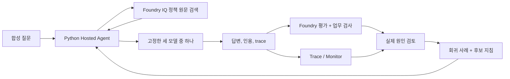

# 설계·모델·평가 기준

[한국어 실습](../README.ko.md) · [English](reference.en.md)

**실습은 [참가자 가이드](../README.ko.md)를 순서대로 진행합니다.** 이 문서는 용어, label, 모델·배포 이름, 엔드포인트, 근거 필드, 평가 범위만 빠르게 확인하는 참고 자료입니다. 재시작하지 마세요.

| 찾는 것 | 볼 곳 | 돌아갈 곳 |
|---|---|---|
| 용어 또는 결과 label | [용어](#terms), [판단값](#decision-values) | 브라우저 뒤로, 또는 [6-2 검토 블록](../README.ko.md#review-case) |
| 모델 또는 배포 이름 | [모델과 배포 이름](#model-names) | [5단계](../README.ko.md#lab-c) 또는 [8단계](../README.ko.md#lab-f) |
| 근거 필드 | [검색 결과 읽기](#retrieval-evidence) | [6단계 review](../README.ko.md#lab-d) |
| 평가 게이트 | [평가 범위](#evaluation-scope) | [8단계 holdout](../README.ko.md#lab-f) |
| 회귀 또는 표본 수의 불확실성 | [짝 비교와 Wilson 구간](evaluation-design.ko.md) | [7단계 비교](../README.ko.md#compare-results) |
| trace 또는 Monitor | [Trace와 Monitor](#trace-monitor) | [9단계 evidence](../README.ko.md#lab-g) |
| 배경 가정 | [시나리오](#scenario), [선택 배경](#background) | [시작](../README.ko.md#start) |
| 실행·언어 경계 | [실행 경로](#execution-path), [엔드포인트](#endpoints), [언어별 실행 분리](#language) | [시작](../README.ko.md#start) |
| 준비·복구 | [강사 준비](instructor.ko.md), [문제 해결](troubleshooting.ko.md) | [시작](../README.ko.md#start) |
| 현재 SDK와 기록된 실행 환경의 차이 | [호환성과 출처 검토](compatibility.ko.md) | [시작](../README.ko.md#start) |

<a id="terms"></a>

## 먼저 알아둘 용어

**짧은 답:** 이 이름들은 도구, 배포된 에이전트, 모델, 데이터, 결과 label을 구분합니다.

**도구와 실행 환경**

| 용어 | 이 실습에서의 뜻 |
|---|---|
| Copilot CLI | 명령 실행 보조 도구. |
| 실습 에이전트 | Azure에 배포된 Python 출장 규정 앱. |
| 요청별 에이전트 | 요청마다 Sol, Luna, Astra 중 하나를 호출하는 Python Agent Framework 객체. 투표하지 않습니다. |
| Foundry | 실습용 Azure 서비스와 포털. |
| Agent Framework | Python 에이전트 라이브러리. |
| knowledge base / KB | 검색 가능한 정책 근거. |
| Hosted Agent | Azure 관리형 환경의 Python 코드. |

**모델과 label**

| 용어 | 이 실습에서의 뜻 |
|---|---|
| 모델 | `gpt-6-sol`, `gpt-6-luna`, `gpt-6-astra`의 고정 배포 중 하나. |
| V1 / V2 | 지침 두 버전. |
| `agent_version` | 배포마다 생성되는 숫자 Hosted Agent 버전. |
| `baseline` / `improved` | V2 전후 결과 label. |
| dev | 실패를 보고 개선하는 고정 질문 6개. |
| holdout | 후보 고정 뒤 별도 질문 4개. |

**평가**

| 용어 | 이 실습에서의 뜻 |
|---|---|
| judge | 답변 텍스트 채점 모델. |
| calibration | judge 확인 예제 2개. |
| native 평가 | Foundry 기본 평가입니다. 답변 텍스트를 채점합니다. |
| 업무 검사 | Python이 판단값, 금액, 인용 계약을 확인합니다. native 평가 점수가 이를 대신하지 않습니다. |
| rubric | 채점 기준 |
| 품질 게이트 | 모델별 집계 기준. 운영 승인 아님. |

**근거와 파일**

| 용어 | 이 실습에서의 뜻 |
|---|---|
| trace | 한 요청의 검색, 모델 호출, 응답을 연결한 실행 기록. |
| 회귀 사례 | 고정 기준과 원래 trace를 보존한 사례. |
| lineage | 언어, 모델, 지침, 데이터, 버전, 결과 이력. |
| `case_id` / `row_id` | `case_id`는 고정 질문 ID, `row_id`는 label·모델·질문별 응답 ID. V1/V2의 같은 사례는 **`case_id` + `model_key`**로 찾습니다. |
| JSON / JSONL | JSON은 문서, JSONL은 줄별 JSON 객체입니다. 응답은 `row_id`로 찾습니다. |

↩ 브라우저 **뒤로**로 이 참고를 열기 직전 블록에 돌아갑니다. 6-2에서 왔다면 [한 사례 검토](../README.ko.md#review-case)입니다.

<a id="decision-values"></a>

## 답변 설명과 판단값을 따로 읽기

**짧은 답:** `answer`는 설명문, `decision`은 Python이 `expected_decision`과 비교하는 label입니다.

| `decision` | 이 실습에서의 뜻 | 혼동하지 말 것 |
|---|---|---|
| `allowed` | 적용되는 정책과 명시된 조건 안에서 허용 | 실제 승인·예약·지급을 실행한 것이 아님 |
| `needs_approval` | 사전 승인이 필요 | 절대 금지나 이미 승인받았다는 뜻이 아님 |
| `not_allowed` | 정책에서 금지 | 필요한 승인을 기다리는 상태와 구분 |
| `needs_info` | 판단에 필요한 요청 정보가 부족 | 제공 정책에 없는 주제와 구분 |
| `not_covered` | 제공된 정책이 다루지 않는 범위 | 정책이 금지한다는 뜻이 아님 |

설명이 타당해도 판단값은 틀릴 수 있습니다. 불일치하면 설명, label, 고정 기준을 따로 대조합니다. 응답에 맞춰 `expected_decision`이나 평가 기준을 바꾸지 않습니다.

↩ 브라우저 **뒤로**로 이 참고를 열기 직전 블록에 돌아갑니다. 6-2에서 왔다면 [한 사례 검토](../README.ko.md#review-case)입니다.

<a id="scenario"></a>

## 시나리오와 남는 자산

**짧은 답:** 한빛기술은 가상 회사이며 KRW 금액, 적용일, 문서 상태, 인용 근거가 남습니다.

가상의 한빛기술 에이전트는 한국 국내 출장 규정을 설명합니다. 영어판에서도 통화는 **Korean won (KRW)**이며, 언어를 바꿔도 한도와 규칙은 바뀌지 않습니다.

정책에는 현행 규정, 과거 규정, 미승인 초안이 함께 있습니다. 올바른 답은 **출장일과 문서 상태**에 달려 있습니다.

에이전트는 안내만 하며 예약, 승인, 지급, 예외 승인을 실행하지 않습니다. 정책, 기준 정답, calibration 예제는 합성 교육 자료이며 승인된 회사 규정이 아닙니다.

이 루프는 지침과 검증 체계를 개선합니다. trace는 모델 가중치를 학습시키지 않습니다. [레벨 3](level-3.ko.md#continuous-eval)은 trace를 정기적으로 평가하지만 fine-tuning, RL, 자동 재학습, 자동 운영 배포는 범위 밖입니다.

↩ [시작](../README.ko.md#start).

<a id="model-names"></a>

## 고정 모델 식별자

**짧은 답:** 요청에는 모델 키, 검증에는 모델 ID·버전, 환경에는 Azure 배포 이름을 씁니다.

| 이름 | 확인할 곳 | 사용하는 위치 |
|---|---|---|
| 모델 키 | `sol`, `luna`, `astra` | 에이전트 요청의 `model_key`, 결과 집계 |
| 모델 ID와 버전 | 아래 표 | `preflight`가 대조하는 고정 모델 |
| Azure 배포 이름 | 강사가 전달한 `.env` 또는 Foundry **Build → Models** | `.env`의 `MODEL_SOL_DEPLOYMENT`, `MODEL_LUNA_DEPLOYMENT`, `MODEL_ASTRA_DEPLOYMENT`, 보조 배포 `LAB_AUX_DEPLOYMENT`. 모델 키·ID와 같을 필요 없음 |

새 조의 `LAB_PREFIX`를 바꾸어도 공유 모델의 배포 이름은 바뀌지 않습니다.

| 키 | 실제 모델 ID | 버전 |
|---|---|---|
| `sol` | `gpt-6-sol` | `2026-09-22` |
| `luna` | `gpt-6-luna` | `2026-09-22` |
| `astra` | `gpt-6-astra` | `2026-09-03` |

`preflight`가 실제 배포의 모델·버전, 지역 카탈로그, 할당량을 확인합니다. 카탈로그 항목이 다른 구독의 사용 가능성을 보장하지 않습니다. 필요한 모델이 없으면 다른 모델로 대체하지 말고 중단합니다.

- 세 후보 모델은 같은 dev/holdout, KB, 지침, 평가 기준으로 답합니다. 투표 합의 구조가 아닙니다.
- 검색 planner와 judge에는 고정 배포(`gpt-5.4-mini`)를 사용하며, 이 보조 모델은 후보 모델을 대체하지 않습니다.
- 세 후보는 모두 OpenAI 모델이므로 여러 공급자 간 이식성을 검증했다고 주장하지 않습니다.

↩ 브라우저 **뒤로**로 이 참고를 열기 직전 블록에 돌아갑니다. 설정 확인 중이었다면 [1-1 설정](../README.ko.md#workspace-settings), 평가 중이었다면 [5단계 baseline](../README.ko.md#lab-c) 또는 [8단계 holdout](../README.ko.md#lab-f)입니다.

<a id="execution-path"></a>

## 실행 경로를 이렇게 고른 이유

**짧은 답:** 실습은 Python 소스 직접 배포, 엄격한 JSON 요청, 질문별 상태 분리, 같은 Foundry 계정의 Chat Completions 엔드포인트를 씁니다.

- **소스 직접 배포:** `azure.yaml`은 Python 3.13 런타임의 소스 직접 배포를 지정합니다. 로컬 Docker나 ACR 빌드는 필요 없습니다.
- **실습 호출:** 각 요청은 `model_key`, `case_id`, `run_id`를 명시합니다. 모델 라우팅은 허용 목록으로 제한합니다.
- **레벨 3 대상 평가:** Foundry는 `{"type": "input_text", "text": ...}`를 보냅니다. 에이전트는 그 text에서 호출 JSON을 추출해 같은 엄격한 요청으로 실행하거나, 일반 텍스트를 `case_id` `external`로 Sol에 보냅니다([레벨 3의 4절](level-3.ko.md#evaluate-agent)).
- **요청 간 상태 분리:** Hosted session은 컴퓨트 재사용에 쓰지만, 각 질문·모델 요청은 새 에이전트 인스턴스로 실행합니다.
- **엄격한 JSON 계약:** 모델은 JSON 텍스트를 반환하고 Pydantic이 검증합니다. 잘못된 출력을 고쳐 성공으로 처리하지 않습니다.

추론 경로는 **같은 Foundry 계정의 Azure OpenAI v1 Chat Completions 엔드포인트**입니다. 코드는 `AIProjectClient.get_openai_client()` 엔드포인트/자격 증명 재정의와 `OpenAIChatCompletionClient`를 사용합니다. 공개 OpenAI 서비스로 보내는 대체 경로가 아닙니다.

애플리케이션의 JSON 검증은 모델 서비스가 강제하는 Structured Outputs와 다릅니다. 두 언어 모두 기존 모델 호환 경로를 유지합니다.

↩ [3단계 local](../README.ko.md#local).

<a id="endpoints"></a>

## 엔드포인트와 토큰 범위

**짧은 답:** 프로젝트 관리, 모델 추론, IQ 검색은 서로 다른 엔드포인트와 Entra 토큰 범위를 씁니다.

| 연결 | 설정 | Entra 토큰 범위 |
|---|---|---|
| 에이전트 관리 / Foundry Evaluation | `FOUNDRY_PROJECT_ENDPOINT` | `https://ai.azure.com/.default` |
| 후보 모델 추론 | `AZURE_OPENAI_ENDPOINT` | `https://cognitiveservices.azure.com/.default` |
| Foundry IQ 검색 | `AZURE_SEARCH_ENDPOINT` | `https://search.azure.com/.default` |

호스팅 서비스가 GA라고 해서 함께 쓰는 모든 SDK나 API도 GA라는 뜻은 아닙니다.

↩ [1단계 시작 준비](../README.ko.md#start).

<a id="language"></a>

## 언어별 실행 분리

**짧은 답:** 언어가 바뀌면 데이터, 지침, 응답, 평가, 원격 분석, lineage가 따로 생깁니다.

`LAB_LANGUAGE=ko`가 기본값입니다. `LAB_LANGUAGE=en`은 영어 정책, 질문, 지침, 모델 요청 label, calibration 예제, Hosted 응답 메타데이터를 선택합니다.

언어마다 작업 폴더와 리소스 접두사를 분리합니다. 한국어 데이터는 `data/`에 있고 한국어 지침은 현재 위치를 유지합니다. 영어 데이터는 `data/en/`, 영어 지침은 `src/agent/prompts/en/`에 있습니다.

소유권, 응답, 평가, 원격 분석 요약, 회귀 출처 이력에는 언어가 기록됩니다. 언어 필드가 없는 기록은 **한국어**입니다. 번역해도 문서 ID·날짜·금액·판단값·인용 규칙은 유지하지만, 텍스트가 달라지면 데이터·지침·검색 근거의 hash는 달라집니다. 언어별 결과를 합치거나 한국어 측정값을 영어 실측 결과로 제시하지 마세요.

↩ [시작](../README.ko.md#start).

<a id="retrieval-evidence"></a>

## 검색 결과를 읽는 기준

**짧은 답:** 정책 문서는 `docKey` 또는 `sourceData.id`로 확인하고, 모델 차이 판단 전 `context_hash`를 봅니다.

`references[].id`는 retrieval 결과 내부의 참조 번호입니다. 정책 문서 키와 같지 않을 수 있습니다. 문서 키는 `docKey` 또는 `sourceData.id`로 확인합니다. 두 필드가 모두 없으면 인용 근거가 확인되지 않은 것으로 보고 [6단계 review](../README.ko.md#lab-d)로 돌아갑니다.

`retrieve` 콘솔에는 해결된 `document_ids`, planning `activity`, 저장 경로(`saved`)가 표시됩니다. 전체 `references`는 그 저장 JSON에 보존됩니다.

같은 말뭉치라도 호출별 context가 달라질 수 있습니다. `context_hash`가 다르면 모든 답변 차이를 후보 모델 탓으로만 해석하지 않습니다.

**검색 누락 방지:** KB의 `retrievalInstructions`는 요청이 규정 무시나 승인 완료를 요구해도 관련 정책을 검색하라고 지시합니다.

- 그래도 planner가 검색하지 않으면 에이전트는 같은 질문을 **한 번만** 다시 시도하고, `retrieval_attempts`를 응답과 trace에 기록합니다.
- 두 번 모두 검색하지 않으면 근거 없는 답변으로 진행하되 그 실패를 trace에 남깁니다. [도입 배경](validation.ko.md#retrieval-miss)

<details>
<summary>Foundry IQ 검색 방식</summary>

이 실습은 실제 Search knowledge source와 knowledge base를 만들고 `/knowledgebases/{name}/retrieve`를 호출합니다. 일반 `search()` 응답에 “Foundry IQ”라는 이름을 붙인 것이 아닙니다. 작은 합성 문서는 semantic retrieval로 검색하며, 별도 embedding 배포나 MCP 도구는 필요하지 않습니다.

Foundry Indexes 목록, knowledge source 고급 설정, 실제 Azure Search index는 다른 화면입니다.

</details>

↩ [6단계 review](../README.ko.md#lab-d).

<a id="evaluation-scope"></a>

## 평가와 채택 기준

**짧은 답:** 레벨 1에서는 저장된 응답 48개와 trace 48개, 고정 평가기를 확인합니다. 모델별 dev·holdout 업무 게이트 6개의 결과와 native 평가 점수는 따로 읽습니다. **게이트가 `false`여도 실습은 완료할 수 있으며**, 그 결과를 보고합니다. 운영 승인이 아닙니다.

**아래 기준은 기본 10단계 실습(레벨 1)용입니다.** [레벨 2](level-2.ko.md)와 [레벨 3](level-3.ko.md)은 입력과 기준값이 다르므로 본평가 48개 응답과 점수를 합치지 않습니다.

| 평가 | 확인하는 것 | 대신하지 못하는 것 |
|---|---|---|
| native groundedness | 답변 주장이 검색 근거로 뒷받침되는가 | 업무 판단, 최신 정책 선택, 인용 ID 전체 |
| native relevance | 답변이 질문에 응답하는가 | 업무 정답 전체나 정당한 보류의 품질 전체 |
| 결정적 업무 검사 | 판단값, 필수 금액, 허용된 검색 문서 인용 | 답변 전체의 의미 정확성 |
| 사람의 검토 | 적용일, 예외, 원인, 제안한 개선의 타당성 | 작은 표본에서 운영 품질을 통계적으로 증명 |

레벨 1 native 평가 경로는 캡처한 에이전트 답변의 **JSONL 데이터셋 평가**입니다. judge를 호출하지만 에이전트를 다시 호출하지 않습니다. native `response`는 답변 텍스트이고, 판단값과 인용 배열은 업무 검사로 따로 봅니다.

실험 중에는 다음을 확인합니다.

| 확인 항목 | 필요한 값 | 다르면 |
|---|---|---|
| 응답 행렬 | baseline dev 18행, improved dev 18행, holdout 12행. 오류·중복·누락 없음 | [실패한 단계만 복구](troubleshooting.ko.md#resume) |
| 고정 입력 | 같은 dev 데이터, 말뭉치, 동시성, judge, evaluator 정의 | baseline과 비교하지 않음 |
| 업무 게이트 | 모든 모델의 dev·holdout `business_gate`가 `true`. 업무 통과율 80% 이상, 필요한 인용 모두 유효. dev는 최소 5/6, holdout은 4/4 | 채택하지 않음 |
| native 평가 점수 | native 1–5 척도와 통과 기준 4. null·오류를 점수로 바꾸지 않음 | 실패 또는 누락 증거로 유지 |
| holdout 사용 | holdout 전에 후보 고정. holdout 답변으로 개선하지 않음 | 새 실험으로 취급 |
| 결과 읽기 | native 평가 점수, 업무 검사, 지연 시간, 토큰 수, 사람 검토를 따로 읽음 | 한 점수로 합치지 않음 |

`candidate_quality_gates`와 레벨 3 릴리스 게이트는 실습 증거만 확인하며 `production_release_approved`는 false로 남습니다.

방법, 측정값, 해석은 [평가 방법·개선 결과](validation.ko.md)에 있습니다. 업무 게이트는 운영 승인이 아닙니다.

↩ [5단계 baseline](../README.ko.md#lab-c) 또는 [8단계 holdout](../README.ko.md#lab-f).

<a id="trace-monitor"></a>

## Trace와 Monitor

**짧은 답:** trace 확인은 본평가 응답마다 sampling 없이 수집된 성공 trace가 있음을 증명하고, 포털 대시보드는 더 넓은 운영 집계입니다.

`queries/monitor.kql`은 실습 에이전트의 `requests`를 고르고 `operation_Id`로 `dependencies`를 연결합니다. framework span과 custom span을 중복 모델 호출로 세지 않습니다.

**터미널 — 저장소 루트:** 아래 변수는 실제 V1 label을 사용합니다. 새 터미널이면 [실행값 복원](troubleshooting.ko.md#run-values)을 먼저 합니다. 다른 단계의 trace 복구는 [해당 label 조회](troubleshooting.ko.md#telemetry)를 따릅니다.

```bash
python scripts/workshop.py monitor --label "$BASELINE_LABEL"
```

**완료 확인:** JSON 출력에 run의 `expected_trace_count`, 그와 일치하는 `observed_trace_count`, `complete: true`가 나옵니다.

**다르면:** [trace 복구](troubleshooting.ko.md#telemetry)에서 반영 지연·조회 기간을 확인합니다. 수집·평가는 반복하지 않습니다.

`monitor`는 기본으로 최근 2시간을 조회합니다. `--hours`는 같은 trace coverage 조회의 KQL 필터와 API 시간 범위를 함께 늘리며, agent/run 필터와 정확한 trace 수·sampling 검사는 유지됩니다. 포털의 날짜 선택이나 `azd ai agent monitor` 로그 스트리밍과는 다른 기능입니다.

실습 에이전트는 `microsoft.fixed_percentage` 값 `1.0`으로 완전한 trace coverage를 수집하며 공유 Application Insights sampling 정책은 그대로 둡니다.

- 포털 대시보드에는 smoke 또는 추가 UI 호출이 섞여 48개 본평가 응답보다 범위가 넓을 수 있습니다.
- 표시된 추정 비용 `$0`은 전체 Azure 청구액이 아닙니다.
- Tools chart가 비어 있어도 코드 수준 IQ span이 없었다는 뜻은 아닙니다.

운영에는 sampling, 개인정보, retention, alert, 비용, 권한 부여 정책이 필요합니다.

↩ [9단계 evidence](../README.ko.md#lab-g).

<a id="background"></a>
<a id="배경-learning-loop와-frontier-ecosystems"></a>

<details>
<summary>선택 배경과 공식 출처</summary>

### 배경: Learning loop와 frontier ecosystems — 선택 자료

**짧은 답:** 모델은 바꿀 수 있어도 조직의 지식, 판단 기준, 개선 경험은 남아야 합니다.



사티야 나델라는 [AI 시대 기업의 미래에 관한 원문](https://x.com/satyanadella/status/2066182223213293753)에서, AI 시대의 기회는 가장 좋은 모델을 고르는 데서 끝나지 않는다고 설명합니다. 사람의 전문성과 조직이 소유한 AI 역량이 함께 축적되는 learning loop가 필요하다는 뜻입니다. *human capital*은 사람의 전문성, 판단, 관계이고, *token capital*은 기업이 구축하고 소유하는 AI 역량입니다. 단순한 토큰 사용량을 뜻하지 않습니다.

**Learning loop**는 실제 업무, 업무별 평가, 사람의 판단, 다음 개선을 연결합니다. 조회 가능한 조직 지식, 비공개 eval, trace는 조직이 배운 내용을 보존하는 데 도움을 줍니다.

**Frontier ecosystems**는 하나의 frontier 모델을 넘어 기업, 산업, 국가가 자신의 전문성과 가치를 만들 수 있어야 한다는 관점입니다.

이 실습은 그 관점을 작게 해석한 교육용 예시입니다.

| 관점 | 이 실습에서 해볼 일 | 조직에 남는 자산 |
|---|---|---|
| 조직의 기억 | 합성 출장 규정을 Foundry IQ로 검색 | 정책 문서, ID, 적용 기준 |
| 업무별 learning loop | 실제 답변 생성, 평가, trace 검토, V1/V2 비교 | 기준 정답, 평가 기준, 검토 사례, 개선 이유 |
| 모델과 조직 자산 분리 | 같은 정책 말뭉치와 질문으로 세 고정 모델 비교 | 모델 선택과 분리해 관리하는 데이터, 지침, trace lineage |

이 실습은 **프롬프트와 평가 체계 개선**입니다. fine-tuning, reinforcement learning, 자동 운영 배포가 아닙니다. 세 후보는 모두 OpenAI 모델이므로 여러 공급자 간 상호운용성을 검증했다고 주장하지 않습니다.

↩ [시작](../README.ko.md#start).

### 공식 출처

| 문서 | 실습에서 사용하는 내용 |
|---|---|
| [Nadella의 learning-loop와 frontier-ecosystem 논의](https://x.com/satyanadella/status/2066182223213293753) | 배경 관점. 실습은 교육적 해석입니다. |
| [Foundry 모델 카탈로그](https://ai.azure.com/explore/models) · [Azure 판매 모델](https://learn.microsoft.com/azure/ai-foundry/foundry-models/concepts/models-sold-directly-by-azure) · [엔드포인트와 배포 이름](https://learn.microsoft.com/azure/foundry/foundry-models/concepts/endpoints) | 모델 ID, 지역, 배포 유형, 추론에 쓰는 이름 |
| [Agent Framework Foundry hosting](https://learn.microsoft.com/agent-framework/hosting/foundry-hosted-agent?pivots=programming-language-python) | Python Hosted Agents |
| [OpenAI adapter](https://learn.microsoft.com/agent-framework/integrations/by-component/model-providers/openai) · [AIProjectClient](https://learn.microsoft.com/python/api/azure-ai-projects/azure.ai.projects.aiprojectclient) | 인증된 Chat Completions 클라이언트 통합 |
| [Agent Server Core](https://learn.microsoft.com/python/api/overview/azure/ai-agentserver-core-readme?view=azure-python) · [Invocations](https://learn.microsoft.com/python/api/overview/azure/ai-agentserver-invocations-readme?view=azure-python) | readiness, request context, 원격 분석, JSON 입출력 |
| [Hosted session 관리](https://learn.microsoft.com/azure/foundry/agents/how-to/manage-hosted-sessions?pivots=python) | 버전에 고정한 세션과 일괄 요청 |
| [Structured Outputs](https://learn.microsoft.com/agent-framework/agents/structured-outputs?pivots=programming-language-python) | 서비스 강제 스키마와 애플리케이션 JSON 검증의 구분 |
| [Foundry IQ quickstart](https://learn.microsoft.com/azure/foundry/agents/quickstarts/quickstart-foundry-iq-hosted-agent) · [Retrieval pipeline](https://learn.microsoft.com/azure/search/agentic-retrieval-how-to-create-pipeline) · [Retrieve API](https://learn.microsoft.com/azure/search/agentic-retrieval-how-to-retrieve) | 지식 개체, 실제 검색, 참조, 활동 |
| [Dataset evaluation](https://learn.microsoft.com/azure/foundry/observability/how-to/cloud-evaluation-datasets) · [Hosted evaluation](https://learn.microsoft.com/azure/foundry/observability/quickstarts/quickstart-evaluate-hosted-agent) | 평가 모드, judge, 입력 매핑 |
| [Tracing](https://learn.microsoft.com/azure/foundry/observability/how-to/trace-agent-setup) · [Monitoring](https://learn.microsoft.com/azure/foundry/observability/how-to/how-to-monitor-agents-dashboard) | 개별 요청 trace와 운영 집계 |
| [Sampling configuration](https://learn.microsoft.com/azure/azure-monitor/app/opentelemetry-configuration#enable-sampling) | trace 완전성과 운영 절충 |
| [공식 Python Hosted Agent 예제](https://github.com/microsoft-foundry/foundry-samples/tree/main/samples/python/hosted-agents/agent-framework) | azd direct-code deployment와 프로토콜 manifest |

</details>
